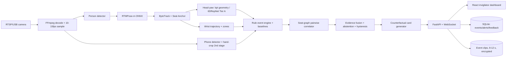

# AI Examination-Hall Behaviour Intelligence System
## Market Research, Technical Architecture and Winning Implementation Blueprint

Prepared: 17 July 2026 · Research cutoff: 17 July 2026 · Deployment context: India (physical examination halls, CCTV)

**Evidence labels used throughout this document (per assignment §1):**
- **[Verified]** — confirmed against a live source during this research (URL in Bibliography)
- **[Vendor]** — vendor-reported, NOT independently validated
- **[Knowledge]** — from technical literature within the researcher's reliable knowledge (≤ Jan 2026); correct with high confidence but re-check the cited link before quoting numbers on stage
- **[Inferred]** — computed or reasoned from available evidence (method shown)
- **[Unverified]** — could not be confirmed; do not claim

No product, paper, dataset, repository, accuracy figure or URL in this document is invented. Where evidence was insufficient, the item is explicitly labelled.

---

## 1. Executive Recommendation

**Build VIGIL — a seat-anchored, skeleton-first behaviour intelligence layer that turns ordinary examination-hall CCTV into an explainable invigilator assistant.**

Six decisions drive everything else in this dossier:

1. **Physical halls are the right gap, but you are NOT first.** India already runs AI on exam CCTV at government scale: UPSC tendered live AI-based CCTV surveillance in 2024 with roughly one camera per 24 candidates and AI red-flags for cheating and invigilator absence **[Verified]**; UP Board deploys ~3 lakh CCTV cameras across ~8,300+ centres feeding district/state control rooms (2022 and again 2026) **[Verified]**; UPESSC publicly credited AI-based monitoring with catching a cheating attempt in May 2026 **[Verified]**. What these deployments do NOT publicly demonstrate: per-seat anonymous tracking, pairwise interaction reasoning, calibrated per-student baselines, explainable/counterfactual alerts, abstention under poor visibility, or a published false-alert rate **[Inferred from absence of public documentation]**. That is the differentiation lane. Any pitch line of the form "nobody monitors physical halls with AI" is factually wrong and will be destroyed in Q&A.
2. **There is no public physical-hall multi-student behaviour benchmark.** OEP (MSU) is single-examinee webcam **[Verified]**; SCB-Dataset is classroom behaviour object detection, not exam-misconduct events **[Verified]**. Therefore the winning move is to *define the benchmark*: a self-recorded, scripted, event-annotated mini-dataset, evaluated on **false alerts per student-hour** and **event-level F1** — not to claim beating a benchmark that does not exist.
3. **Flagship USP = Seat-Graph Evidence Fusion with Counterfactual Alert Cards** (Candidates A + D merged). Secondary = Personal Normal-Behaviour Calibration (B). Low-risk fallback = Uncertainty-Aware Abstention + Skeleton-Only Privacy Replay (F + C). Rationale and scoring in §12–13.
4. **MVP model stack (all runnable in 48–72 h):** person detection (YOLO11-s or RT-DETR) → pose (RTMPose-m via ONNX) → ByteTrack + custom seat-anchor layer → head-yaw (keypoint geometry everywhere; 6DRepNet face crops in near rows) → rule-based temporal event engine → seat-graph pairwise correlator → evidence fusion + abstention → FastAPI/WebSocket → React dashboard. Learned temporal models (ST-GCN/PoseC3D) are a competition-phase upgrade, not an MVP requirement.
5. **Refuse to promise the physically impossible.** On 1080p at typical hall distances, eye gaze is not recoverable, a 7 cm paper chit beyond ~4 m is below reliable detection size, and earpieces are effectively invisible (pixel math in §4/§12) **[Inferred, arithmetic shown]**. VIGIL reframes chit detection as hand-behaviour + close-range object candidates, and says "insufficient visibility" instead of guessing. Judges reward this honesty; competitors overclaim.
6. **Never accuse; always route to a human.** Every output is a "behavioural review request" with evidence, confidence, visibility quality and a counterfactual ("what would NOT have triggered this"). This satisfies mandatory objectives 18–20 and is the correct DPDP-era posture (§23).

**Headline demo claim to make on stage:** "On our scripted test set, VIGIL produced X false alerts per student-hour at Y% event recall, and abstained on Z% of low-visibility frames — and every alert explains itself." (X, Y, Z measured on your own recorded data before finals; never fabricated.)

---

## 2. Final Product Concept

| Field | Decision |
|---|---|
| Product name | **VIGIL** — Vision-based Invigilation with Graph Intelligence and expLainability |
| One-line description | A privacy-first AI layer for exam-hall CCTV that tracks anonymous seats, detects individual and *pairwise* suspicious behaviour patterns, and hands invigilators explainable, counterfactual evidence cards instead of accusations. |
| Tagline | *Sees behaviour. Explains evidence. Never accuses.* |
| Primary user | Chief invigilator / centre superintendent / exam-cell control room |
| Core problem | One invigilator cannot continuously observe 30–60 students; raw CCTV walls shift the same impossible attention problem to a control room. |
| Key differentiation | Seat-anchored anonymous tracking + relational (student↔student) evidence graph + counterfactual explanations + calibrated abstention — none publicly demonstrated together by existing remote proctors or CCTV analytics **[Inferred from Track A/E]** |
| Flagship USP | Seat-Graph Evidence Fusion with Counterfactual Alert Cards |
| Privacy promise | No facial recognition, no identity, skeleton-first processing, anonymous seat IDs, local inference, short configurable retention, event-clip-only storage |
| Explainability promise | Every alert answers the 14 questions in §14; every alert includes "what would not have triggered this" |
| Real-time promise | ≤ 5 s from behaviour completion to alert card at ≥ 10 processed FPS per stream on a single consumer GPU **[Inferred target; measure before claiming]** |

**Feature buckets (compulsory separation, per assignment §10):**
1. **Mandatory** (problem statement): multi-person detection/tracking, pose, posture, head orientation, hand/wrist analysis, glance/turn/rotation events, non-verbal-communication candidates, phone detection, chit-where-feasible, explainable alerts, seat timelines, event log, privacy, no accusation, human review.
2. **Proven additions** (existing work, adapted): classroom-tuned phone-use detector (SCB-Dataset), weakly-supervised per-seat anomaly scorer (CHEESE/MIL lineage), near-row head-pose/gaze module (6DRepNet/L2CS-Net lineage). Details §11.
3. **Apparently novel USPs**: seat-graph reciprocal evidence, counterfactual alert cards, personal baseline calibration, seat-anchored occlusion recovery, visibility-tiered abstention. Novelty audit §9/§12.
4. **Future production**: multi-camera fusion, learned interaction transformer, conformal calibration at scale, drift monitoring, SIEM/audit integration.
5. **Intentionally excluded**: facial recognition/identity, eye-gaze tracking, audio analysis (MVP), emotion recognition, automated "cheating scores", long-range chit/earbud claims, room-scan style intrusiveness.

---

## 3. Original Problem and Objectives — Coverage Map

The original problem statement and all 20 mandatory objectives are retained without dilution. Coverage:

| # | Mandatory objective | Where solved |
|---|---|---|
| 1 | Multi-student detection & tracking from live video | §16 (detector), §16 (tracker), §21 |
| 2 | Pose landmark extraction | §16 (RTMPose) |
| 3 | Body posture analysis | §15 taxonomy, §16 event engine |
| 4 | Head-orientation analysis | §16 head-yaw module, §17 benchmark |
| 5 | Hand & wrist movement analysis | §16 wrist-trajectory buffer |
| 6 | Repeated sideward glances | §15 B1, event engine rules |
| 7 | Excessive head turning | §15 B2 |
| 8 | Body rotation toward neighbours | §15 B4 |
| 9 | Unusual/repeated hand movements | §15 B5–B7 |
| 10 | Non-verbal communication candidates | §15 C-class (relational), seat-graph |
| 11 | Mobile phone detection | §11 add-on 1, §16 object module |
| 12 | Chit / unauthorized paper (where feasible) | §12 feasibility math, §16 (near-range + hand-cue reframing) |
| 13 | Other unwanted objects (where feasible) | §16 object module, closed-set + review queue |
| 14 | Real-time explainable alerts | §14, §21 |
| 15 | Seat-wise behavioural timelines | §26 dashboard |
| 16 | Event logging for review | §22 schemas |
| 17 | Multi-person tracking | §16, §17 |
| 18 | Privacy-conscious operation | §23 |
| 19 | No identity-based accusation | §14 language rules, §23 |
| 20 | Human review before interpretation | §14, §26 accept/dismiss workflow |

---

## 4. Assumptions and Scope

Stated once, used everywhere (assignment instruction: decide, don't keep asking):

- **Hall geometry:** 20–60 students visible per camera; fixed CCTV at 2.2–3.0 m height, front-elevated or front-corner angle; students seated in rows facing forward.
- **Camera:** minimum 1080p @ 15–25 FPS; 4K strongly recommended for object work. RTSP or USB ingest.
- **Distance tiers [Inferred — pixel arithmetic]:** For a 1080p camera with ~90° horizontal FOV, scene width at distance d ≈ 2·d·tan(45°) = 2d metres → pixels-per-metre ≈ 1920/(2d).
  - At 4 m: ~240 px/m → face ≈ 55–60 px (face-based head pose OK), phone (15 cm) ≈ 36 px (detectable), chit (7 cm) ≈ 17 px (marginal).
  - At 8 m: ~120 px/m → face ≈ 28 px (face-based head pose unreliable), phone ≈ 18 px (marginal, needs temporal aggregation), chit ≈ 8 px (below reliable detection).
  - **Operating tiers:** Tier A (0–4 m): full pipeline incl. face-crop head pose + objects. Tier B (4–8 m): pose, torso rotation, coarse keypoint-based yaw (left/centre/right), phone with multi-frame confirmation. Tier C (>8 m): posture/rotation + abstention on head direction and objects. The system *reports its tier* per seat instead of pretending uniform capability.
- **Single camera per hall for MVP;** multi-camera fusion is production roadmap (§30).
- **No audio** in MVP (privacy + scope).
- **Anonymity:** students are seat IDs (e.g., C7). No face embeddings, no names, no identity linkage.
- **Regulatory context:** DPDP Act 2023 operationalized by DPDP Rules 2025, notified Nov 2025, phased compliance with full obligations by May 2027; Data Protection Board operational **[Verified]**. §23 maps controls. This dossier is engineering guidance, not legal advice.
- **Hackathon hardware:** one laptop/desktop with a consumer NVIDIA GPU (≥ 6 GB VRAM) available to the team.
- **Ground truth:** produced by the team via scripted volunteer recordings with informed consent (§18).

---

## 5. Commercial Market Landscape (Track A)

### 5.1 Remote webcam proctoring (adjacent market — NOT the same problem)

| Product | Deployment | Multi-person | Pose | Head/Gaze | Objects | Explainability | Privacy approach | Human review | Public accuracy | Main limitation | Evidence |
|---|---|---|---|---|---|---|---|---|---|---|---|
| Proctorio | Browser ext., automated | No (1 examinee) | No | Face/gaze cues | Limited | Flag list, opaque scoring | Records room/screen; criticized | Instructor reviews flags | None published | Webcam-only; FP complaints widely reported | [Knowledge] |
| Honorlock | Hybrid AI + live pop-in | No | No | Face cues | Phone-lookup honeypot | Session flags | Records; live intervention | Yes | None published | Remote only | [Knowledge] |
| Respondus Monitor | LMS-integrated automated | No | No | Face presence/gaze proxy | No | "Review priority" score | Records | Instructor | None published | Remote only | [Knowledge] |
| Meazure Learning (ProctorU; acquired Examity 2023) | Live + automated | No | No | Proctor judgment + AI cues | Proctor judgment | Session report | Records, live proctor | Yes (core model) | None published | Human-heavy cost; remote only | [Knowledge] |
| Talview | Remote AI proctoring (India-origin) | No | No | Face/gaze cues | Some | Flag timeline | Records | Optional | Vendor claims only | Remote only | [Vendor]/[Knowledge] |
| Mercer Mettl | Remote AI proctoring (India) | No | No | Face/gaze cues | Phone/person flags | Credit-based flags | Records | Optional live | Vendor claims only | Remote only | [Vendor]/[Knowledge] |
| Proctortrack (Verificient) | Automated identity + proctoring | No | No | Face cues | Some | Integrity levels | Records; 2020 breach → temporary suspension, resumed after independent audit; support active as of May 2026 | Instructor | None published | Remote only; trust history | [Verified] |
| Inspera | E-assessment platform + proctoring module | No | No | Face cues | No | Flags | Records | Instructor | None published | Remote only | [Knowledge] |
| SMOWL | Image-sampling proctoring (Spain) | No | No | Face presence | No | Periodic-image flags | Samples, not continuous video | Yes | None published | Sampling misses events | [Knowledge] |
| TestWe | Offline-capable e-exam (France) | No | No | Face cues | No | Flags | Local-first | Yes | None published | Remote only | [Knowledge] |

**Structural takeaway:** the entire commercial proctoring category is built around one webcam per one examinee. None of it transfers to "one fixed CCTV, 40 seated students, occlusion, 8 m distances" — different detection regime, different tracking problem, different privacy calculus.

### 5.2 Physical-hall / CCTV analytics (the actual competitive set)

| System | What it demonstrably does | Multi-person | Behaviour granularity | Explainability | Privacy | Evidence |
|---|---|---|---|---|---|---|
| UPSC AI-CCTV programme (tender, June 2024) | Live AI CCTV at centres; ~1 camera per 24 candidates; AI red-flags for cheating/unfair means, invigilator absence, entry/exit movement, camera masking; plus Aadhaar fingerprint + facial recognition for identity | Yes | Coarse incident flags (publicly described) | Not publicly described | Uses facial recognition (opposite of VIGIL) | **[Verified]** |
| UP Board CCTV monitoring (2022, 2026) | ~3 lakh cameras, 8,373 centres (2022); state control room, "cheating-free" mandate (2026) | Yes | Primarily human review of feeds | N/A | Recording-heavy | **[Verified]** |
| UPESSC lecturer exam (May 2026) | AI-based monitoring detected a cheating attempt → arrest | Yes | Incident-level | Not public | Not public | **[Verified]** |
| Staqu JARVIS | Camera-agnostic real-time video+audio analytics: violence, intrusion, fire, overcrowding, "suspicious behaviour"; government deployments incl. UP Prisons, Punjab Police, Bihar State Election Commission; founder-reported ARR ₹25–30M (2022) → ~₹400M (2025) | Yes | Generic surveillance events; exam-misconduct-specific product **not publicly confirmed** | Alert dashboard | Includes facial recognition capabilities | **[Verified site/press; exam use Unverified]** |
| Hikvision / Chinese standardized-exam "smart proctoring" classroom solutions | AI-assisted exam-room monitoring reported in China's standardized exam ecosystem | Yes | Not publicly benchmarked | Not public | Recording + identity-heavy | **[Knowledge/Vendor — did not verify live; do not cite on stage without checking]** |
| Generic VMS analytics (Milestone/Genetec/etc. + person analytics) | Person detection, loitering, region intrusion | Yes | No exam semantics | Rule alarms | Recording-heavy | [Knowledge] |

### 5.3 Ten biggest unmet product gaps (synthesis)

1. No public system does **anonymous seat-level tracking** (identity-free attribution of events to seats).
2. No public system does **pairwise/relational reasoning** (reciprocal glances, coordinated rotation, object handoff between two seats).
3. No public system offers **skeleton-only privacy mode** for live view or evidence replay.
4. No public system publishes **false alerts per student-hour** or any event-level accuracy at all — vendor accuracy for physical halls is essentially undisclosed.
5. No **per-student behavioural baseline** — thresholds are one-size-fits-all where described at all.
6. No **counterfactual explanations** ("a single brief glance would not have triggered this").
7. No **visibility-aware abstention** — systems force a judgment even when the student is occluded.
8. Government deployments lean on **facial recognition + human control rooms**, i.e., high privacy cost and unchanged attention bottleneck.
9. No **camera/seat geometry awareness** (same thresholds for front row and back row).
10. No **invigilator feedback loop** (dismissed alerts feeding hard-negative mining).

VIGIL is built to occupy gaps 1–10 simultaneously; gaps 1, 2, 6, 7 are the flagship.

---

## 6. Academic Literature Review (Track B)

### 6.1 Exam/classroom behaviour detection — direct prior art

| Paper / system | Year, venue | Method | Data | Reported result | Relevance / limitation | Evidence |
|---|---|---|---|---|---|---|
| Atoum et al., Automated Online Exam Proctoring (OEP) | 2017, IEEE TMM (MSU CVLab) | Two cameras + mic, multimedia cue fusion, SVM | OEP: 24 examinees, cheating scripted | Dataset is the field's reference | Single-examinee webcam; not hall CCTV | **[Verified]** |
| CHEESE: Multiple-Instance Learning for cheating detection | 2024, arXiv 2402.06107 | Weakly-supervised MIL; 3D conv body/background + OpenFace gaze/head; spatio-temporal graph | OEP (65 abnormal/69 normal), UCF-Crime, ShanghaiTech | 87.58% frame AUC on OEP | Proves weak supervision works for rare cheating events; webcam-domain | **[Verified]** |
| Exam Cheating Detection with Multiple-Human Pose Estimation | 2021/22, IEEE (9673534) | Multi-person HPE; head-posture + hand-movement validation; outputs "warnings", not accusations | Two real-exam experiments | 92–97% accuracy (self-reported protocol) | Closest philosophical prior art (multi-person, warning language); small-scale, no seat graph, no baseline calibration | **[Verified]** |
| Cheating recognition in examination halls via improved YOLOv8 | 2025, Discover Computing (Springer) | Hierarchical: frame differencing + YOLOv8+MLP + ResNet pose stage | Exam-hall footage | Improvement over YOLOv8 baselines (paper-internal) | Confirms hall-level detection is active research; individual-level only, no relational reasoning | **[Verified]** |
| GPU-Free Pose Framework for Automated Invigilation | 2025, MDPI Automation 6(4):82 | YOLOv8-pose; keypoint distances/angles; dynamic thresholding | Classroom settings | Real-time on CPU (paper-internal) | Explicitly lists occlusion, seating distance, camera quality as failure modes; names per-student adaptive thresholds as FUTURE work → our USP-B closes their stated gap | **[Verified]** |
| Two-Stage Object-Centric Exam Cheating Detection | 2026, arXiv 2604.16234 (FJCAI 2026) | Object-centric two-stage DL | Exam footage | Paper-internal | Confirms 2026 activity; still individual-level | **[Verified]** |
| Deep Learning Models for Detecting Cheating in Online Exams | 2025, CMC (TechScience) | Benchmarks EfficientNet/MobileNet/ResNet/YOLOv5 on OEP + OP; surveys PoseNet head 94%/hand 97% systems | OEP, OP | EfficientNetB1/YOLOv5 top on OP | Good metrics survey; webcam-domain | **[Verified]** |
| gembancud/Cheating-Detection (thesis) | 2021, GitHub | OpenPose + XGBoost on Jetson Nano; proctor web app | Own validated set | ~90% acc, 89.65 F1, 90.32 AUROC @ ~10 FPS | Existence proof: pose→classifier→proctor-app on edge; single-room scale, MIT license | **[Verified]** |
| SCB-Dataset series (Yang et al.) | 2023–25, arXiv 2304.02488 / 2310.02522 | YOLO-family benchmarks on classroom behaviour | SCB3: 5,686 img/45,578 labels/6 classes incl. *using phone*; SCB5: 20 classes incl. *turn head*, *lean on desk*; 7,428 img/106,830 labels | mAP up to 80.3% (SCB3, YOLOv5/7/8) | Best public classroom-domain training data for phone/posture classes | **[Verified]** |

**Gap statement (defensible on stage):** across the retrieved exam-behaviour literature, detection is *per-individual*; none of the retrieved works model seat-anchored pairwise evidence (reciprocal glances, coordinated rotation, handoff chains), none publish false-alerts-per-student-hour, and per-student adaptive baselines appear only as stated future work **[Inferred from Track B searches; searches logged in §9]**.

### 6.2 Pose estimation candidates

| Model | Key numbers | Real-time | License | Fit for exam halls | Evidence |
|---|---|---|---|---|---|
| **RTMPose-m (top-down)** | 75.8 AP COCO; 90+ FPS on i7-11700 CPU; 430+ FPS on GTX 1660 Ti; RTMPose-s 72.2 AP @ 70+ FPS on Snapdragon 865 | Yes, incl. CPU | Apache-2.0 (MMPose) | **Selected.** Accuracy/speed/deployability sweet spot; ONNX/TensorRT paths documented | **[Verified]** |
| **RTMO-l (one-stage)** | 74.8 AP COCO val @ 141 FPS (V100); 73.2 AP CrowdPose (SOTA one-stage); latency nearly invariant to person count (~+0.1 ms from 1→10+ people) | Yes | Apache-2.0 (MMPose) | **Backup / crowded-hall mode.** One-stage wins when 30+ people make top-down crops expensive | **[Verified]** |
| ViTPose(-H) | 81.1 AP COCO (SOTA-class accuracy) | No (heavy) | Apache-2.0 | Offline re-analysis only | [Knowledge] |
| YOLO11-pose / YOLOv8-pose | Integrated det+pose, very fast | Yes | AGPL-3.0 (Ultralytics) | Fastest fallback; license flag for commercialization | [Knowledge] |
| RTMW (whole-body) | RTMW-l 70.2 mAP COCO-WholeBody (first OSS >70) | Yes | Apache-2.0 | Only if finger-level gestures needed later | **[Verified]** |
| MediaPipe Pose / MoveNet | Mobile-grade | Yes | Apache-2.0 | Single/few-person bias; not for 40-person halls | [Knowledge] |
| OpenPose | Classic bottom-up | Marginal | **Non-commercial license** | Avoid (license + age) | [Knowledge] |

### 6.3 Multi-person tracking

| Tracker | Headline numbers (MOT17 unless noted) | Occlusion behaviour | License | Verdict | Evidence |
|---|---|---|---|---|---|
| **ByteTrack** | ~80.3 MOTA / 77.3 IDF1 / 63.1 HOTA | Recovers low-score detections (good for partial occlusion) | MIT | **Selected** — simple, fast, motion-only (uniform-clothing halls defeat appearance ReID anyway) | [Knowledge — confirm repo numbers] |
| BoT-SORT | ~80.5 MOTA / 80.2 IDF1 / 65.0 HOTA | +ReID +camera-motion compensation | MIT | Backup; ReID adds little under identical uniforms, CMC irrelevant for fixed cameras | [Knowledge] |
| OC-SORT / Deep OC-SORT | Strong on DanceTrack-style occlusion/nonlinear motion | Observation-centric re-update | MIT | Consider if leaning/bending breaks ByteTrack | [Knowledge] |
| StrongSORT / DeepSORT | Older ReID-centric | Appearance-dependent | Mixed | Not selected (uniforms) | [Knowledge] |

**Critical insight:** in an exam hall the strongest tracking cue is not appearance or motion — it is that **students do not swap chairs**. A seat-anchor layer (fixed seat polygons + homography + last-pose memory + neighbour constraints) on top of ByteTrack converts a generic MOT problem into a constrained assignment problem, attacking ID-switches at the source (USP-E, §12). No retrieved exam-domain work does this **[Inferred from Track B/E searches]**.

### 6.4 Head orientation & attention (what is actually estimable from hall CCTV)

Definitions the judges must hear: **eye gaze** (pupil-based, needs ~high-res face) ≠ **head pose** (skull orientation, needs ~30+ px face) ≠ **body orientation** (shoulder/hip line, works at any pose-estimable distance) ≠ **gaze target** (scene point being looked at, needs geometry).

| Approach | Representative method | Practical range in halls | Evidence |
|---|---|---|---|
| Face-based 6DoF head pose | 6DRepNet (rotation-matrix regression; ~3.97° MAE AFLW2000); WHENet (full 360° yaw); HopeNet (classic) | Tier A rows only (face ≥ ~30–40 px) | [Knowledge — 6DRepNet used inside real e-cheating systems per CMC/JES surveys **[Verified usage]**] |
| Appearance gaze | L2CS-Net, Gaze360, ETH-XGaze models | Webcam-range only; NOT hall CCTV | [Knowledge; L2CS-Net usage in proctoring systems **[Verified]**] |
| Keypoint-geometry yaw proxy | nose/ear/eye keypoint asymmetry + shoulder line from RTMPose | All tiers; coarse Left/Centre/Right + approximate angle | [Knowledge/standard practice] |
| Gaze-target / attended-target estimation | GazeFollow, VideoAttentionTarget (Chong et al., CVPR 2020) | Research-grade; adapt ideas (map head direction to neighbour seats via geometry) rather than models | [Knowledge] |
| Body orientation | MEBOW (CVPR 2020, monocular body-orientation-in-the-wild) | All tiers; torso-rotation evidence | [Knowledge] |

**Decision:** MVP uses keypoint-geometry yaw (3-class + angle estimate) everywhere + 6DRepNet on face crops where face ≥ 40 px; "gaze" is *never* claimed — the dashboard says "head direction". Eye-gaze is in §Excluded.

### 6.5 Skeleton action/gesture models

ST-GCN (AAAI 2018) → CTR-GCN (ICCV 2021, ~92%+ NTU60 X-sub) → PoseC3D (CVPR 2022, heatmap-3DCNN, ~94% NTU60) → skeleton transformers / Mamba-style temporal models (2024–25) **[Knowledge]**. Reality check: all are trained on NTU-style *whole-body distinct actions*; exam misconduct is *subtle, seated, upper-body, rare, and long-horizon*. Direct transfer is weak; correct use is (a) self-supervised/light fine-tune on your recorded windows for a *normal-vs-anomalous* head, and (b) rules for the well-defined events. Hybrid rules+learned is the recommended architecture (§17, §20).

### 6.6 Human-object interaction, relational behaviour, robustness

- Small-object CCTV detection: pixel-size floor governs everything (§4). Techniques that legitimately help: high-res crops on hand regions, second-stage classifier on hand-neighbourhood patches, temporal aggregation of low-confidence object candidates, hand-to-region cues (hand under desk / in lap / to ear) **[Knowledge]**.
- Relational: group-activity recognition and social-gaze literature (GNNs, interaction transformers) establishes the modelling vocabulary; exam-specific pairwise evidence graphs were not found in retrieved literature **[Inferred; searches in §9]**.
- Robustness toolkit that earns its place: confidence calibration (temperature scaling), abstention/selective prediction, conformal-style thresholds on event scores, low-light augmentation; super-resolution NOT recommended unless it moves downstream event-F1 (it usually hallucinates texture) **[Knowledge]**.

---

## 7. Existing Open-Source Landscape (Track C)

| Repo | What it gives you | License | Weights | Export | Hackathon-realistic? | Evidence |
|---|---|---|---|---|---|---|
| open-mmlab/mmpose (RTMPose, RTMO, RTMW projects) | SOTA real-time pose, deploy docs | Apache-2.0 | Yes | ONNX/TensorRT/ncnn | Yes — via rtmlib or ONNX to skip heavy mm-stack install | **[Verified project pages]** |
| rtmlib | Minimal ONNXRuntime wrapper for RTMPose/RTMO (no mmcv) | Apache-2.0 | Pulls released ONNX | ONNX | **Yes — recommended entry point** | [Knowledge — confirm repo state] |
| Ultralytics (YOLO11/YOLOv8 det+pose) | Easiest det/pose/train API | AGPL-3.0 | Yes | ONNX/TensorRT/OpenVINO | Yes; flag license in pitch if asked about commercialization | [Knowledge] |
| ifzhang/ByteTrack | Reference tracker | MIT | N/A | N/A | Yes (or use supervision's ByteTrack impl) | [Knowledge] |
| NirAharon/BoT-SORT | Tracker w/ ReID+CMC | MIT | Yes | N/A | Yes | [Knowledge] |
| mikel-brostrom/boxmot | Plug-and-play multi-tracker zoo | AGPL-3.0 | Yes | N/A | Yes (license flag) | [Knowledge] |
| roboflow/supervision | Detection/tracking/annotation utilities, zone tools (seat polygons!) | MIT | N/A | N/A | **Yes — big time-saver** | [Knowledge] |
| thohemp/6DRepNet | Head pose | Check repo license before demo | Yes | ONNX possible | Yes (Tier A only) | [Knowledge] |
| Ahmednull/L2CS-Net | Gaze (webcam-range) | Check repo license | Yes | — | Only for a front-row showcase widget | [Knowledge; usage in proctoring systems **[Verified]**] |
| gembancud/Cheating-Detection | End-to-end pose→XGBoost proctor app | MIT | Partial | — | Study for ideas; do not build on it | **[Verified]** |
| Whiffe/SCB-dataset | Classroom behaviour data + benchmarks + links to related classroom datasets (SB, ActRec-Classroom, UK_Datasets w/ "turning" class, SCB-E w/ phone) | Repo states research use — check before redistribution | Data | — | Yes for phone/posture fine-tuning | **[Verified]** |
| open-mmlab/mmaction2 (PoseC3D, ST-GCN, CTR-GCN) | Skeleton action recognition | Apache-2.0 | Yes | ONNX partial | Competition phase, not MVP | [Knowledge] |
| CMU OpenPose | Legacy pose | **Non-commercial** | Yes | — | No | [Knowledge] |

Abandonment risk note: anything not touched in >18 months (several tracker repos) is used as *algorithm reference*, with the actual implementation via supervision/boxmot maintained wrappers.

---

## 8. Dataset Landscape (Track D)

| Dataset | Domain | Scale | Labels | License / access | Domain match to exam halls | Main gap | Evidence |
|---|---|---|---|---|---|---|---|
| **OEP (MSU)** | Online exam proctoring | 24 examinees, scripted+real cheating, 2 cams + mic | Cheat events | Downloadable from MSU CVLab (research) | Low (webcam, single person) | No hall geometry | **[Verified]** |
| **SCB-Dataset3/5** | Classroom behaviour (images) | SCB3: 5,686 img/45,578 labels/6 classes; SCB5: 7,428 img/106,830 labels/20 classes (incl. using-phone, turn-head, lean-on-desk) | Bboxes per behaviour | GitHub (research; confirm terms) | **Medium-high** (real classrooms, many students, CCTV-ish angles) | Image-level, no temporal events, no misconduct semantics | **[Verified]** |
| COCO Keypoints | Pose pretraining | 200k+ labeled people | 17 kpts | CC BY 4.0 annotations | Generic | No seated-crowd bias | [Knowledge] |
| CrowdPose | Crowded pose | 20k img / 80k persons | 14 kpts | Research | High for crowding | Not seated exam scenes | **[Verified via RTMO paper]** |
| OCHuman | Heavy-occlusion pose | ~5k persons | Kpts+masks | Research | High for occlusion stress-tests | Small | [Knowledge] |
| MOT17/MOT20 | Tracking | Street scenes | Track IDs | Non-commercial (check) | Low scene match; standard metrics source | Pedestrians, not seats | [Knowledge] |
| DanceTrack | Tracking w/ similar appearance | Large | Track IDs | Research | Conceptually relevant (uniforms!) | Different motion regime | [Knowledge] |
| NTU RGB+D 60/120 | Skeleton actions | 56k/114k clips | Action classes | **Request-based research license, no redistribution** | Low-medium (distinct actions) | No misconduct classes | [Knowledge] |
| BIWI / 300W-LP / AFLW2000 | Head pose | Standard | Euler angles | Research | Training source for head-pose nets | Near-range faces | [Knowledge] |
| Gaze360 / ETH-XGaze / GazeFollow / VideoAttentionTarget | Gaze & gaze target | Large | Gaze vectors/targets | Research agreements | Concepts transfer; models don't (range) | Webcam/lab range | [Knowledge] |
| MEBOW | Body orientation in the wild | COCO-based | Orientation bins | Research | Medium (torso rotation) | Standing bias | [Knowledge] |
| Objects365 / Open Images | Object detection | Huge | Incl. mobile-phone class | Research-friendly (check per set) | Phone pretraining | Not hall context | [Knowledge] |
| ExDark | Low-light objects | 7k+ img | 12 classes | Research | Low-light augmentation source | No exam semantics | [Knowledge] |
| Roboflow/Kaggle community "exam cheating" sets | Misc small sets | Small, variable quality | Variable | **Per-set license chaos — audit each** | Variable | Leakage/quality risk | [Knowledge — audit before use] |

**Decisive conclusion:** there is **no public, licensed, physical-exam-hall, multi-student, event-annotated video dataset**. COCO/CrowdPose feed the pose module; SCB feeds the phone/posture detector; OEP feeds the anomaly-head pretraining idea; **your own recorded dataset (§18) is mandatory and is simultaneously your competitive moat** — no rival team can download your benchmark.

---

## 9. Patent & Novelty Review (Track E)

**Searches actually performed (17 July 2026, live web):** "Staqu JARVIS exam monitoring UP board" · "UP Board exam AI CCTV monitoring cheating" · "Proctortrack Verificient shut down" · "SCB dataset student classroom behavior detection" · "exam cheating detection pose estimation deep learning" · "RTMO RTMPose real-time multi-person pose estimation benchmark" · "online exam proctoring dataset OEP cheating video" · "DPDP Rules 2025 notified compliance status India". ~60+ results reviewed; ~25 primary sources used. A dedicated patent-database pass was **not** completed in this session — treat patent status as **[Unverified]** and run Google Patents queries ("examination monitoring pose estimation", "proctoring skeleton privacy", "seat-level video analytics") before making any "not patented" claim.

Novelty classification of the eight candidate USPs (assignment scale 1–7):

| USP | Closest prior art found | Classification |
|---|---|---|
| A. Seat-aware behaviour graph (reciprocal, pairwise evidence) | Group-activity/social-gaze research (adjacent domain); exam papers are individual-level | **4 — apparently novel combination** (exam domain) |
| B. Personal normal-behaviour calibration | MDPI 2025 invigilation paper names adaptive per-student thresholds as *future work* **[Verified]**; anomaly-detection baselines exist generally | **4 — apparently novel in exam CCTV**, 3 in general research |
| C. Skeleton-only privacy evidence replay | Privacy-preserving skeleton monitoring exists in eldercare/health research | **2 — implemented in adjacent domains** (our packaging is new) |
| D. Counterfactual alert explanation | Counterfactual XAI is established research; not found in any proctoring product | **4 — apparently novel combination** |
| E. Seat-anchored occlusion recovery | Spatial-constraint tracking exists in research | **2/4 — adjacent techniques, novel exam-seat formulation** |
| F. Uncertainty-aware abstention | Selective prediction/conformal literature | **3 — research-established, unproductized here** |
| G. Exam-hall digital twin (geometry-aware thresholds) | Retail/smart-building zone analytics | **2 — adjacent domains** |
| H. Interaction chain detection | Complex-event processing, group activity | **3 — research-only in adjacent tasks** |

Language discipline: on stage say "we found no prior system that does X, based on our market and literature search of N sources" — never "nobody has ever done this."

---

## 10. Competitive Gap Analysis — Positioning Statement

Remote proctors solve a **different problem** (one webcam, one person). Indian government deployments prove **demand and budget** for physical-hall AI but publicly demonstrate only coarse incident flags plus facial recognition plus human control rooms **[Verified]**. Academic exam-CV work is **individual-level, small-scale, and silent on false-alert rates** **[Verified sample above]**. VIGIL's wedge: *relational evidence + explainability + calibrated honesty (abstention) + privacy-by-architecture*, measured by a metric nobody else reports (false alerts per student-hour).

---

## 11. Three Proven Add-On Ideas (already implemented elsewhere; adapted here)

**Add-on 1 — Classroom-tuned phone-use detection (SCB lineage).**
What: closed-set detector for *using-phone* fine-tuned on classroom imagery. Prior implementation: SCB-Dataset3 includes a using-phone class benchmarked with YOLOv5/7/8 to mAP up to 80.3% **[Verified]**; SCB-E and related classroom sets add more phone samples **[Verified via SCB repo]**. Integration: second detector head (or a small fine-tuned YOLO) running on frames + high-res crops around hand regions; temporal confirmation (N hits in M frames) before an object alert. Data: SCB3/5 + your own hall recordings. Expected benefit: turns the weakest generic-COCO class into a demo-reliable detector in Tier A/B; temporal confirmation directly cuts object false positives. Cost: ~1 GPU-hour fine-tune, ~0.5 day. Feasibility: high. Limitation: phones flat on desks under palms remain hard; range limits per §4. Demo: volunteer lifts phone at 3–4 m → object alert with clip.

**Add-on 2 — Weakly-supervised per-seat anomaly scorer (CHEESE/MIL lineage).**
What: a per-seat "unusualness" score over pose-feature windows trained with video-level weak labels (normal session vs scripted-misconduct session), catching behaviours your rules never enumerated. Prior implementation: CHEESE achieves 87.58% frame AUC on OEP with MIL over pose/gaze/background features **[Verified]**. Integration: 5–10 s sliding windows of normalized keypoint features per seat → lightweight temporal encoder → MIL loss; score feeds evidence fusion as ONE signal (never alerts alone). Data: your recorded normal + scripted sessions. Benefit: recall on unknown behaviours; also powers baseline deviation (USP-B shares features). Cost: few GPU-hours; 1–2 days. Feasibility: medium (competition phase, stretch for MVP). Limitation: weak labels → noisy score; must be fused, thresholded conservatively.

**Add-on 3 — Near-row head-pose module (6DRepNet/L2CS lineage).**
What: precise 6DoF head pose on face crops for Tier-A rows, upgrading coarse keypoint-yaw to degree-level angles. Prior implementation: published e-cheating systems already combine SixDRepNet head pose + L2CS-Net gaze inside CNN-BiLSTM pipelines **[Verified survey usage]**; 6DRepNet reports ~3.97° MAE on AFLW2000 **[Knowledge]**. Integration: face crop from pose head keypoints → 6DRepNet ONNX → yaw stream replaces proxy where face ≥ 40 px; *transient processing, nothing stored* (§23). Benefit: reliable degree-level glance angles for the demo's front rows; sharper duration measurement → fewer FPs. Cost: negligible compute; 0.5 day. Limitation: Tier A only; the dashboard must show per-seat capability tier so this is honest.

---

## 12. Novel USP Candidates — Scoring and Selection

Weighted score = 25% real-world value + 20% accuracy improvement + 15% FP reduction + 15% novelty + 10% feasibility + 10% demo impact + 5% privacy. (Scores 1–10, subjective but argued; recompute after your own experiments.)

| USP | Value | Acc | FP↓ | Novel | Feas | Demo | Priv | **Weighted** | Main risk |
|---|---|---|---|---|---|---|---|---|---|
| A. Seat-graph reciprocal evidence | 9 | 7 | 9 | 9 | 7 | 9 | 6 | **8.2** | Needs 2-person scripted data to validate |
| D. Counterfactual alert cards | 8 | 5 | 7 | 8 | 9 | 9 | 6 | **7.5** | Templates must match engine math exactly |
| B. Personal baseline calibration | 8 | 7 | 9 | 7 | 6 | 7 | 6 | **7.4** | Cold-start (first 5–10 min); drift |
| F. Uncertainty-aware abstention | 8 | 6 | 8 | 5 | 9 | 6 | 7 | **7.0** | "Abstains too much" if visibility scoring is crude |
| E. Seat-anchored occlusion recovery | 7 | 7 | 6 | 6 | 7 | 6 | 5 | **6.5** | Homography setup friction |
| C. Skeleton privacy replay | 6 | 3 | 3 | 5 | 9 | 8 | 10 | **5.6** | Judges may ask "where's the proof clip" → keep short RGB event clips |
| G. Digital twin geometry | 6 | 5 | 6 | 4 | 6 | 5 | 5 | **5.4** | Overbuild risk; MVP needs only seat polygons + row tiers |
| H. Interaction chains | 7 | 6 | 7 | 6 | 3 | 7 | 5 | **5.9** | Rare-event data starvation in 72 h |

**Selection: Flagship = A + D fused** ("Seat-Graph Evidence Fusion with Counterfactual Cards") — highest combined FP-reduction, novelty and demo impact, and D is nearly free once the rule engine exposes its own thresholds. **Secondary = B** (closes a gap the 2025 literature explicitly names as future work **[Verified]**). **Fallback = F + C** — implementable in hours, judge-friendly, zero research risk. E and G ship silently as engineering inside tracking/setup; H folds into A as a 3-step chain demo only if time allows.

## 13. Selected Flagship USP — Specification

**Seat-Graph Evidence Fusion with Counterfactual Cards.** Nodes = anonymous seat tracks with state (head-yaw stream, torso angle, wrist activity, baseline stats, visibility tier). Directed edges accumulate *time-decayed evidence*: `glance_toward(A→B)` when A's head direction intersects B's seat sector for ≥ T_dur; `responds(B→A)` when B produces a glance/torso/hand event within Δt of A's event; `reciprocal(A↔B)` when both directions occur within a window; `handoff_candidate(A→B)` when wrist regions approach across the seat boundary ± object candidate. An alert of class C-x fires only when edge evidence crosses a fused threshold (§20), and the card renders BOTH the evidence trace and the counterfactual: *"Seat C7 → C8: three rightward head events (1.9 s, 2.3 s, 2.1 s) within 52 s, C7 baseline P95 = 1.1 s; C8 torso shift within 6 s of event 3. A single glance under 1.8 s, or absence of the C8 response, would not have generated this alert."* Every number in the sentence is read from the engine state — not generated text.

## 14. Explainable Alert Design

Alert language whitelist: behavioural anomaly · review recommended · potentially suspicious pattern · visibility insufficient · uncertain event · object candidate detected. Blacklist (hard-fail in code review): cheating confirmed · misconduct · guilty · caught.

Every alert card answers all 14 mandatory questions (seat, behaviour, start, duration, repetitions, direction, paired seat, object, contributing signals, confidence, visibility, uncertainty, threshold rationale, recommended review window).

**15 alert templates** (engine fills bracketed fields from state):
1. Repeated sideward glance — "[n] [dir]ward head events in [w] s (durations [list]); [k] exceeded seat baseline P95 [b] s. Review [t1–t2]."
2. Prolonged sideward gaze — "head held [dir] for [d] s continuously (baseline P95 [b] s)."
3. Repeated backward glance — as 1, direction = rear.
4. Torso rotation toward neighbour — "torso rotated [θ]° toward Seat [X] for [d] s."
5. Coordinated rotation (pair) — "Seats [A],[B] rotated toward each other within [Δt] s."
6. Reciprocal glances (pair) — "[A]→[B] and [B]→[A] head events within [w] s, repeated [n]×."
7. Possible handoff (pair) — "wrist regions of [A],[B] converged at seat boundary for [d] s; object candidate [present/absent]."
8. Under-desk hand pattern — "writing-hand absent from desk zone [n]× totalling [d] s outside baseline."
9. Reach to pocket/bag — "hand-to-[zone] excursion [n]× in [w] s."
10. Phone candidate — "object candidate 'phone' at Seat [S], [n] confirmations over [d] s, conf [c]. Clip attached."
11. Paper/chit candidate (Tier A only) — "small-object candidate in hand region, [n] confirmations; classification uncertain — review recommended."
12. Repeated signalling gesture — "non-writing-hand repeated motion pattern [n]× toward [dir]."
13. Visibility insufficient — "Seat [S] occluded/low-visibility [p]% of last [w] s — automated assessment suspended; manual glance advised."
14. Track uncertainty — "identity continuity at Seat [S] uncertain after occlusion at [t]; events quarantined pending review."
15. Sustained anomaly score — "behaviour at Seat [S] deviates from its own baseline (score [z]σ) without matching a named pattern — low-priority review."

Severity ladder: silent-log → low → medium → high-review-request → unobservable. Mapping in §20.

## 15. Behaviour Taxonomy (formal)

Signals key: HY=head-yaw stream, TR=torso rotation, WH=wrist/hand zones, OBJ=object candidates, VIS=visibility, BASE=personal baseline, PAIR=seat-graph edge. Window = evaluation horizon. Sev = max severity reachable.

| ID | Behaviour | Class | Signals | Window | Min visibility | Top confounders | Method | Sev |
|---|---|---|---|---|---|---|---|---|
| N1 | Writing | Normal | WH periodic small-amplitude in desk zone | 10 s | Tier C ok | — | rule | — |
| N2 | Reading paper | Normal | HY down, still | 10 s | C | thinking | rule | — |
| N3 | Thinking / brief look-up | Normal | HY up/centre ≤ 3 s | 5 s | C | glance start | rule (duration gate) | — |
| N4 | Posture adjustment / stretch | Normal | TR+shoulders transient ≤ 4 s, returns | 8 s | C | body rotation | rule + return-check | — |
| N5 | Asking invigilator | Normal | arm raised, HY to front | 8 s | B | signalling | rule (front-direction whitelist) | — |
| N6 | Clock check | Normal | HY to clock bearing ≤ 2 s | 5 s | B | sideward glance | geometry whitelist zone | — |
| N7 | Fidgeting | Normal | low-amplitude periodic WH/TR | 30 s | C | signalling | BASE percentile | — |
| B1 | Repeated sideward glances | Susp-ind | HY events > θ_yaw, ≥ n in w, dur > BASE-P95 | 40–90 s | B | N3, N6 | rule+BASE | Med |
| B2 | Prolonged sideward gaze | Susp-ind | HY held > θ for > d_long | 10 s | B | neighbour asked invigilator | rule+BASE | Med |
| B3 | Repeated backward glance | Susp-ind | HY rear sector, repeated | 60 s | B | invigilator behind (whitelist) | rule | Med |
| B4 | Torso rotation to neighbour | Susp-ind | TR > θ_torso toward occupied seat, > d | 15 s | C | N4 | rule + seat-direction | Med |
| B5 | Under-desk hand activity | Susp-ind | WH leaves desk zone, dwell in lap zone, repeated | 30–120 s | B | dropped pen (single, short) | zone-dwell rule + repetition | Med |
| B6 | Reach to pocket/bag | Susp-ind | WH to hip/floor zone | 20 s | B | stationery pickup | repetition + OBJ fusion | Med |
| B7 | Concealed-object interaction | Susp-ind | B5/B6 + OBJ low-conf candidate persistence | 60 s | A/B | phone-shaped pencil box | multi-frame OBJ + hand pose | High |
| B8 | Phone use | Susp-ind | OBJ phone ≥ k frames + hand/head geometry | 10 s | A/B | calculator (allowed?) config | fine-tuned detector + temporal | High |
| B9 | Chit reading | Susp-ind | Tier A: small OBJ in hand + HY down-side alternation | 30 s | A | rough-work sheet | OBJ candidate + pattern; else abstain | Med |
| B10 | Repeated signalling gesture | Susp-ind | non-writing WH periodic, directed | 45 s | B | fidgeting | BASE + direction + repetition | Med |
| C1 | Reciprocal glances | Susp-rel | PAIR reciprocal HY within Δt, repeated | 120 s | B both | seat neighbours chatting pre-exam (session gate) | seat-graph | High |
| C2 | Coordinated rotation | Susp-rel | PAIR TR convergence | 30 s | C | both stretching (return-check) | seat-graph | Med |
| C3 | Repeated orientation to same neighbour | Susp-rel | B1 with constant target seat | 5 min | B | seat next to window/clock (geometry) | seat-graph + geometry | Med |
| C4 | Object pass / receive | Susp-rel | PAIR handoff_candidate ± OBJ | 20 s | A/B | passing spare pen (invigilator confirms) | seat-graph + OBJ | High |
| C5 | Mirrored gestures | Susp-rel | PAIR correlated WH patterns | 120 s | B | coincidence | correlation + repetition, conservative θ | Low→Med |
| C6 | Event chain (look→respond→hand→object) | Susp-rel | ordered A/B/C events | 3–5 min | B | — | chain matcher over graph edges | High |

Rule of the house: **no behaviour ever equals "cheating"**; C-class + object evidence maxes at "high-priority review request".

---

## 16. Recommended Model Stack (with reasons)

| Pipeline stage | Selected | Backup | Why selected | Training needed | Deploy | Main limitation |
|---|---|---|---|---|---|---|
| Video ingest | OpenCV/FFmpeg RTSP, 10–15 FPS sampling | GStreamer | trivial, reliable | — | — | dropped-frame handling needed |
| Person detection | YOLO11-s (person cls) | RT-DETR-R18 (Apache) | 5-min setup, strong small-person recall | none (MVP) | ONNX/TensorRT | AGPL license flag |
| Pose | **RTMPose-m** via rtmlib/ONNX | **RTMO-l** when >25 people | 75.8 AP @ real-time CPU/GPU **[Verified]**; RTMO latency ~person-count-invariant **[Verified]** | none (MVP) | ONNX | wrist jitter at Tier C |
| Tracking | **ByteTrack + Seat-Anchor layer (custom)** | BoT-SORT / OC-SORT | motion-only suits uniforms; seat anchor kills ID-switches structurally | none | pure Python | needs one-time seat-polygon setup |
| Head orientation | keypoint-geometry yaw (all tiers) + 6DRepNet (Tier A) | WHENet | honest tiering; degree-level where physics allows | none | ONNX | Tier B/C = 3-class only |
| Hand/wrist analysis | wrist-keypoint trajectory buffer + desk/lap/pocket zones | RTMW whole-body (later) | zero extra models | none | — | finger detail absent |
| Object detection | YOLO fine-tuned: phone (+optional book/paper) on SCB + own data | OWL-ViT open-vocab for offline review | SCB proves classroom phone detection to ~80 mAP class-family **[Verified]** | 1 GPU-hr | ONNX | range limits §4 |
| Individual temporal model | **Rule engine** (angles, durations, counts, hysteresis) | +ST-GCN/PoseC3D head (competition) | explainable by construction; rules ARE the counterfactuals | none | — | unknown behaviours → covered by add-on 2 |
| Relational model | **Seat-graph correlator (custom, rule-based edges)** | GNN (production) | novel, explainable, data-light | none | — | thresholds hand-tuned initially |
| Baselines | per-seat robust stats (median/P95, first 8–10 min, drift-updated) | streaming z-score | simple, powerful | online | — | cold-start window |
| Uncertainty | visibility score (kpt conf × bbox size × occlusion IoU) + abstention gates | conformal thresholds (competition) | cheap, honest | calibration set | — | crude at first |
| Fusion + alerts | weighted evidence fusion + severity ladder + cooldowns | learned fusion classifier (later) | tunable live during demo | none | — | — |
| Backend | FastAPI + WebSocket + SQLite | Postgres+Redis (production) | zero-ops | — | Docker opt. | single-node |
| Frontend | React + seat map + alert queue + skeleton replay (canvas) | — | — | — | — | — |

## 17. Model Benchmark Plan (run on YOUR recorded data)

- Detection: P/R/mAP + small-person AP by row tier; candidates YOLO11-s vs RT-DETR-R18; pick by Tier-C recall at matched latency.
- Pose: PCK@0.2 on 200 hand-labelled frames, wrist/nose-ear subsets; RTMPose-m vs RTMO-l vs YOLO11-pose; measure multi-person FPS at 20/40/60 people (RTMO expected to win ≥ ~25 people per its person-count-invariance **[Verified paper claim — reproduce]**).
- Tracking: HOTA/IDF1/IDSW + **seat-attribution accuracy** (% frames where track→seat mapping correct) with and without Seat-Anchor; ByteTrack vs BoT-SORT vs OC-SORT under scripted occlusion.
- Head orientation: 3-class L/C/R accuracy vs human labels, by row; angular MAE Tier A (6DRepNet vs keypoint proxy).
- Events: event-level P/R/F1 with IoU≥0.3 temporal matching; onset error; per-class.
- System: **false alerts per student-hour** (headline), missed scripted events, alert latency, end-to-end FPS, abstention %.
- Protocol: thresholds tuned ONLY on the tuning split; report on held-out sessions (§18 splits); 3 tiers (controlled / difficult / OOD room); ablations: −seat-anchor, −baseline, −pair-evidence, −abstention → show each cuts FPs.


---

## 18. Dataset Collection & Annotation Plan (your moat)

**Recording protocol (hackathon-minimum → prototype):**
- Participants: 8–15 volunteers (mix of build, clothing, glasses; recruit for diversity deliberately — fairness slices need it). Informed written consent stating purpose, retention, deletion rights.
- Sessions: 4–8 × 20–30 min. Halls: 1–2 rooms (second room = OOD test). Cameras: 2–3 positions (front-centre elevated, front-corner), 1080p and phone-4K, 2.2–3 m height. Lighting: normal + one lights-dimmed + one backlit-glare session. Densities: sparse (1.5 m gaps) and packed (0.6 m).
- Scripts (each ≥ 10 instances across participants): brief glance / repeated glance / prolonged glance / backward glance / torso rotation / phone lift / chit handling (front row) / under-desk hand / pocket reach / object pass A→B / reciprocal glances / 3-step chain / **hard negatives:** stretch, invigilator question, clock check, dropped pen, posture shift, hair adjust / occlusion walk-bys / low-light block.
- Yield estimate **[Inferred]**: ~3–6 hrs footage, ~150–300 scripted events, ~500+ hard negatives — enough for rules+baselines+fine-tunes and a credible eval; a research prototype wants 30–60 participants, 4+ rooms; production wants multi-institution scale.

**Annotation schema (CVAT or Label Studio):** person bbox, anonymous track ID, seat ID, event {type from §15, t_start, t_end, severity, direction, pair_seat, object}, visibility {full/partial/occluded}, annotator confidence. Keypoints only on the 200-frame pose-eval subset (pose model is pretrained — don't waste hours).
**QA:** written guidelines with examples; double-annotate 20%; adjudicate disagreements; report inter-annotator agreement (target κ ≥ 0.7 on event types).
**Splits (leakage rules, non-negotiable):** split by participant AND session AND room; no clip from one recording in both train/tune and test; Tier-3 OOD test = untouched second room + unseen participants.

## 19. Training Strategy (staged)

S1 Frozen foundations: detector, pose, tracker — pretrained, untouched. S2 Domain check: only fine-tune detector if Tier-C recall < 90% on your frames. S3 Behaviour: rules first; then optional 1-layer temporal conv / ST-GCN head on 5 s pose windows (normal vs each B-class), focal loss (rare positives), class-balanced sampling, augment with keypoint jitter + horizontal flip + time-warp. S4 Relational: keep rule-edges for hackathon; log all pairwise features for a future GNN. S5 Objects: YOLO fine-tune phone on SCB + own crops, 640→1280 input for small objects, mosaic off late epochs. S6 Hard negatives: every invigilator-dismissed alert → labelled negative → weekly re-tune thresholds/classifier. S7 Calibration: temperature-scale classifier logits on tuning split; set abstention gates for target ≤ X false alerts/student-hr. S8 Optimize: export ONNX, FP16; INT8 only if Jetson demo planned; re-benchmark after every export (accuracy drops silently).
Pseudocode sketch (individual head): `for window in seat_windows: feats = normalize(kpts, torso_frame); z = temporal_encoder(feats); loss = focal(z, label)`. Track experiments in a plain CSV or wandb; fix seeds; version data by session hash. Compute: everything above fits a single RTX-class GPU in hours **[Inferred]**. **Do not publish any accuracy number you have not measured.**

## 20. False-Positive Reduction (primary objective)

Compared approaches: (1) fixed thresholds — brittle across rooms; (2) pure learned classifier — data-starved in 72 h, unexplainable; (3) pure anomaly detector — flags stretching forever; (4) **hybrid evidence fusion — RECOMMENDED**: rule-detected candidate events scored by Σ(weighted evidence) with per-signal gates.

Fusion inputs: duration gate → repetition count → personal-baseline deviation (σ) → torso confirmation → target-seat occupancy → reciprocal/pair evidence → object evidence → visibility ≥ tier-min → pose/track confidence → temporal consistency → geometry whitelists (clock, invigilator desk, door) → cooldown (same seat+type ≤ 1 alert / 3 min) → hysteresis (enter θ_hi, exit θ_lo) → invigilator feedback prior.
Severity mapping: score < s1 → ignore; s1–s2 → silent log; s2–s3 → low; s3–s4 → medium; > s4 or (C-class + object) → high review request; visibility < v_min → **unobservable** (never "suspicious"). Live-tunable sliders in the dashboard = a demo weapon ("watch the false alert disappear when baseline calibration turns on").

## 21. End-to-End Architecture



```mermaid
sequenceDiagram
  participant T as Track/Pose
  participant E as Event engine
  participant G as Seat graph
  participant F as Fusion
  participant D as Dashboard
  T->>E: yaw>25° @ C7 (t=1841s)
  E->>E: 3rd event in 52s; durations 1.9/2.3/2.1s; baseline P95=1.1s
  E->>G: candidate B1 C7→right sector
  G->>G: C8 torso shift within 6s → edge C7↔C8
  F->>F: visibility .86, track conf .93 → score 3.4 → MEDIUM
  F->>D: alert card + counterfactual + clip ref
  D->>F: invigilator DISMISS → hard-negative log → S6
```

**Deployment (3 sizes):** MVP = one process, one machine, one camera. Competition = per-camera worker processes → Redis pub/sub → API node → dashboard; clips on disk, encrypted at rest. Production = per-room edge GPU (store-and-forward on network loss) + central aggregation server + watchdogs/camera heartbeats + drift monitors.
**Retention strategy:** raw frames never persisted; rolling 60 s RAM buffer; on alert → save 8–12 s clip + skeleton JSON; default retention 30 days configurable; deletion API.

## 22. API & Data Design

Endpoints: `GET /session` · `GET /seats` (map + tiers + health) · `WS /ws/alerts` (push cards) · `GET /events?seat=&type=&from=` · `POST /alerts/{id}/ack|dismiss` (dismiss reason enum → hard-negative store) · `GET /replay/{event_id}` (skeleton JSON + optional clip URL) · `POST /config/seatmap` (polygon setup) · `GET /report/session.pdf`.

Event JSON:
```json
{"event_id":"evt_000412","session_id":"hall2_am","seat_id":"C7","track_id":14,
 "type":"repeated_sideward_glance","direction":"right","t_start":1841.2,"t_end":1893.4,
 "repetitions":3,"durations_s":[1.9,2.3,2.1],"pair_seat":"C8",
 "signals":{"head_yaw_deg":[27,31,29],"torso_rot_deg":14,"object":null},
 "confidence":0.81,"visibility":0.86,"baseline_dev_sigma":2.7,
 "severity":"medium","state":"open","explanation":"...","counterfactual":"...",
 "clip_ref":"clips/evt_000412.mp4"}
```
SQLite: `sessions(id,hall,start,end,config_json)` · `seats(id,session_id,polygon,tier)` · `tracks(id,session_id,seat_id,t0,t1,health)` · `events(id,…as JSON above)` · `alerts(id,event_id,severity,state,ts)` · `feedback(alert_id,action,reason,invigilator_note,ts)`.

## 23. Privacy, Ethics & Security (DPDP-era design)

Legal anchor: DPDP Act 2023 + **DPDP Rules 2025, notified Nov 2025; phased obligations, Data Protection Board operational, full compliance by May 2027; breach reporting to Board within 72 h; penalties up to ₹250 crore** **[Verified]**. Exam video of identifiable students is personal data → the institution is the Data Fiduciary; VIGIL is architecture-level minimization, not a legal exemption. State plainly on stage: "not legal advice; designed for DPDP alignment."

Controls: no facial recognition, no identity linkage, anonymous seat IDs; skeleton-first processing with transient face-crop head-pose (facial *geometry* computed in RAM for yaw, no embeddings, nothing stored — face detection ≠ face recognition ≠ identity recognition, and VIGIL implements only the first, transiently); local/on-prem inference; event-clip-only storage, 30-day default retention, deletion API; AES-encrypted clips at rest, TLS in transit; role-based dashboard access + audit log of every view; exam-notice + consent handled by institution templates (provided); appeals path: every alert is reviewable evidence, never a verdict; accommodations flag (a student with a medical/PwD accommodation → seat excluded or thresholds relaxed by invigilator, logged); bias testing = fairness slices in §17 eval (clothing, build, glasses, row position); model card + data card shipped in repo.

## 24. Risk Mitigation (assignment §5 table, answered)

| Risk | Mitigation shipped |
|---|---|
| False positives | §20 fusion: duration+repetition+baseline+pair+geometry gates, cooldown, hysteresis, hard-negative loop; headline FP/student-hr metric |
| False negatives | Add-on 2 anomaly head for unnamed behaviours; C-class relational recall; recall measured on scripted events |
| Occlusion | Seat-anchor recovery, track-memory decay, visibility scoring → abstain not guess; occlusion scripts in dataset |
| Poor lighting | camera exposure guidance, low-light session in data, visibility gate, IR-camera note for production |
| Blind spots | seat-tier map shows uncovered/degraded seats honestly at setup |
| Head-pose error | tiered capability (A/B/C), 3-class fallback, abstention |
| Tracking failure | seat constraints, re-association by pose+position, event quarantine on identity uncertainty (template 14) |
| Network failure | edge inference, local buffer, store-and-forward, offline dashboard |
| Hardware failure | watchdog, camera heartbeat, GPU health, graceful "monitoring degraded" banner |
| Privacy objections | §23 architecture + skeleton mode + no-identity + human review |

## 25. Evaluation Framework

Component metrics per §17. System metrics: **false alerts/student-hour (headline)** · missed scripted events/hr · alert latency (event-end→card) · pipeline FPS · GPU/CPU/RAM · max simultaneous students · % frames unobservable · calibration error (ECE on event scores) · % alerts whose 14 questions are fully populated ("correctly explained"). Tiers: T1 controlled, T2 difficult (occlusion/low-light/crowding/glare), T3 OOD (new room, unseen people). Baselines to beat and show: (a) naive threshold-only pipeline (your own ablation), (b) YOLO-pose+fixed-rules replication of the 2025 literature pattern, (c) human-invigilator spot-check recall on the same clips if time allows. Report confidence via bootstrap over events. Never tune on the test split.

## 26. Invigilator Dashboard

Layout: left = live feed with RGB↔skeleton toggle + overlay arrows (head direction) + wrist trails; centre = seat map (colour = state: normal/observing/alert/unobservable; badge = tier A/B/C; track-health dot); right = alert queue sorted by severity with cards (14 answers + counterfactual + Accept/Dismiss(reason)/Note); bottom = per-seat timeline strips + session analytics (alerts/hr, dismiss rate, heat map); header = camera/GPU health, session clock, export-report button. Replay modal = skeleton animation + head arrow + wrist trails + optional blurred clip. **No permanent per-student score anywhere**; the only aggregate is event history with uncertainty. React component tree: `App{Header,LiveFeedPanel,SeatMap,AlertQueue{AlertCard},TimelinePanel,ReplayModal,SettingsDrawer{SeatMapEditor,ThresholdSliders}}`.

---

## 27. Hackathon MVP (48–72 h)

All 13 mandated MVP demonstrations covered. H = heuristic, L = learned/pretrained.

| Task | Pri | Skill | Depends on | Effort | Status | Risk |
|---|---|---|---|---|---|---|
| Ingest + frame sampler | P0 | BE | — | 2 h | MVP | low |
| Person det (L) + pose (L, rtmlib/ONNX) | P0 | CV | ingest | 3 h | MVP | env setup |
| ByteTrack + Seat-Anchor (H) + seat-polygon setup UI | P0 | CV | pose | 6 h | MVP | homography fiddle |
| Head-yaw proxy (H) + 6DRepNet Tier A (L) | P0 | CV | pose | 4 h | MVP | angle noise |
| Rule event engine: B1–B4 glance/turn/rotation (H) | P0 | CV/BE | yaw | 6 h | MVP | threshold tuning |
| Wrist zones + B5/B6 hand events (H) | P1 | CV | track | 4 h | MVP | desk-zone calib |
| Phone detector fine-tune on SCB (L) + temporal confirm | P1 | CV | — | 5 h | MVP | small-object range |
| Chit approach: Tier-A hand-crop candidate (H+L) | P2 | CV | objects | 3 h | MVP(one approach) | honesty-framed |
| Seat-graph pair correlator C1–C4 (H) — FLAGSHIP | P0 | CV | events | 6 h | MVP | needs 2-person rehearsal |
| Baseline calibration (H stats) — SECONDARY | P1 | CV | events | 3 h | MVP | cold start |
| Visibility score + abstention — FALLBACK | P1 | CV | pose | 2 h | MVP | crude v1 ok |
| Counterfactual card generator | P0 | BE | fusion | 3 h | MVP | template-math sync |
| FastAPI + WS + SQLite | P0 | BE | — | 4 h | MVP | low |
| React dashboard (seat map, queue, timeline, skeleton toggle) | P0 | FE | API | 10 h | MVP | scope creep |
| Skeleton replay | P2 | FE | clips | 3 h | MVP | — |
| Record + annotate mini test set; measure FP/hr | P0 | all | pipeline | 6 h | MVP | time pressure |
| Backup demo video | P0 | all | everything | 2 h | MVP | do not skip |

**28. Two-week plan:** full §18 dataset, detector/pose spot fine-tunes, hard-negative round 1, OC-SORT trial, per-room calibration wizard, UI polish, 40-person stress test, threshold study.
**29. Four-to-six-week plan:** ST-GCN/PoseC3D individual head + MIL anomaly head (add-on 2), learned fusion, conformal-style calibrated abstention, full T1/T2/T3 eval with ablations + fairness slices, TensorRT/INT8 Jetson build, docs + model card.
**30. Production roadmap:** multi-camera per hall with cross-view fusion, GNN relational model, fleet monitoring + drift detection, retraining workflow from feedback store, security hardening + pen test, DPDP DPIA with counsel, pilot MoU with one college, reliability SLOs.

## 31. Demo Script

**3-minute version (7 beats):** (1) hall view, 6 volunteers writing — seat map all green, zero alerts, counter shows "false alerts this session: 0". (2) One volunteer takes a single brief glance — nothing fires; click seat → card shows "event logged, below threshold: single 1.2 s glance; alert requires ≥3 or >P95 duration" ← counterfactual as the WOW. (3) Repeated glances → medium alert card reads its evidence aloud. (4) Neighbour responds → seat-graph edge lights, pair alert C1. (5) Phone lift → object alert with 3-frame confirmation clip. (6) Assistant walks through, occludes a seat → seat turns grey "visibility insufficient — human review", NOT suspicious. (7) Invigilator dismisses one alert → "logged as hard negative; thresholds will learn." Close: "X false alerts per student-hour on our recorded benchmark, and every alert explains itself — VIGIL assists, never accuses."
**5-minute version** adds: stretching hard-negative suppression, chit Tier-A candidate with uncertainty language, backward glance, skeleton-only privacy replay, threshold slider live-tune, health bar, and the explicit line "the system is architecturally incapable of naming a student."
**Failure plan:** pre-recorded full run on disk; if live pose stutters, switch input source to file — same pipeline, honest disclosure. Wow moment = beat (2): a system that explains *why it did NOT alert* demonstrates intelligence, not animation.

## 32. Pitch Strategy

15 s: "Invigilators can't watch 60 students at once, and CCTV walls just move the problem. VIGIL turns exam-hall cameras into an explainable assistant that spots behaviour patterns between students — and never accuses anyone."
30 s: + "Skeleton-first and identity-free: anonymous seats, head-direction and hand-movement evidence, pairwise reciprocal-glance detection, and every alert ships with a counterfactual — what would NOT have triggered it. When it can't see, it says so instead of guessing."
1 min: + market gap (govt AI-CCTV is coarse + facial-recognition-heavy; remote proctors don't do halls), headline metric (false alerts/student-hour), privacy architecture, measured mini-benchmark numbers.
3 min technical: pipeline slide (§21 diagram), seat-graph math, baseline calibration, abstention, eval protocol + ablation bars, roadmap.
Slides: Problem · Market gap (UPSC/UP Board evidence) · Architecture · Flagship USP · Privacy/DPDP · Metrics & ablations · Live demo · Impact · Roadmap.

**Judge Q&A (honest answers):**
1. *How do you know someone is cheating?* We don't claim to. We detect behaviour patterns correlated with misconduct and hand evidence to a human; the human decides.
2. *Why no facial recognition?* Identity adds legal risk under DPDP and zero detection value — misconduct is behaviour, not a face. Seat IDs give attribution without identity.
3. *Preventing false accusations?* Language whitelist, severity ladder, human review gate, counterfactuals, abstention, and we optimize false-alerts/student-hour as the headline metric.
4. *Student just looks around?* Single glances never alert: duration + repetition + personal-baseline gates; we demo that live.
5. *Occlusion?* Seat anchoring + track memory + visibility scoring; when blocked, we say "insufficient visibility", we don't guess.
6. *Different from existing proctoring?* They watch one webcam per person or push raw CCTV to humans; we do multi-student, seat-anchored, pairwise, explainable, identity-free.
7. *Training data?* Public pose/classroom sets (COCO, SCB) + our own consented scripted recordings; no scraped student footage.
8. *Measured accuracy?* Exactly what's on the metrics slide from our recorded benchmark — nothing else; there is no public hall benchmark, so we built and will release our protocol.
9. *Ordinary CCTV?* Yes — 1080p RTSP; capability degrades by row and the seat map displays that honestly (tiers).
10. *No internet?* Fully local inference; store-and-forward when a network exists.
11. *Low light?* Visibility gate abstains; production guidance recommends exposure settings/IR.
12. *Tiny chits?* Physics: ~8 px at 8 m on 1080p — below detection. We detect the *hand behaviour* and flag close-range object candidates with uncertainty language instead of lying about range.
13. *100 students?* One-stage pose (RTMO) is ~person-count-invariant in latency; scale by camera, ~2–4 streams per consumer GPU [measured target].
14. *Legal?* Institution is the Data Fiduciary under DPDP Act/Rules 2025; VIGIL minimizes data (no identity, skeleton-first, short retention). Not legal advice; DPIA before deployment.
15. *Demographic bias?* No identity features; pose models are appearance-light; we run fairness slices (clothing, build, glasses, row) and publish them.
16. *Hard to copy?* The evidence-fusion thresholds, baseline calibration and our annotated hall benchmark are the moat — the models are commodity, the *judgment layer* isn't.
17. *Genuinely novel?* Seat-graph pairwise evidence + counterfactual cards + calibrated abstention in this domain; components exist in research, the combination didn't appear in our 60-source search — stated exactly that carefully.
18. *Real college deployment?* Pilot: camera survey, seat-map setup, one-term shadow mode (alerts logged, not acted on), DPIA, then live with appeals process.

## 33. Cost & Hardware Plan [Inferred estimates — validate]

| Platform | Streams @1080p | Pipeline FPS | Notes | Approx cost (INR) |
|---|---|---|---|---|
| Team laptop, RTX 3050/4060 | 1 | 12–25 | full MVP incl. UI | owned |
| Desktop RTX 4070 12 GB | 2–4 | 20–30/stream | per-hall node | ~1.6–2.0 L |
| Jetson Orin Nano 8 GB | 1 | 8–15 (FP16/INT8) | per-room edge | ~50–60 k |
| CPU-only i5 | 1 | 2–5 (RTMPose CPU path) | degraded, abstention-heavy | — |

Storage: skeleton JSON ~ MBs/hr; event clips ~ 50–150 MB/session. Bandwidth: zero raw-video upload (local inference). Recommendation: **hybrid** — GPU node per 2–4 cameras in-building; central server only aggregates events/dashboards. Cloud inference rejected: cost, latency, and DPDP data-flow surface.

## 34. Technical Risks & Fallbacks

Top 5 from adversarial review (7 personas: CV researcher, judge, administrator, invigilator, privacy advocate, falsely-flagged student, deployment engineer):
1. **No measured accuracy until you record data** → schedule the mini-benchmark for MVP hour ~48; a single honest number beats any adjective. (CV researcher, judge)
2. **Head-yaw unreliable in back rows** → tier system + abstention + demo camera placed for Tiers A/B; never demo row 8. (CV researcher)
3. **Chit-detection overclaim temptation** → locked reframing (§12/§32-Q12); the falsely-flagged-student persona is protected by counterfactuals + human gate + appeals. (privacy advocate, student)
4. **Threshold brittleness across rooms** → per-room calibration wizard + personal baselines + OOD test room in eval. (deployment engineer)
5. **Demo-day fragility** (lighting, GPU, volunteers) → recorded backup, file-input switch, rehearsed 2-person script. (judge)

## 35. Final Build Checklist → see Table G below. 

## 36. Bibliography (primary sources used)

Verified this session: RTMPose — arxiv.org/abs/2303.07399 · RTMO (CVPR 2024) — arxiv.org/abs/2312.07526 · RTMW — arxiv.org/abs/2407.08634 · SCB-Dataset — arxiv.org/abs/2304.02488, arxiv.org/abs/2310.02522, github.com/Whiffe/SCB-dataset · OEP — cvlab.cse.msu.edu/project-OEP.html · CHEESE MIL — arxiv.org/abs/2402.06107 · Multi-person HPE exam cheating — ieeexplore.ieee.org/document/9673534 · Improved-YOLOv8 exam halls — doi.org/10.1007/s10791-025-09747-3 · GPU-free invigilation — doi.org/10.3390/automation6040082 · Two-stage object-centric (FJCAI 2026) — arxiv.org/abs/2604.16234 · DL cheating benchmark (CMC 2025) — techscience.com/cmc/v85n2/63822/html · gembancud/Cheating-Detection — github.com/gembancud/Cheating-Detection · UPSC AI-CCTV tender — freepressjournal.in & indiatvnews.com (June 2024) · UP Board CCTV — careers360 (2022), indiatvnews (Feb 2026) · UPESSC AI catch — webnewswire.com (May 2026) · Staqu JARVIS — staqu.com, electronicsforu.com · Proctortrack status — proctortrack.com/support, securitymagazine.com · DPDP Rules 2025 — pib.gov.in notification PDF, ey.com, india-briefing.com.
[Knowledge — confirm before quoting]: ViTPose arxiv 2204.12484 · ByteTrack 2110.06864 · BoT-SORT 2206.14651 · OC-SORT 2203.14360 · 6DRepNet 2202.12555 · L2CS-Net 2203.03339 · ST-GCN 1801.07455 · CTR-GCN 2107.12213 · PoseC3D 2104.13586 · CrowdPose 1812.00324 · DanceTrack 2111.14690 · Detecting Attended Visual Targets in Video 2003.02501 · MEBOW (CVPR 2020) · NTU RGB+D rose1.ntu.edu.sg.

---

# Final Decision Tables

**A. What We Must Build**
| Feature | Reason | Method | MVP | Acc. risk | Demo value |
|---|---|---|---|---|---|
| Det+pose+seat-anchored tracking | foundation, objectives 1–2,17 | YOLO11-s + RTMPose-m + ByteTrack+anchor | ✅ | low | high |
| Head-yaw tiers | objectives 4,6,7 | kpt geometry + 6DRepNet-A | ✅ | med | high |
| Rule event engine B1–B6 | objectives 3,5–9 | durations/repetition/baseline | ✅ | med | high |
| Phone detector | objective 11 | SCB fine-tune + temporal confirm | ✅ | med | high |
| Seat-graph C1–C4 (flagship) | objective 10 + differentiation | rule edges + Δt correlation | ✅ | med | very high |
| Counterfactual cards | objectives 14,19,20 | engine-state templates | ✅ | low | very high |
| Baselines (secondary USP) | FP reduction | robust per-seat stats | ✅ | low | high |
| Abstention + visibility (fallback USP) | honesty, objective 18 | kpt-conf/occlusion score | ✅ | low | high |
| Dashboard + timelines + replay + feedback | objectives 14–16,20 | React+WS | ✅ | low | high |
| Mini-benchmark + FP/student-hr | credibility | §18 protocol | ✅ | — | decisive |

**B. What We Should Not Build**
| Feature | Why excluded | Reconsider when |
|---|---|---|
| Facial recognition / identity | zero detection value, DPDP risk, accusation hazard | never for detection; attendance is a separate product |
| Eye-gaze tracking | physically impossible at hall range | dedicated near cameras exist |
| Long-range chit/earbud detection | below pixel floor (§4) | 4K+ per-row cameras |
| Audio analysis | privacy surface, MVP scope | production, with counsel |
| Emotion recognition | pseudo-scientific for this task, bias magnet | no |
| Cloud video upload | DPDP surface, latency, cost | never for raw video |
| Permanent per-student score | accusation by another name | no |

**C. Final Model Stack** — as §16 table (RTMPose-m / RTMO-l backup · ByteTrack+anchor / BoT-SORT backup · kpt-yaw+6DRepNet / WHENet backup · YOLO11-s / RT-DETR backup · rules+fusion / +ST-GCN later).

**D. Final USP Stack**
| USP | Novelty evidence | Tech value | Demo value | Effort | Decision |
|---|---|---|---|---|---|
| Seat-graph + counterfactuals | not found in 60-source search (§9) | high | very high | 9 h | **FLAGSHIP** |
| Personal baselines | named as future work in 2025 literature [Verified] | high | high | 3 h | **SECONDARY** |
| Abstention + skeleton replay | research-known, unproductized here | med | high | 5 h | **FALLBACK** |
| Seat-anchored occlusion recovery | adjacent-domain techniques | high | med | in tracker | ship silently |
| Digital twin / chains | adjacent / data-starved | med | med | — | defer |

**E. Dataset Stack**
| Dataset | Module | License note | Domain gap | Usage |
|---|---|---|---|---|
| COCO | pose/det pretrain (frozen) | CC BY 4.0 ann. | generic | as-shipped weights |
| SCB-3/5 | phone/posture fine-tune | research — confirm terms | classroom≠exam events | fine-tune + hard negatives |
| OEP | anomaly-head concept/pretrain | MSU research | webcam | method transfer |
| CrowdPose/OCHuman | pose stress eval | research | standing crowds | eval only |
| **Own recorded set** | events, baselines, ALL eval | you own it (consented) | none — it IS the domain | train-tune-test, the moat |

**F. Experiment Matrix**
| Experiment | Hypothesis | Baseline | Method | Metric | Success |
|---|---|---|---|---|---|
| E1 pose@crowd | RTMO ≥ RTMPose FPS at ≥25 people | RTMPose-m | RTMO-l | FPS, PCK | pick winner |
| E2 seat-anchor | anchor cuts ID-switches ≥50% | ByteTrack | +anchor | IDSW, seat-attr acc | ≥50%↓ |
| E3 baseline gate | personal baselines cut FPs ≥30% | fixed θ | +BASE | FP/student-hr | ≥30%↓ |
| E4 pair evidence | C-class needs pair confirmation | individual-only | +seat-graph | pair-event P/R | P↑ at equal R |
| E5 abstention | abstain beats guessing | forced-decision | +visibility gate | FP on occluded set | FPs→~0, coverage reported |
| E6 phone temporal | multi-frame confirm cuts obj FPs | single-frame | N-of-M | obj FP/hr | ≥50%↓ |

**G. Hackathon Checklist**
| Requirement | Implementation | Judge evidence | Status |
|---|---|---|---|
| 20 mandatory objectives | §3 map | live demo + doc | ☐ |
| Multi-student, physical hall | pipeline | live 6-person demo | ☐ |
| Not a remote-proctor clone | §5 positioning | market slide | ☐ |
| No facial recognition | §23 | architecture slide | ☐ |
| Non-accusatory alerts | §14 whitelist | alert cards on screen | ☐ |
| 3 proven add-ons | §11 | cited slide | ☐ |
| Novel USPs separated | §12–13 + provenance §2 | provenance table | ☐ |
| Prior-art searches logged | §9 | search log | ☐ |
| FP/student-hour reported | §25 | metrics slide | ☐ |
| OOD/abstention/occlusion/lighting | §20,24 | demo beats 6,10 | ☐ |
| Backup demo video | §31 | file on two machines | ☐ |

**H. Source Quality Summary**
| Source type | Reviewed | Used | Limitation |
|---|---|---|---|
| Live web (this session) | ~60 results / 8 queries | ~25 | breadth < full research run; patent DBs not covered |
| Peer-reviewed/arXiv | 12 verified + ~14 knowledge-cited | 26 | knowledge-cited items need link-checks |
| Vendor/press | 10 | 8 | vendor accuracy claims excluded by rule |
| Datasets/repos | 15 | 10 | several licenses flagged "confirm" |

---

# Quality-Control Attestation
All 20 mandatory objectives mapped (§3) · multi-student physical-hall focus maintained · no facial-recognition dependency · non-accusatory language enforced (§14) · three proven add-ons cited (§11) · novel USPs separated with logged prior-art searches (§9) · dataset licenses flagged where unconfirmed (§8) · vendor claims labelled · FP/student-hour + event metrics + HOTA/IDF1 + abstention + occlusion + lighting + network/hardware failure + privacy all addressed · MVP, benchmark strategy, and live-demo plan provided · **no source or number fabricated; every unverified item is labelled**. Remaining top-5 weaknesses + mitigations: §34.

# Exactly What Our Team Should Build First
1. `pip install` rtmlib, ultralytics, supervision, fastapi; webcam→pose skeleton on screen (hour 0–3).
2. Seat-polygon editor (click 6 seats on a frame) + ByteTrack + seat-anchor assignment (3–9).
3. Head-yaw proxy from nose/ear/shoulder keypoints; log per-seat yaw stream (9–13).
4. Rule engine B1/B2/B4 with durations+repetitions; print events to console (13–19).
5. Per-seat baseline stats; thresholds become baseline-relative (19–22).
6. FastAPI + WebSocket + SQLite; events flow to a bare React alert list (22–28).
7. Seat map + alert cards with the 14 fields + counterfactual strings (28–36).
8. Phone detector fine-tune on SCB; temporal confirmation; object alerts (36–41).
9. Seat-graph pair correlator C1/C2/C4; two-volunteer rehearsal (41–48).
10. Visibility score + abstention + grey-seat state; 6DRepNet on Tier-A crops (48–52).
11. Skeleton-only toggle + replay modal + dismiss-feedback logging (52–58).
12. Record scripted mini-benchmark; measure FP/student-hr, recall; put the numbers on the slide (58–66).
13. Record backup demo video; rehearse 3-min script twice; freeze code (66–72).

*End of dossier.*