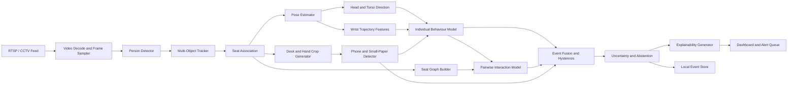
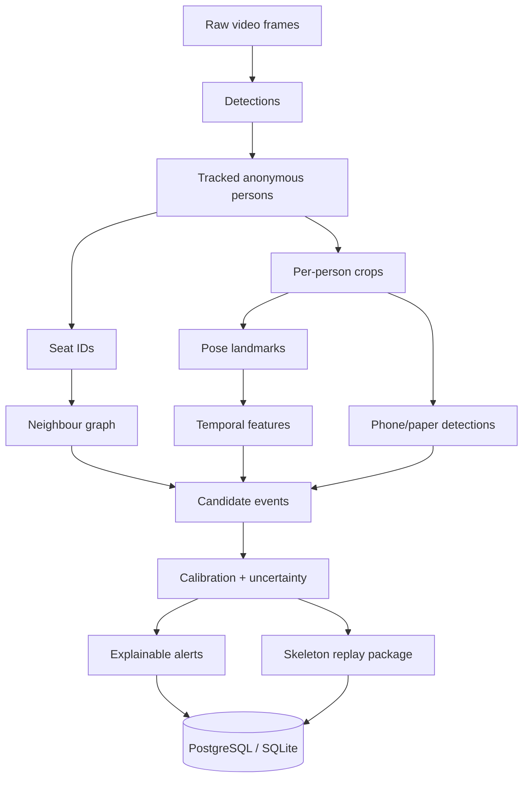
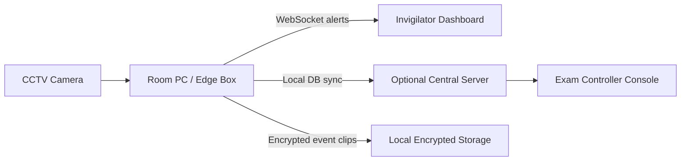
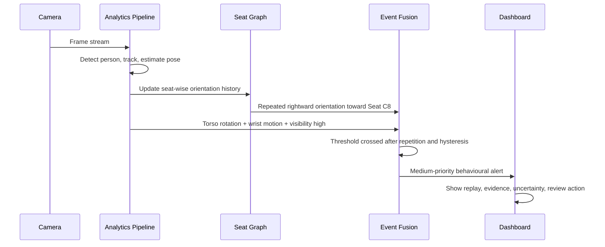

# AI Examination-Hall Behaviour Intelligence System: Market Research, Technical Architecture and Winning Implementation Blueprint

## Executive Recommendation

The best way to win this hackathon is **not** to build another webcam proctoring clone. The strongest commercial products in assessment integrity still describe workflows centred on a **single remote candidate**, webcam, microphone, browser lockdown, screen capture, room scan, and post-exam human review. That pattern is visible across Honorlock, Proctorio, Respondus Monitor, ProctorU and Meazure Learning, Mercer Mettl, Talview, Proctortrack, Inspera, SMOWL, TestWe, DigiProctor, and Eklavvya. By contrast, adjacent CCTV analytics vendors such as Avigilon, Axis, BriefCam, and Irisity offer real-time video analytics and anomaly alerts, but they do not publicly present an exam-specific, **seat-aware, multi-student behavioural intelligence** product for physical examination halls. That is the gap to occupy. citeturn4search1turn4search2turn4search3turn5search0turn5search11turn6search0turn6search1turn6search2turn7search0turn7search1turn7search2turn7search16turn8search1turn8search3turn8search9

The final recommendation is to build a **privacy-first, seat-aware exam-hall assistant** that operates on CCTV video, tracks multiple seated students anonymously, detects interpretable patterns such as repeated side glances, torso rotation toward neighbours, unusual hand activity, and phone or chit appearance, and then produces **review recommendations rather than accusations**. The winning differentiator should be a **Seat-Aware Behaviour Graph**: each student is mapped to an anonymous seat, and alerts are raised only when the system sees temporally meaningful evidence such as repeated orientation toward the same neighbour, reciprocal response, hand movement correlation, or object-passing cues. This is scientifically defensible because group-activity and relation-modelling literature shows that modelling actor relations improves understanding beyond isolated action classification, while modern MOT and crowded-pose datasets explicitly reward identity continuity under occlusion and similar appearance. citeturn21search5turn21search13turn25search5turn25search10turn24search12turn9search3turn26search3

**Final product concept.**  
**Name:** **Invigilens SeatGraph**  
**One-line description:** Anonymous, seat-aware behavioural intelligence for physical examination halls.  
**Tagline:** *See patterns, not faces.*  
**Primary user:** Invigilators, examination controllers, and university administrators.  
**Core problem:** Human invigilation misses subtle, repeated, relational, and short-duration suspicious patterns across many students at once.  
**Key differentiation:** Fixed-seat geometry + multi-person tracking + pose-based temporal behaviour modelling + pairwise interaction reasoning + privacy-preserving evidence replay.  
**Flagship USP:** Seat-Aware Behaviour Graph.  
**Privacy promise:** No facial recognition, no identity matching, anonymous seat IDs by default, skeleton-first review mode, limited raw-video retention.  
**Explainability promise:** Every alert explains what was seen, for how long, how often, in which direction, with what uncertainty, and why the threshold was crossed.  
**Real-time promise:** Hackathon MVP targets one hall stream in real time on a single NVIDIA GPU, with graceful degradation and explicit “insufficient visibility” abstention. The deployment choice is supported by the speed-oriented design of RTMDet and RTMPose, the deployment tooling in MMDeploy, and the available MOT stack around ByteTrack and related trackers. citeturn30search3turn30search19turn30search0turn26search0turn26search2turn26search3

**Mandatory features retained without dilution.**  
The system design below keeps all compulsory requirements in your brief: multi-student detection and tracking, pose landmarks, posture analysis, head-orientation analysis, hand/wrist movement analysis, repeated sideward glance detection, excessive head turning, body rotation toward neighbours, unusual hand behaviour, possible non-verbal communication, phone detection, chit or unauthorized paper detection where feasible, explainable alerts, seat-wise timelines, event logging, privacy-conscious operation, no identity-based accusation, and mandatory human review before disciplinary interpretation. These choices are also aligned with public concern around AI proctoring fairness and privacy, which makes explainability and human review strategically important for judges as well as for real deployment. citeturn28search0turn28search4turn28search15turn28search20turn14search0turn14search1

**Assumptions and scope.**  
This blueprint assumes fixed CCTV cameras, primarily overhead-front or elevated diagonal views, 20–100 students per hall, 720p–1080p streams, mostly seated writing behaviour, modest compute on a local workstation or edge box, and a need for privacy-first operation in India under the Digital Personal Data Protection Act, 2023 and the notified DPDP Rules, 2025. It explicitly excludes fully autonomous disciplinary decisions, lip-reading, biometric identification, and any claim of “confirmed cheating.” It also assumes that fine eye-gaze estimation from far-field CCTV is not dependable enough to be the primary signal; the system should instead rely on **coarse head direction, torso direction, seat geometry, repetition, and relational evidence**. citeturn14search0turn14search1turn23search1turn23search4turn23search10

**Exactly what success looks like for judges.**  
The demo should convincingly show that the system can tell the difference between normal writing, brief harmless glances, repeated suspicious orientation, reciprocal neighbour interaction, and object-related events, while visibly respecting privacy. The judges should leave believing three things: first, this can actually run on ordinary CCTV infrastructure; second, this is more precise and more respectful than generic remote proctoring; and third, you understand the false-positive problem deeply enough to build a deployable assistant rather than an overclaiming detector. That positioning is credible because exam-specific literature still largely uses simpler pipelines or smaller prototypes, while adjacent surveillance products do not publicly expose the seat-aware semantics needed here. citeturn32search2turn32search7turn16search1turn8search1turn8search3turn8search9

## Market Landscape And Novelty

**Commercial market landscape.**  
Publicly visible product evidence strongly suggests that the exam-integrity market is still dominated by remote online proctoring rather than physical hall monitoring. Honorlock advertises live-proctor plus AI, phone detection, browser lock, and ID verification; Proctorio emphasises browser lockdown and AI-enabled review; Respondus Monitor describes webcam recording and flagged events for later review; Mercer Mettl promotes cloud-based online proctoring with facial verification and browser lockdown; Talview promotes automated and live remote proctoring with a second camera and secure browser; Inspera describes remote monitoring with camera, microphone, screen recording, and room scanning; SMOWL, TestWe, DigiProctor, Proctortrack, Examity, and ProctorU similarly frame their solutions around remote assessment. This matters: it means a **multi-person physical hall** assistant is not crowded by identical products. citeturn4search1turn4search2turn4search3turn5search0turn5search6turn5search11turn6search0turn6search1turn6search2turn7search0turn7search1turn7search2

**Competitive matrix.**  
The table below separates true exam products from adjacent CCTV analytics platforms. Where a capability is not clearly stated publicly, it is marked **Not publicly disclosed** rather than guessed.

| Product | Deployment type | Physical hall or remote | Real-time support | Multi-person support | Pose estimation | Head or gaze analysis | Hand analysis | Object detection | Audio | Explainability | Privacy approach | Human review | Public accuracy claim | Independent validation | Main limitations | Source |
|---|---|---|---|---|---|---|---|---|---|---|---|---|---|---|---|---|
| Mercer Mettl | Cloud + browser plugin | Remote | Yes | Single candidate | Not publicly disclosed | Facial verification; detailed gaze not publicly disclosed | Not publicly disclosed | Not publicly disclosed | Not publicly disclosed | Flag-based | Vendor privacy statements; online session only | Yes | Not publicly disclosed | Not found | Remote webcam-first, not hall CCTV | citeturn5search0turn5search6 |
| Honorlock | Cloud + extension | Remote | Yes | Single candidate | Not publicly disclosed | AI video analysis; exact gaze model not public | Not publicly disclosed | Phone detection marketed | Yes | Flags plus live intervention | Uses AI + live review | Yes | Vendor-reported features only | Not found | Chrome/webcam dependent; not seat-wise multi-student | citeturn4search1turn4search9turn28search2 |
| Proctorio | Browser extension | Remote | Yes | Single candidate | Not publicly disclosed | Face detection and looking-away logic, no facial recognition | Not publicly disclosed | Environment and browser controls | Yes | Review centre and logs | Publicly states no facial recognition | Yes | Not publicly disclosed | Not found | Remote workflow, browser-first | citeturn4search2turn27search3turn28search1turn28search12 |
| Respondus Monitor | Browser + webcam | Remote | Near real time + post review | Single candidate | Not publicly disclosed | Webcam-based facial presence/orientation cues | Not publicly disclosed | Not publicly disclosed | Yes | Flagged segments with review | Fairness whitepaper for face detection | Yes | Not publicly disclosed | Fairness study is vendor-authored | Remote webcam-only | citeturn4search3turn27search9turn28search0turn28search4 |
| ProctorU / Meazure | Browser + live services | Remote/hybrid testing | Yes | Single candidate | Not publicly disclosed | Proctor viewing + ID verification | Not publicly disclosed | Not publicly disclosed | Yes | Human-centred reporting | Service-led controls | Yes | Not publicly disclosed | Not found | Focuses on remote workflows and hybrid exam delivery, not hall CCTV semantics | citeturn5search11turn27search1turn27news21 |
| Examity | Remote service, now migrating to ProctorU | Remote | Yes | Single candidate | Not publicly disclosed | Identity/authentication and live monitoring | Not publicly disclosed | Not publicly disclosed | Yes | Reports/auditing | Traditional remote proctoring controls | Yes | Not publicly disclosed | Not found | Legacy platform migration; remote-only emphasis | citeturn5search1turn5search15turn5search17 |
| Talview | Cloud platform + secure browser + app | Remote | Yes | Single candidate | Not publicly disclosed | AI analysis of webcam video; secondary camera support | Not publicly disclosed | General malpractice checks | Yes | Integrity score and review | Accessibility claims and configurable rules | Yes | Vendor-reported | Not found | Remote candidate monitoring, not one-CCTV-many-students | citeturn6search0turn6search3turn6search6turn6search19 |
| Proctortrack | Cloud/service platform | Remote | Yes | Single candidate | Not publicly disclosed | Automation + live proctoring | Not publicly disclosed | Not publicly disclosed | Yes | Reviewable proctoring layer | Remote monitoring controls | Yes | Not publicly disclosed | Not found | Remote only | citeturn6search1turn6search7turn6search10 |
| Inspera Proctoring | Platform module | Remote | Yes | Single candidate | Not publicly disclosed | Camera and room scan, no public seat graph | Not publicly disclosed | Not publicly disclosed | Yes | Live or recorded review | Assessment ecosystem controls | Yes | Not publicly disclosed | Not found | Remote room-scan model, not physical hall CCTV | citeturn6search2 |
| SMOWL | Proctoring software | Remote | Yes | Single candidate | Not publicly disclosed | Behaviour monitoring claimed | Not publicly disclosed | Second camera and environment control referenced | Yes | Evidence generation for decisions | Claims integrity and privacy | Yes | Not publicly disclosed | Not found | Remote supervision orientation | citeturn7search0turn7search3turn27search2 |
| TestWe | Exam platform + remote proctoring | Remote / digital exams | Yes | Single candidate | Not publicly disclosed | Not publicly disclosed | Not publicly disclosed | Not publicly disclosed | Yes | Assisted review | GDPR/CNIL compliance claims | Yes | Not publicly disclosed | Not found | Remote and platform-centric | citeturn7search1turn7search4 |
| DigiProctor | Cloud + AI proctoring | Remote | Yes | Single candidate | Facial analysis advertised | Behaviour detection marketed | Not publicly disclosed | Prohibited-resource checking claimed | Yes | Analytics and reports | Remote privacy/security language | Yes | Vendor-reported | Not found | Remote monitoring focus | citeturn7search2turn7search13 |
| Eklavvya | Online proctoring | Remote | Yes | Single candidate | Facial recognition advertised | Not publicly disclosed | Not publicly disclosed | Not publicly disclosed | Yes | Not publicly disclosed | Remote proctoring data capture | Yes | Not publicly disclosed | Not found | Uses facial recognition; remote orientation | citeturn7search16 |
| Avigilon | AI CCTV analytics | Adjacent physical analytics | Yes | Yes | No public human pose module | Unusual motion / anomaly style analytics | No public hand semantics | Generic threat/object analytics | Not central | Alerts and investigation tools | Security analytics platform | Human operator expected | Not publicly disclosed | Not found | Not exam-specific, no seat semantics | citeturn8search1turn8search5 |
| Axis Object Analytics | Edge camera analytics | Adjacent physical analytics | Yes, edge | Yes | No | No | No | Human/vehicle detection and counting | No | Rule-trigger explainability | Edge processing | Human operator expected | Not publicly disclosed | Not found | Humans need upright movement; limited seated exam semantics | citeturn8search3turn8search20 |
| BriefCam | Video analytics/search | Adjacent physical analytics | Yes | Yes | No public pose layer | No public gaze layer | No public hand layer | Strong object search/classification | No public exam audio workflow | Strong forensic explainability | Surveillance review platform | Human review oriented | Not publicly disclosed | Not found | Not seat-aware or exam-specific | citeturn8search0turn8search4turn8search17 |
| Irisity | AI video analytics platform | Adjacent physical analytics | Yes | Yes | No public pose layer | Behaviours of interest at surveillance level | No public hand layer | Person/object/behaviour analytics | Not central | Real-time alerts | Security monitoring platform | Human review expected | Not publicly disclosed | Not found | Domain-generic, not exam-specific | citeturn8search2turn8search9 |

**Ten biggest unmet product gaps.**  
The public market evidence points to the following gaps: one-camera monitoring of many students; robust distant-CCTV head direction; seat-wise anonymous tracking; crowded seated pose extraction; pairwise interaction reasoning; explicit false-positive suppression for normal exam behaviour; skeleton-only privacy mode; hall-specific geometry calibration; edge/offline operation during network failure; and detailed, behaviour-specific explanations beyond generic “flagged event” workflows. These gaps are not minor. They sit exactly between remote proctoring and generic surveillance analytics, which is why a well-scoped hackathon system can look both useful and differentiated. citeturn4search1turn4search2turn4search3turn6search2turn8search1turn8search3turn8search9

**Academic literature synthesis.**  
Recent exam-hall and classroom papers confirm that the problem is feasible but not solved. Exam-specific work exists, including surveillance-exam suspicious activity recognition and newer cheating-recognition papers, but much of it still relies on simpler YOLO-style person detection, head-turn cues, or monolithic cheating classifiers rather than the combination of pose, tracking, relation reasoning, uncertainty, and privacy-aware evidence needed for a defensible deployment. Classroom behaviour work shows that skeleton and person-detection pipelines can recognise student states, but crowding, occlusion, and far-field resolution remain difficult. The key implication is that your system should use the literature as a **module library**, not as a template to copy end-to-end. citeturn32search2turn32search7turn32search0turn17search2turn17search8turn16search2

**Representative paper matrix.**  
The dossier is grounded in more than thirty relevant papers and official repositories; the table below highlights the most decision-critical ones.

| Paper | Year | Venue | Task | Dataset | Method | Reported result | Real-time status | Open-source | Direct relevance | Main limitation | How it helps here |
|---|---|---|---|---|---|---|---|---|---|---|---|
| RTMDet | 2022 | arXiv / OpenMMLab technical report | Real-time detection | COCO | Efficient single-stage detector | 52.8 AP COCO, 300+ FPS on 3090 | Yes | Yes | Strong | Generic object set | Hall person/object detector backbone citeturn30search3 |
| RTMPose | 2023 | arXiv / MMPose | Real-time multi-person pose | COCO | Top-down real-time pose | RTMPose-m 75.8 AP, 90+ FPS on Intel CPU for cited setting | Yes | Yes | Strong | Benchmark setting differs from hall CCTV | Practical pose backbone citeturn30search19 |
| RTMO | 2024 | arXiv | One-stage real-time pose | COCO | YOLO-style one-stage pose | Competitive speed/accuracy | Yes | Yes | Medium | One-class and newer pipeline risk | Potential future simplification citeturn31search0turn31search12 |
| ViTPose / ViTPose++ | 2022–2023 | NeurIPS / TPAMI | Generic pose | COCO, OCHuman, WholeBody | Vision transformer pose | Strong SOTA-style accuracy | Usually slower | Yes | Medium | Heavier for hackathon | Accuracy upper bound baseline citeturn34search1turn34search9 |
| DWPose | 2023 | ICCV workshop | Whole-body pose | WholeBody-style tasks | Distillation-based whole-body pose | Strong practical whole-body quality | Practical | Yes | Medium | Research repo more generation-adjacent in adoption | Whole-body alternative for hands/head citeturn34search0 |
| ByteTrack | 2022 | ECCV | MOT | MOT benchmarks | Associate every detection box including low-score | Strong MOT baseline | Yes | Yes | Strong | Can still switch IDs in similar uniforms | Best hackathon tracker baseline citeturn26search0 |
| BoT-SORT | 2022 | arXiv / GitHub | MOT | MOT benchmarks | Motion + appearance + camera compensation | Strong published SOTA-style tracking | Yes | Yes | Strong | More tuning complexity | Backup tracker with ReID benefits citeturn26search2 |
| Deep-OC-SORT | 2023 | GitHub / arXiv companion | MOT | MOT17, MOT20, DanceTrack | OC-SORT + deep appearance | Improved HOTA and DanceTrack over OC-SORT | Yes | Yes | Strong | Heavier integration | Best for similar appearance + occlusion recovery citeturn26search3 |
| DanceTrack | 2022 | CVPR | Tracking benchmark | DanceTrack | Uniform-appearance MOT benchmark | Large tracker drop vs MOTChallenge | Dataset, not method | Yes | Strong | Dancers are not seated students | Proxy for uniforms + motion swaps citeturn9search3turn9search15 |
| PoseTrack21 | 2022 | CVPR | Pose tracking + MOT | PoseTrack21 | Joint pose/MOT benchmark | Rich IDs and occlusion labels | Benchmark | Yes | Strong | Not exam-hall domain | Best public benchmark for pose tracking robustness citeturn24search12 |
| CrowdPose | 2019 | CVPR | Crowded pose | CrowdPose | Crowded pose benchmark | 20k images, 80k persons | Benchmark | Yes | Strong | Still image benchmark | Crowding benchmark for seated halls citeturn24search13 |
| OCHuman | 2018/2020 extensions | CVPR/TBD ecosystem | Occluded pose | OCHuman | Heavy occlusion benchmark | 13,360 instances in 5,081 images in official repo summary | Benchmark | Yes | Strong | No hall domain | Occlusion stress test citeturn24search3 |
| 6DRepNet | 2022 | ICIP / arXiv | Head pose | AFLW2000, BIWI | 6D rotation regression | Up to 20% better than prior art on cited datasets | Real-time capable | Yes | Strong | Head-pose benchmark comparability issues remain | Face-based yaw/pitch when head box visible citeturn23search4turn23search10 |
| L2CS-Net | 2022/2023 | arXiv / IEEE Access | Gaze estimation | MPIIGaze, Gaze360 | Fine-grained gaze CNN | 3.92° MPIIGaze, 10.41° Gaze360 | Practical | Yes | Medium | Far-field hall reliability unclear | Useful only as optional coarse cue when face size sufficient citeturn23search1 |
| WHENet | 2020 | BMVC | Wide-range head pose | BIWI, AFLW2000 | Real-time full yaw head pose | Strong low error and compact model | Yes | Yes | Medium | Older baseline | Lightweight head-pose fallback citeturn23search2turn23search15 |
| PoseC3D | 2021 | arXiv / MMAction2 | Skeleton action recognition | NTU, FineGYM etc. | 3D heatmap stack | More robust to pose noise than many GCNs | Often offline-ish but practical | Yes | Strong | Heavier than simple TCN | Strong robustness baseline for suspicious behaviour sequences citeturn12search0turn12search8 |
| CTR-GCN | 2021 | ICCV | Skeleton action recognition | NTU, NW-UCLA | Channel-wise topology refinement GCN | Strong SOTA on benchmark sets | Practical | Yes | Strong | Graph tuning overhead | Strong skeleton baseline for individual actions citeturn11search4turn11search12 |
| MS-G3D | 2020 | CVPR | Skeleton action recognition | NTU etc. | Multi-scale graph 3D conv | Strong benchmark results | Practical | Yes | Medium | Older | Baseline for temporal skeleton modelling citeturn11search14 |
| Actor-Transformers | 2020 | CVPR | Group activity recognition | Volleyball, Collective | Transformer over actors | Improves actor relation modelling | Practical research | Code promised in paper | Strong | Not designed for exam layouts | Prior art for seat-graph reasoning citeturn21search5turn25search10 |
| Hunting Group Clues with Transformers | 2022 | ECCV workshop | Group activity | GAR benchmarks | Transformer for social group clues | Better relation modelling | Research | Yes/public paper | Strong | Group-activity benchmark mismatch | Supports relational reasoning claim citeturn21search13turn21search25 |
| Skeleton-OOD | 2025 | Neural Networks | OOD for skeleton action | NTU, Kinetics | End-to-end OOD detection | Better skeleton OOD detection than prior methods | Practical research | Code reported | Strong | Newer, not yet standard in production | Enables abstention instead of overconfident alerts citeturn22search0 |
| Detection calibration | 2022 / 2024 tooling | Springer / GitHub | Confidence calibration | COCO, Cityscapes | Multivariate calibration for detection | Detects and improves detector miscalibration | Post-processing | Yes | Strong | Must be revalidated on hall data | Crucial for alert thresholds citeturn22search1turn22search7 |
| Student behaviour recognition in classrooms | 2021 | Sensors | Classroom student states | Custom classroom data | Person detection + skeletons + DNN | Demonstrates feasibility | Yes | Paper only | Medium | Classroom engagement, not malpractice | Useful hard-negative taxonomy source citeturn17search2 |
| Surveillance cheating detection in exams | 2022 | Journal article | Exam-hall suspicious activity | Exam surveillance videos | Deep CNN suspicious activity classifier | Real-time surveillance-exam prototype | Prototype | Not clearly open | Strong | Limited semantics/explainability | Confirms problem relevance, not final architecture citeturn32search2 |

**Open-source landscape and hackathon realism.**  
For a 48–72 hour build, the most realistic repository family is the OpenMMLab stack plus a proven tracker: MMDetection or RTMDet for detection, MMPose for pose, MMDeploy for export, and either ByteTrack or Deep-OC-SORT for tracking. OpenMMLab is Apache-2.0 oriented, supports deployment to ONNX, TensorRT, and OpenVINO through MMDeploy, and is actively used for inference demos and model-zoo workflows. Ultralytics is very convenient but its AGPL/commercial licensing path is less convenient if you later want to productise or pitch to institutions. OpenPifPaf is technically interesting and commercially licensable, but it is less hackathon-friendly than MMPose if your team already works in PyTorch detector-first pipelines. citeturn30search0turn30search4turn30search12turn30search1turn13search7turn13search20turn26search0turn26search3turn31search2turn31search9

**Repository short-list.**  
The table below emphasises practicality over exhaustiveness.

| Repository | Associated paper/tool | License | Weights | Training code | Inference code | Export support | Edge potential | Hackathon realism | Main risk | Source |
|---|---|---|---|---|---|---|---|---|---|---|
| open-mmlab/mmdetection | RTMDet and detector zoo | Apache-2.0 | Yes | Yes | Yes | ONNX/TensorRT via MMDeploy | Good | High | Setup complexity if team new to OpenMMLab | citeturn13search3turn30search12 |
| open-mmlab/mmpose | RTMPose, RTMO, RTMW and pose zoo | Apache-2.0 | Yes | Yes | Yes | MMDeploy support | Good | High | Whole-body variants need careful selection | citeturn30search1turn31search1turn31search13 |
| open-mmlab/mmaction2 | PoseC3D and video models | Apache-2.0 | Yes | Yes | Yes | MMDeploy support | Moderate | Medium | Heavier configs and longer training | citeturn12search1turn30search0 |
| open-mmlab/mmdeploy | Deployment | Apache-2.0 | N/A | N/A | Yes | ONNX, TensorRT, OpenVINO, more | Strong | High | Export quirks per model | citeturn30search0turn30search4 |
| FoundationVision/ByteTrack | ByteTrack | MIT-style repo license context | Yes | Yes | Yes | Detector-dependent | Good | High | ID switches in visually similar students | citeturn26search0 |
| NirAharon/BoT-SORT | BoT-SORT | MIT | Partial | Yes | Yes | Detector-dependent | Moderate | Medium | More moving parts, ReID tuning | citeturn26search2turn26search6 |
| GerardMaggiolino/Deep-OC-SORT | Deep-OC-SORT | MIT | Partial | Yes | Yes | Detector-dependent | Moderate | Medium | Install burden | citeturn26search3turn26search11 |
| kennymckormick/pyskl | Skeleton action toolbox | Apache-2.0 | Yes | Yes | Yes | Limited deployment story | Moderate | Medium | Not actively maintained by original developer | citeturn12search4turn26search4 |
| ViTAE-Transformer/ViTPose | ViTPose | Apache-2.0 | Yes | Yes | Yes | Via MMPose ecosystem | Moderate | Medium | Heavier inference | citeturn34search1 |
| IDEA-Research/DWPose | DWPose | Official repo; downstream Apache uses exist | Yes | Yes | Yes | Community TensorRT variants exist | Moderate | Medium | Repo ecosystem fragmented | citeturn34search0turn34search16 |
| thohemp/6DRepNet | 6DRepNet | MIT | Yes | Yes | Yes | ONNX conversion practical | Good | High | Face crop quality gate needed | citeturn23search0 |
| ahmednull/L2CS-Net | L2CS-Net | Open-source repo | Yes | Yes | Yes | ONNX practical | Moderate | Medium | Fine gaze less reliable at hall distance | citeturn23search14 |
| openpifpaf/openpifpaf | OpenPifPaf | Open-source + commercial route | Yes | Yes | Yes | Some deployment paths | Good | Medium | Different stack, commercial terms separate | citeturn31search2turn31search9 |

**Patent and novelty review.**  
I searched public prior art using exam-proctoring patent terms and surveillance-cheating terms. Relevant remote-proctoring prior art includes **US9154748B2** and **EP1987505A2**, both describing remote monitoring and improper-behaviour detection in exams, and **KR101765770B1**, which describes image-processing-based cheating detection for online tests. On the adjacent-surveillance side, generic intelligent video surveillance patents already cover real-time analytics and training-database approaches. This means that any claim that “AI proctoring” or “behaviour detection” itself is novel would be indefensible. citeturn29search1turn29search17turn15search1turn29search5

What *does* still look differentiated is the **combination** of fixed seat geometry, anonymous seat IDs, multi-person pose tracking, interaction-graph reasoning, uncertainty-aware abstention, and privacy-preserving skeletal evidence replay for **physical exam halls**. I did **not** find public evidence that this exact combination is commercially standard in exam monitoring; the closest prior art comes from remote proctoring systems, surveillance-exam papers, and group-activity relation models. That should be described as an **apparently novel combination**, not a guaranteed patentable invention. citeturn29search1turn29search17turn32search2turn32search7turn21search5turn25search10

**USP candidate ranking.**  
The candidate USPs below are scored against your requested weighting. Scores are recommendation scores, not empirical measurements.

| USP | Problem solved | Closest prior art | Novelty classification | Accuracy impact | False-positive impact | Privacy impact | Demo wow factor | Technical difficulty | Time required | Compute cost | Main risk | Weighted decision |
|---|---|---|---|---|---|---|---|---|---|---|---|---|
| Seat-Aware Behaviour Graph | Distinguishes isolated glance from repeated neighbour interaction | Actor-relation and group-activity models; exam papers without seat graph | Apparently novel combination | High | High | Neutral-positive | Very high | Medium-high | Medium | Moderate | Requires clean seat mapping and track continuity | **Flagship** |
| Personal Normal-Behaviour Calibration | Reduces one-threshold-fits-all false alarms | Scene-adaptive anomaly detection and unusual-motion systems | Implemented in adjacent domains | Medium-high | Very high | Neutral | High | Medium | Medium | Low | Baseline drift if early minutes include suspicious acts | **Secondary** |
| Privacy-Preserving Skeletal Evidence Replay | Reviewability without identity exposure | Pose demos + event review systems | Apparently novel combination | Indirect | Medium | Very high | High | Medium | Medium | Low | Judges may ask for RGB evidence too | Strong |
| Counterfactual Alert Explanation | Makes thresholds legible | XAI, review centres | Potentially novel but insufficient evidence | Medium | Medium | Neutral | High | Medium | Medium | Low | Needs careful language design | Strong |
| Seat-Anchored Occlusion Recovery | Limits ID switches in seated crowding | MOT + seat constraints | Implemented only in research-adjacent form | High | Medium | Neutral | Medium | Medium-high | Medium | Low | Hard if seats are not fixed | Strong |
| Uncertainty-Aware Abstention | Prevents forced wrong decisions | Skeleton-OOD and calibration literature | Implemented in research | Medium | High | Positive | High | Medium | Medium | Low | Requires calibrated confidence | **Low-risk fallback** |
| Exam-Hall Digital Twin | Makes thresholds camera- and seat-aware | Calibration/homography in surveillance | Implemented in adjacent domains | Medium-high | High | Neutral | High | Medium | Medium | Low | Manual setup overhead | Strong |
| Interaction Chain Detection | Looks for sequences instead of isolated actions | Temporal GAR / event reasoning | Implemented only in research adjacent domains | High | Very high | Neutral | Very high | High | High | Moderate-high | Needs more annotated data | Stretch |

**Why these three should be chosen.**  
The **flagship USP** should be **Seat-Aware Behaviour Graph** because it is the clearest differentiation from webcam proctoring and generic CCTV analytics, and it directly improves both precision and demo impact. The **secondary USP** should be **Personal Normal-Behaviour Calibration** because false positives are the biggest practical risk in deployment, and personalised baselines are a strong response to the fairness critique of one-threshold-fits-all monitoring. The **fallback USP** should be **Uncertainty-Aware Abstention** because it is scientifically grounded, easier to implement than full interaction chains, and lets the system say “visibility insufficient” rather than producing brittle or unfair alerts. citeturn8search5turn22search0turn22search1turn22search7turn21search5turn25search10

**Three proven add-on ideas.**  
These are deliberately chosen because they are already implemented or scientifically demonstrated and directly strengthen this project.

| Feature name | What it does | Existing implementation | Why directly relevant | Integration into our pipeline | Required models | Required data | Expected benefit | Compute cost | Feasibility | Limitations | Demo method | Citation |
|---|---|---|---|---|---|---|---|---|---|---|---|---|
| Surveillance-view phone-use detection | Detects phones and face-phone interaction from surveillance-like imagery | FPI-Det dataset and recent phone-use detection research | Phones are a real exam threat and appear in Indian cheating incidents | Second-stage detector on hand/desk crops + temporal object aggregation | RTMDet-s or RT-DETR-R18 fine-tuned | Open Images phone class + FPI-Det + custom exam data | High phone-recall uplift; better object evidence reduces behavioural false positives | Moderate | High | Small-object range limits | Show normal writing vs phone reveal | citeturn20search10turn20search18turn20search12turn32news42 |
| Relation-aware interaction modelling | Models pairwise or group cues rather than isolated actions | Actor-Transformers, relation-graph GAR papers | Cheating in halls is often relational, not purely individual | Build a seat graph over tracks and feed head/torso/hand event tokens | Lightweight graph transformer or GNN | Custom interaction annotations + GAR pretraining ideas | Better reciprocal-glance and object-passing detection; stronger false-positive suppression | Moderate | Medium | Needs seat-aware annotations | Show two students triggering reciprocal alert | citeturn21search5turn21search13turn25search5turn25search10 |
| Uncertainty-aware abstention and calibration | Flags “insufficient visibility” instead of overconfident classification | Skeleton-OOD and detection-calibration work | Exam halls have occlusion, glare, and low-light failure modes | Confidence head + visibility score + abstention thresholds after event fusion | Skeleton-OOD-style head, temperature scaling, calibration layer | Validation split with hard occlusion/lighting slices | Medium accuracy gain, large trust gain, lower false-alert rate | Low | High | Needs careful threshold tuning | Show occlusion clip producing uncertain review card | citeturn22search0turn22search1turn22search7 |

## Research Synthesis And Model Choices

**Behaviour taxonomy.**  
The system needs a formal taxonomy because judges and future administrators will distrust a black-box “cheating score.” The hierarchy below is designed around **observables**, not intent.

| Behaviour class | Observable signals | Required keypoints / cues | Temporal window | Confounding normal behaviour | Detection method | Confidence rule | Alert severity | Explanation template | Recommended human response |
|---|---|---|---|---|---|---|---|---|---|
| Writing | Downward head, repetitive dominant-hand desk motion | Head, shoulders, elbows, wrists | 2–10 s | Reading, note turning | Rule + baseline | Stable, repetitive, desk-localised | None | “Writing-like activity observed.” | None |
| Reading | Lower motion, downward head, small page-hand motion | Head, wrists | 2–10 s | Thinking while looking down | Rule | High visibility + low motion | None | “Reading-like posture observed.” | None |
| Thinking | Brief upward/side glance, still torso | Head, shoulders | <2 s | Suspicious glance | Rule + duration suppression | Short duration only | None | “Brief attention shift within normal range.” | None |
| Brief posture adjustment | Torso shift, shoulder rise, short hand reposition | Shoulders, hips, wrists | <3 s | Excessive rotation | Rule + cooldown | No repetition | None | “Short posture adjustment suppressed.” | None |
| Stretching | Bilateral arm extension, large vertical motion | Shoulders, elbows, wrists | 1–5 s | Signalling | Pose-shape rule | Symmetric, not directed to neighbour | Silent log | “Stretch-like motion suppressed as normal.” | None |
| Repeated sideward glances | Repeated left/right head yaw toward same side | Head pose or body-orientation proxy | 20–60 s | Clock glance, invigilator look | Temporal repetition + seat direction | ≥N glances with dwell threshold and neighbour direction | Low to medium | “Repeated leftward head turns toward neighbouring seat.” | Review short replay |
| Prolonged sideward orientation | Sustained left/right head or torso orientation | Head + torso | >1.5–2 s, repeated | Looking at invigilator | Duration + neighbour consistency | Sustained and repeated | Medium | “Prolonged orientation exceeded normal range.” | Review |
| Excessive torso rotation | Chest/shoulder axis rotates toward neighbour | Shoulders, hips, seat geometry | 1–5 s | Stretching, picking object | Geometry-aware rule | Torso + head corroborate | Medium | “Torso rotated toward adjacent seat with head alignment.” | Review |
| Unusual under-desk hand movement | Hand disappears below desk with unusual motion burst | Wrists, elbows, desk ROI | 1–5 s | Dropping stationery | Trajectory + desk occlusion logic | Repetition or object cue needed | Low to medium | “Repeated under-desk hand movement observed.” | Review if repeated |
| Phone use | Phone object appears; hand-to-phone interaction | Object box + wrist trajectory | 0.5–5 s | Allowed calculator if policy permits | Detector + HOI fusion | Object confidence + persistent hand proximity | High review request | “Object candidate consistent with mobile phone detected.” | Immediate invigilator review |
| Chit / unauthorized paper | Small paper appears apart from authorised answer sheet | Object box + hand proximity + page count context | 0.5–5 s | Turning answer sheets | Detector + crop refinement + contextual rule | Needs object evidence + hand interaction | Medium to high | “Small paper candidate detected near hand.” | Review |
| Repeated signalling gesture | Repeated non-writing hand gesture toward neighbour | Wrists, elbows, torso, pairwise relation | 5–30 s | Stretching, asking invigilator | Temporal gesture model + seat graph | Repetition and neighbour direction required | Medium | “Repeated hand gesture directed toward neighbouring seat.” | Review |
| Reciprocal glances | A looks at B, B responds within short interval | Pairwise head directions + seat graph | 10–60 s | Group disturbance | Graph event logic | Bidirectional temporal relation | Medium to high | “Reciprocal orientation pattern observed between seats.” | Review both seats |
| Object passing / receiving | Hand extends across boundary and object changes seat ownership | Wrists, inter-seat boundary, object track | 1–5 s | Borrowing allowed stationery | Graph + object transition logic | Needs spatial crossing + object evidence | High review request | “Cross-seat hand interaction with possible object transfer.” | Immediate review |
| Unobservable / uncertain | Missing keypoints, low light, head too small, occlusion | Visibility score | Any | N/A | Abstention | Below visibility threshold | Advisory | “Insufficient visibility for reliable interpretation.” | Human-only review |

**Practical distinction between gaze, head pose, body orientation, gaze target, and direction of attention.**  
Eye gaze is the actual visual axis of the eyes. Head pose is the 3D orientation of the head. Body orientation refers to torso alignment. Gaze target asks *what object or person* the subject is looking at, often requiring scene reasoning. Apparent direction of attention is the coarse estimate a human observer might infer from head and body cues. In far-field exam CCTV, **fine eye gaze is usually the least reliable of these**, because public gaze benchmarks such as Gaze360 and L2CS-Net do not establish dependable accuracy for tiny, partially occluded, hall-distance faces, and even head-pose benchmarking suffers from dataset-processing comparability issues highlighted by HeadPose+. Therefore, the recommended operational target is **left / centre / right / backward coarse direction with uncertainty**, not “precise eye gaze.” citeturn10search6turn23search1turn23search4turn23search10

**Recommended model stack.**  
The winning stack is **hybrid**, not monolithic. Use pretrained foundations where the public ecosystem is strong, then fine-tune only the modules that are genuinely exam-specific. The following model-selection table is the decisive recommendation.

| Component | Selected model | Alternatives | Accuracy reason | Speed reason | License | Training required | Deployment format | Main limitation |
|---|---|---|---|---|---|---|---|---|
| Person detection | RTMDet-s or RTMDet-m | YOLO11s, RT-DETR-R18 | Strong real-time detector family with good small-object performance and OpenMMLab ecosystem | Designed for high FPS | Apache-2.0 ecosystem | Fine-tune on hall data recommended | ONNX / TensorRT / OpenVINO via MMDeploy | Needs exam-specific small-person tuning citeturn30search3turn13search7turn30search0 |
| Phone/paper detector | RTMDet-s second stage on crops | RT-DETR-R18, Faster R-CNN for offline eval | Better control over custom classes and crop-level training | Crop inference is efficient | Apache-2.0 ecosystem | Yes, custom fine-tuning essential | ONNX / TensorRT | Chit class extremely data-hungry and context-sensitive citeturn30search3turn20search18 |
| Pose estimation | RTMPose-m whole-body variant for MVP; RTMW-m for enhanced version | ViTPose, DWPose, MoveNet, MediaPipe | RTMPose balances accuracy and deployment; RTMW is stronger on whole-body accuracy | RTMPose is more hackathon-friendly than heavier transformers | Apache-2.0 ecosystem | Domain adaptation optional but valuable | ONNX / TensorRT / OpenVINO | Wrist and face detail still weak at long distance citeturn30search19turn31search4turn34search1turn34search2turn34search3 |
| Tracking | ByteTrack for MVP; Deep-OC-SORT for competition version | BoT-SORT, OC-SORT | ByteTrack is robust and simple; Deep-OC-SORT better under similar appearance and occlusion | Both practical in real time | MIT-style / MIT | No retraining for baseline | Python / detector-coupled | Identity switches remain possible without seat constraints citeturn26search0turn26search3 |
| Seat association | Homography + fixed seat polygons | Manual ROI only | Geometry improves track continuity and explanation quality | Very low compute | Our logic | No | Pure Python/OpenCV | Requires hall setup | 
| Head orientation | Hybrid: 6DRepNet when head box quality sufficient; torso-orientation fallback always | WHENet, L2CS-Net | 6DRepNet strong head-pose baseline; torso fallback handles far-field cases | Only run face-based model when needed | MIT / open-source | Optional light domain tuning | ONNX practical | Face crop often too small in CCTV citeturn23search0turn23search2turn23search4 |
| Hand / wrist analysis | Rule-based trajectories over pose landmarks for MVP | Dedicated hand keypoint model, MediaPipe Hands on crops | Wrist tracks are sufficient for writing vs signalling vs under-desk movement | Very cheap | OpenMMLab / Google options | No for MVP | Native / ONNX | Fine finger gestures often not visible citeturn34search3turn34search7 |
| Individual behaviour model | Lightweight TCN over engineered pose and orientation features | GRU/LSTM, CTR-GCN, PoseC3D | TCN is easy to train and explain under low-data conditions | Fastest practical temporal learner | Our code | Yes | ONNX optional | Less expressive than full graph models |
| Pairwise behaviour model | Seat-graph transformer or small GNN | Actor-Transformers-style relation model | Best match to relational misconduct patterns | Moderate if seat graph small | Our code | Yes | PyTorch / ONNX optional | Needs custom annotations citeturn21search5turn21search13 |
| Unknown / uncertain behaviour | OOD head + calibrated confidence | Raw softmax only | Scientifically justified abstention improves trust | Low extra cost | Our code | Validation-stage fitting | Native | Requires held-out OOD slices citeturn22search0turn22search1turn22search7 |
| Event fusion | Hybrid rules + learned temporal scores + hysteresis | Fixed thresholds only, end-to-end cheating classifier | Most explainable and strongest under low-data imbalance | Low overhead | Our code | Yes, limited | Native | Needs careful validation |

**Why this architecture, and not a single end-to-end classifier.**  
A direct “cheating / not cheating” classifier is a bad choice for this problem. Public exam papers that report single-number cheating classification often do not provide the behavioural transparency, uncertainty handling, or seat-level relational reasoning needed for a defensible hall deployment. A modular stack lets you localise the failure: person detection can fail without corrupting the privacy model; head-pose reliability can be gated by head-box size; the object detector can explicitly say “phone confidence low”; the relational model can require repeated evidence; and the event fusion layer can abstain when visibility is poor. That is much more aligned with human review and with the documented fairness/privacy concerns around AI proctoring. citeturn32search2turn32search7turn28search0turn28search20

**Feature provenance matrix.**

| Feature | Mandatory / Proven / Novel / Future | Source of inspiration | Existing prior art | Our modification | Why included | Hackathon status |
|---|---|---|---|---|---|---|
| Multi-person hall monitoring | Mandatory | Surveillance exam papers + CCTV analytics | Exam-hall prototypes, generic IVA | Seat-aware hall semantics | Core requirement | MVP |
| Seat association | Mandatory for reliability | Camera calibration / surveillance ROI practice | Adjacent domain | Explicit seat IDs and polygons | Needed for explanation and relational logic | MVP |
| Pose landmarks | Mandatory | MMPose / RTMPose | Standard CV module | Hall-adapted crop strategy | Needed for privacy-first behaviour cues | MVP |
| Head-turn detection | Mandatory | Head-pose literature | Standard HPE methods | Coarse left-centre-right + uncertainty | Reliable at CCTV scale | MVP |
| Torso rotation detection | Mandatory | Pose-based action works | Standard pose features | Geometry aware toward specific neighbour seat | Stronger than head only | MVP |
| Phone detection | Mandatory | FPI-Det and CCTV phone-use papers | Implemented | Small-object crop detector with temporal aggregation | High-value alert type | MVP |
| Chit detection | Mandatory where feasible | Exam papers, document/object detection | Research prototype only | Small-paper context model + policy config | High demo value | MVP stretch |
| Seat-Aware Behaviour Graph | Novel | GAR relation models | Not found as standard exam product | Anonymous seat graph with interaction edges | Flagship differentiator | MVP-lite / Enhanced |
| Personal calibration | Novel / proven-adjacent | Unusual motion and adaptive baselines | Adjacent surveillance | Per-seat neutral baseline in first minutes | Lowers false positives | Enhanced |
| Skeletal evidence replay | Novel / privacy-driven | Event review systems + pose demos | Adjacent only | Blur/minimise RGB, replay skeletons | Privacy and demo wow | MVP |
| Uncertainty-aware abstention | Proven | Skeleton-OOD + calibration | Research demonstrated | Visibility-aware review cards | Trust and fairness | Enhanced |
| Full pairwise interaction chains | Future / stretch | GAR and temporal reasoning | Research only | Seat-specific cheating chains | High precision but more data | Future |
| Facial recognition | Intentionally excluded | N/A | Common elsewhere | Excluded entirely | Privacy, fairness, compliance strategy | Not built |

## Data, Training And Evaluation

**Dataset landscape.**  
No single public dataset is sufficient for this project. COCO and COCO-WholeBody help generic person and keypoint learning; CrowdPose, OCHuman, and PoseTrack21 help crowding and occlusion; DanceTrack stresses similar-appearance tracking; Gaze360, BIWI, and 300W-LP help head/gaze modules; NTU RGB+D and PKU-MMD help temporal skeleton modelling; FPI-Det and phone-use datasets help phone interaction; ExDark and VisDrone help low-light and small-object robustness. But there is still a clear domain gap: public datasets do **not** capture fixed-seat physical exam halls with labelled suspicious relational behaviours and privacy-preserving seat annotations. That means a custom dataset is not optional if you want to make strong claims. citeturn24search10turn24search13turn24search3turn24search12turn9search3turn10search6turn10search0turn10search1turn18search0turn18search1turn20search18turn19search0turn19search1

**Dataset stack and legal usability.**

| Dataset | Module supported | License / availability | Domain match | Main gap | Usage plan |
|---|---|---|---|---|---|
| COCO keypoints | Person and body pose pretraining | Widely available research benchmark | Low-medium | Not seated exam halls | Base pose pretraining citeturn24search6 |
| COCO-WholeBody | Hands/face/body whole-body landmarks | Research use; commercial use of annotations requires care | Medium | Not crowded halls; non-commercial annotation terms | Whole-body pretraining only, not production redistribution citeturn24search2turn24search10 |
| CrowdPose | Crowded pose | Public benchmark | Medium-high | Still images, not seated exams | Crowding robustness validation citeturn24search13 |
| OCHuman | Occlusion robustness | Public benchmark, license details not clearly surfaced in this pass | High for occlusion | Still images; licensing clarity needed | Validation only until license clarified citeturn24search3turn24search19 |
| PoseTrack21 | Pose tracking + IDs | Public benchmark | High for tracking | Not exam seating geometry | Joint pose/MOT evaluation citeturn24search12 |
| DanceTrack | Similar-appearance MOT | Public benchmark | High for similar appearance | Motion differs from seated halls | Tracker stress test citeturn9search3 |
| BIWI | Head pose | Public academic dataset | Medium | Near-field head boxes | Face-based HPE sanity baseline citeturn10search0 |
| 300W-LP | Head pose pretraining | Public benchmark | Medium | Synthetic profiling bias | HPE pretraining only citeturn10search1 |
| Gaze360 | Gaze | Public academic dataset | Medium | Not far-field hall CCTV | Optional coarse direction head/gaze experiments citeturn10search6 |
| VideoAttentionTarget | Gaze target reasoning | Public academic dataset | Medium | Everyday scenes, not exam halls | Inspiration for seat-target mapping only citeturn10search3turn10search7 |
| NTU RGB+D 60 / 120 | Temporal skeleton action | Public academic dataset | Medium | Actions not exam-specific | Pretrain temporal encoders citeturn18search0turn18search8 |
| PKU-MMD | Continuous action detection | Public academic dataset | Medium | No exam behaviours | Temporal detection baseline ideas citeturn18search1turn18search5 |
| FPI-Det | Phone-use detection | Open repo surfaced | High | Still not exam-specific | Fine-tune phone-use branch citeturn20search18turn20search10 |
| Open Images | Generic object classes incl. phone | Apache-2.0 repo / image licensing context via dataset | Medium | No exam interaction context | Generic phone/paper negative sampling citeturn18search2turn18search6turn18search14 |
| Objects365 | Detector pretraining | Public benchmark | Medium | No exam semantics | Better detector pretraining for small objects citeturn18search3turn18search19 |
| ExDark | Low-light object robustness | Official public dataset | Medium | Only 12 object classes | Low-light augmentation sanity set citeturn19search0turn19search14 |
| VisDrone | Small objects / crowded scenes | Public benchmark | Medium | Overhead drone geometry, not halls | Small-object detector stress test citeturn19search1turn19search12 |
| SCB / classroom behaviour datasets | Classroom hard negatives | Public research data, licensing varies | Medium | Engagement vs malpractice mismatch | Hard-negative mining and taxonomy building citeturn17search0turn17search3 |

**Custom dataset creation plan.**  
For this project, the custom dataset is the strategic asset. The recording protocol should include at least **3 halls**, **4 camera positions per hall**, **6–10 sessions per hall**, and roughly **25–50 participants** across multiple days, with variations in lighting, seat density, clothing, and occlusion. Record both **normal-behaviour sessions** and **scripted suspicious-behaviour sessions**. At minimum, script brief glance, repeated glance, prolonged glance, body rotation, phone reveal, phone checking below desk, chit reading, chit passing, object passing, reciprocal head turns, asking invigilator, stretching, looking at the clock, dropping stationery, posture adjustment, and deliberate occlusion events. This is the only realistic way to measure false-alerts-per-student-hour in the actual domain rather than in proxy datasets. citeturn32search2turn17search2turn17search8

**Minimum dataset sizes.**  
For a **hackathon demonstration**, 2–4 hours of curated video with staged scenarios is enough if carefully annotated. For a **research prototype**, target 15–25 hours with at least several hundred temporally marked events and abundant normal-behaviour negatives. For a **production-quality system**, the target should move toward cross-room, cross-camera, and cross-session diversity with thousands of event instances and strict leakage control across participants, sessions, rooms, and lighting conditions. Public classroom and exam datasets are too mismatched to skip this step. citeturn17search0turn17search8turn32search2

**Annotation schema.**  
Each clip should carry: frame-level person boxes, anonymous track IDs, seat IDs, body keypoints, coarse head direction, torso direction, wrist visibility, object classes, object ownership, pairwise interaction labels, event start and end times, visibility quality, occlusion tags, normal versus potentially suspicious label, and annotator confidence. Use double annotation on at least 20 percent of clips, disagreement adjudication, and routine audits of hard negatives such as stretching, clock glances, and invigilator questions. This is important because the main deployment risk is not missed “obvious” cheating; it is over-flagging plausible exam behaviour. citeturn28search20turn17search2turn17search8

**Training strategy.**  
The staged plan should be:

- **Stage one:** keep detector and pose backbones pretrained. Start with RTMDet and RTMPose off the shelf.  
- **Stage two:** fine-tune person and phone/paper detectors on exam-hall frames.  
- **Stage three:** train the individual behaviour model on skeleton, head-direction, torso-direction, and wrist-trajectory sequences.  
- **Stage four:** train the pairwise seat-graph model on reciprocal and passing interactions.  
- **Stage five:** run hard-negative mining on false alerts from normal sessions.  
- **Stage six:** calibrate detector and event scores, add abstention thresholds, and lock down hysteresis.  
- **Stage seven:** export and benchmark ONNX / TensorRT / OpenVINO variants. citeturn30search0turn30search4turn22search1turn22search7turn22search0

**Where each learning technique helps.**  
Transfer learning is essential for detector and pose modules because public pretraining ecosystems are strong. Semi-supervised learning is useful for unlabeled hall footage once you have enough pseudo-poses and object tracks. Synthetic augmentation helps with lighting, blur, and camera-angle shifts, but should not be trusted for chit realism without real examples. Active learning is particularly valuable for hard negatives and rare interactions: review the clips that trigger uncertain or disagreed alerts first. Distillation is useful if you train a heavier teacher for paper/chit detection and then compress to an edge-friendly student. FP16 is almost always worth using; INT8 should be adopted only after verifying that wrist and small-paper recall do not collapse. citeturn30search3turn30search19turn22search1turn19search0turn19search1

**Training pseudocode.**

```python
# Stage 1: detector and pose inference generation
for video in hall_videos:
    frames = sample_frames(video, fps=6)
    dets = person_detector(frames)
    tracks = tracker(dets)
    poses = pose_model(crop_people(frames, tracks))
    save_intermediate(tracks, poses)

# Stage 2: object fine-tuning data
for frame in annotated_frames:
    hand_crops = extract_hand_and_desk_crops(frame, poses, seat_polygons)
    train_object_detector(hand_crops, labels=["phone", "small_paper", "allowed_sheet"])

# Stage 3: individual behaviour model
for track in tracks:
    seq = build_sequence(
        keypoints=poses[track],
        head_dir=head_direction(track),
        torso_dir=torso_direction(track),
        wrist_feats=wrist_trajectories(track),
        visibility=visibility_score(track),
        seat_id=seat_map(track),
    )
    y = event_labels(track)
    optimize_tcn(seq, y, loss=class_balanced_focal_temporal_loss)

# Stage 4: pairwise interaction model
for seat_pair in neighbouring_seat_pairs:
    pair_seq = build_pair_sequence(seat_pair, track_signals, object_signals)
    y_pair = interaction_labels(seat_pair)
    optimize_graph_model(pair_seq, y_pair, loss=focal_loss)

# Stage 5: calibration and abstention
val_scores = infer_validation(all_models)
calibrator.fit(val_scores, val_labels)
abstention_thresholds = tune_visibility_and_uncertainty(val_scores, target_false_alert_rate)
```

**False-positive reduction strategy.**  
This should be treated as a first-class subsystem. The recommended policy is a **hybrid evidence-fusion approach** rather than fixed thresholds alone or a pure learned classifier. The fusion score for each candidate event should combine event duration, repetition count, per-seat baseline deviation, head-direction strength, torso confirmation, neighbour-seat alignment, reciprocal response, object evidence, visibility, tracking confidence, and detector calibration. A brief isolated side glance with no torso support and no repetition should be ignored. Repeated glances toward the same neighbour should create a **silent log** first. Repeated glances plus torso rotation should create a **low or medium alert**. Reciprocal orientation or a phone/chit cue should raise the priority. Missing keypoints, small head boxes, or severe occlusion should trigger **unobservable / uncertain** instead of a binary decision. This design directly reflects what calibration and OOD literature recommends for safety-critical vision pipelines. citeturn22search0turn22search1turn22search7

**Recommended alert policy.**

| System action | When to use |
|---|---|
| Ignore | Single brief event within calibrated normal range; poor relational support |
| Silent log | Pattern is weak but repeated once; no invigilator interruption yet |
| Low-priority alert | Repeated but ambiguous orientation or hand anomaly; no object evidence |
| Medium-priority alert | Repeated orientation plus torso confirmation, or repeated unusual under-desk motion |
| High-priority review request | Phone or small-paper object cue, reciprocal pairwise behaviour, or possible object pass |
| Unobservable | Visibility below threshold, severe occlusion, or unreliable head pose |

**Evaluation framework.**  
The headline metric should indeed be **false alerts per student-hour**, because that is closer to the lived pain of invigilators than frame-level accuracy. The full metric stack should include detector mAP and small-object AP, pose AP and wrist accuracy, HOTA / IDF1 / ID switches / seat-assignment accuracy for tracking, head-direction left-centre-right accuracy by head size, event-level precision / recall / F1, onset error, duration error, alert latency, FPS, end-to-end latency, GPU memory, and percentage of frames marked unobservable. Use three tiers: **controlled**, **difficult**, and **OOD**. Do not choose thresholds on the final test set. Also run fairness slices by lighting, clothing contrast, body size, seat distance, and occlusion severity. citeturn22search1turn9search3turn24search12turn24search13

**Realistic target metrics.**  
Because metrics must not be fabricated, these are recommended **targets**, not achieved claims: in Tier 1, event-level F1 above 0.80 for repeated-side-glance and body-rotation classes, phone-event precision above 0.90 after fine-tuning, seat-assignment accuracy above 0.97, and false alerts below roughly **0.10–0.20 per student-hour**. In Tier 2, expect a meaningful degradation, especially for chit events and tiny heads. In Tier 3, success should be defined less by raw F1 and more by graceful abstention and alert calibration. That framing is far more believable to judges than claiming near-perfect cheating detection. citeturn32search2turn32search7turn22search0turn22search1

## Architecture, Privacy And Operations

**Hackathon MVP architecture.**  
The MVP should be one hall, one camera, one GPU, one dashboard. The processing chain should be: video ingest, frame sampling, person detection, seat association, pose extraction, tracking, head/torso direction, wrist trajectories, phone and paper detection, rule-based event generation, temporal smoothing, explainable alerts, and local logging. The flagship USP can already appear in lightweight form: a **seat graph** that knows who sits next to whom and whether repeated alerts point toward the same neighbour. The MVP does not need perfect pairwise neural interaction modelling on day one; it needs a rigorous **seat-aware evidence layer**. That is enough to look differentiated and technically serious. citeturn30search3turn30search19turn26search0

**Competition-quality extension.**  
The improved version adds: a stronger tracker such as Deep-OC-SORT, custom fine-tuning for phone and paper, per-seat baseline calibration, a compact TCN for individual behaviour, uncertainty calibration, and a cleaner dashboard with skeleton replay and dismissal workflow. The production-scale version then adds multi-camera support, edge buffering, health monitoring, drift detection, role-based access, and a formal retention/deletion policy under Indian data-governance constraints. citeturn26search3turn22search7turn14search0turn14search1

**Component diagram.**



**Data-flow diagram.**



**Deployment diagram.**



**Sequence diagram for one alert.**



**Model input and output contracts.**

```json
{
  "person_detector.input": {"frame_bgr": "H x W x 3 uint8"},
  "person_detector.output": [{"bbox_xyxy": [0,0,0,0], "score": 0.0, "class": "person"}],

  "pose_model.input": {"person_crop": "h x w x 3 uint8"},
  "pose_model.output": {
    "keypoints_xyc": [[0.0, 0.0, 0.0]],
    "bbox_person": [0,0,0,0]
  },

  "tracker.input": {"detections": "list", "timestamp_ms": 0},
  "tracker.output": [{"track_id": 12, "bbox_xyxy": [0,0,0,0], "track_conf": 0.0}],

  "object_model.input": {"desk_crop": "h x w x 3 uint8"},
  "object_model.output": [{"class": "phone", "bbox_xyxy": [0,0,0,0], "score": 0.0}]
}
```

**Event JSON schema.**

```json
{
  "event_id": "evt_20260717_000231",
  "camera_id": "hall_a_cam_01",
  "seat_id": "C7",
  "track_id": 12,
  "event_type": "repeated_side_glance",
  "priority": "medium",
  "start_ms": 125230,
  "end_ms": 133880,
  "duration_ms": 8650,
  "repeat_count": 3,
  "direction": "right",
  "related_seat_id": "C8",
  "object_candidates": [],
  "visibility_score": 0.91,
  "tracking_confidence": 0.94,
  "pose_confidence": 0.88,
  "event_confidence": 0.82,
  "uncertainty": {
    "head_pose_reliable": true,
    "object_reliable": false,
    "occlusion_level": "low"
  },
  "evidence": {
    "head_turns": 3,
    "torso_rotation": true,
    "baseline_deviation_sigma": 2.1
  },
  "message": "Three rightward head rotations exceeded the student’s calibrated normal range; torso also rotated toward Seat C8.",
  "recommended_action": "review_clip"
}
```

**API design.**

```text
POST /api/v1/cameras/register
POST /api/v1/seatmaps/{camera_id}
GET  /api/v1/live/{camera_id}
GET  /api/v1/events?camera_id=&priority=&event_type=&seat_id=
GET  /api/v1/events/{event_id}
POST /api/v1/events/{event_id}/dismiss
POST /api/v1/events/{event_id}/accept_for_review
POST /api/v1/events/{event_id}/notes
GET  /api/v1/health
WS   /ws/alerts
WS   /ws/live-overlays
```

**Database schema.**

```sql
TABLE cameras(
    camera_id TEXT PRIMARY KEY,
    hall_id TEXT,
    name TEXT,
    status TEXT,
    last_heartbeat TIMESTAMP
);

TABLE seats(
    seat_id TEXT,
    camera_id TEXT,
    polygon JSONB,
    neighbour_seats JSONB,
    PRIMARY KEY(seat_id, camera_id)
);

TABLE tracks(
    track_uid TEXT PRIMARY KEY,
    camera_id TEXT,
    seat_id TEXT,
    first_seen TIMESTAMP,
    last_seen TIMESTAMP,
    avg_visibility REAL
);

TABLE events(
    event_id TEXT PRIMARY KEY,
    camera_id TEXT,
    seat_id TEXT,
    event_type TEXT,
    priority TEXT,
    start_ts TIMESTAMP,
    end_ts TIMESTAMP,
    confidence REAL,
    visibility REAL,
    related_seat_id TEXT,
    payload JSONB,
    review_state TEXT
);

TABLE notes(
    note_id TEXT PRIMARY KEY,
    event_id TEXT,
    reviewer TEXT,
    note TEXT,
    created_at TIMESTAMP
);

TABLE audit_log(
    audit_id TEXT PRIMARY KEY,
    actor TEXT,
    action TEXT,
    target_id TEXT,
    created_at TIMESTAMP
);
```

**Explainable alert design.**  
Every alert card should answer the questions you specified: which seat, what behaviour, start time, duration, repetition count, direction, neighbour involvement, object involvement, evidence signals, confidence, visibility, uncertainty, threshold rationale, and suggested review action. The language must remain assistive and non-accusatory. That is both ethically preferable and more aligned with human-review-oriented product practice. citeturn4search2turn27search9turn28search20

**Alert template set.**

| Template | Example language |
|---|---|
| Brief harmless glance suppressed | “Seat B4 showed a brief leftward attention shift within the calibrated normal range. No review needed.” |
| Repeated sideward glance | “Low-priority behavioural anomaly — Seat C7. Three rightward head turns were observed within 52 seconds toward the adjacent seat.” |
| Prolonged side orientation | “Medium-priority review recommended — Seat A3 maintained leftward orientation longer than the calibrated range.” |
| Torso-plus-head confirmation | “Medium-priority behavioural alert — Seat D1 rotated torso and head toward Seat D2 during a repeated attention shift.” |
| Under-desk hand anomaly | “Low-priority hand-movement anomaly — Seat E6 showed repeated under-desk wrist movement outside the writing baseline.” |
| Phone candidate detected | “High-priority object review — Seat B2 shows a handheld object candidate consistent with a mobile phone.” |
| Small-paper candidate detected | “Medium-priority object review — Seat F5 shows a small paper candidate distinct from the main answer sheet.” |
| Reciprocal behaviour pair | “Medium-priority relational pattern — Seats C7 and C8 displayed reciprocal orientation within a short interval.” |
| Possible object pass | “High-priority interaction review — A cross-seat hand motion with possible object transfer was observed between Seats A4 and A5.” |
| Repeated signalling gesture | “Medium-priority behavioural pattern — Seat G3 repeated a directed hand gesture toward a neighbouring seat.” |
| Visibility insufficient | “Visibility insufficient — Seat H1 is partially occluded; automated interpretation withheld.” |
| Head-pose unreliable | “Uncertain event — Head size or profile angle was too weak for reliable face-based orientation; torso cues only.” |
| Normal stretch suppressed | “Normal movement suppressed — Seat D5 performed a brief stretch with no suspicious relational evidence.” |
| Invigilator interaction suppressed | “Normal interaction suppressed — Seat B9 appeared to orient toward the invigilator zone.” |
| Alert dismissed by reviewer | “Event closed after human review — No further action recommended.” |

**Dashboard design.**  
The live screen should show the hall feed, optional skeleton-only overlay, seat map, anonymous seat IDs, track-health indicators, camera-health indicators, and an alert queue sorted by priority and recency. Selecting an alert should open an explanation card with head-direction arrows, wrist trajectory mini-plot, object boxes if any, confidence, uncertainty, replay controls, and actions for accept, dismiss, or note. A side panel should show per-seat timelines rather than a permanent “cheating score.” Hall-level analytics can include counts per student-hour and a heat map of blind spots or frequent low-visibility seats. This is a much safer UX than displaying a global guilt ranking. citeturn4search2turn27search9turn28search20

**Privacy and ethics.**  
Under India’s Digital Personal Data Protection Act, 2023 and the notified Rules, the safest design posture is clear purpose limitation, minimal data collection, retention limits, role-based access, auditable access, and deletion workflows. For this project, that means: no face recognition, no name-to-face matching, anonymous seat IDs by default, local or on-prem processing where possible, raw RGB retention only around high-confidence or manually saved incidents, encryption in transit and at rest, and a visible exam notice explaining the monitoring purpose. Facial geometry or transient facial landmarks may be processed **only to estimate head pose**, provided no identity templates are built or stored. Technically, face detection merely locates a face; facial landmarks estimate geometry; face recognition matches identity across samples. Your system should allow the first two transiently, and prohibit the third by design. citeturn14search0turn14search1turn28search1turn28search5turn28search12

**Video retention strategy.**  
The recommended default is three layers: derived metadata retained for the audit period, short encrypted RGB clips only for reviewed incidents, and skeleton-only replay assets kept longest because they minimise privacy risk. If no event occurs, the hall stream can be processed ephemerally and discarded quickly. If an event is uncertain, store only a short low-resolution snippet until a human review decision is made. This is both privacy-practical and demo-friendly because it shows that the system is designed to assist, not surveil indiscriminately. citeturn14search0turn14search1turn28search20

**Risk mitigation.**  
Occlusion should be handled through seat polygons, track memory, and visibility-aware abstention. Poor lighting should be addressed first with camera placement and exposure control, then with low-light augmentation and only carefully validated enhancement. Tracking loss should be handled with seat constraints, motion prediction, and pose similarity. Small prohibited objects require high-resolution desk crops and multi-frame aggregation rather than relying only on the full-frame detector. Network failures call for edge inference, local buffering, and deferred sync. Hardware failures need watchdogs, camera heartbeats, and graceful degradation to simpler overlays and logging. These mitigation choices are consistent with the robustness issues surfaced in exam-monitoring papers, low-light datasets, and modern uncertainty literature. citeturn32search2turn19search0turn22search0turn22search1

**Cost and hardware plan.**  
Hardware sizing is partly inferential and should be validated on your own hall footage. Architecturally, the recommended deployment mode is **per room or per small cluster of rooms on a local workstation**, not cloud-first, because privacy and reliability improve when inference remains local. RTMDet and RTMPose are explicitly designed for real-time deployment, and NVIDIA’s Jetson Orin family remains the most relevant embedded option for edge AI, while consumer RTX 4060 / 4070 class hardware remains the most cost-effective desktop tier in India. citeturn30search3turn30search19turn33search3turn33search7turn33search5turn33search6

| Deployment target | Indicative throughput | Latency target | Indicative 2026 India cost | Notes |
|---|---|---|---|---|
| Developer laptop CPU-only | 1 stream at reduced FPS, 720p, demo only | High | Already owned / variable | Useful only for UI and logic debugging |
| RTX 4060 desktop | 1–2 hall streams at useful FPS with top-down pose | Moderate | Roughly ₹29k for GPU alone in current Indian retail examples | Strong MVP sweet spot citeturn33search5turn33search1 |
| RTX 4070 class laptop / desktop | 2–4 hall streams depending on crowding | Lower | RTX 4070 laptops listed around ₹1.5–2.0 lakh | Best all-round demo workstation citeturn33search6 |
| Jetson Orin NX / Orin-class edge | 1 stream at reduced model sizes, especially with TensorRT | Moderate | Module pricing varies; verify with vendor | Good for privacy-first edge pilots, not the easiest hackathon path citeturn33search3turn33search7 |
| Orin Nano dev-kit class | Lightweight single-stream demos | Moderate-high | Jetson Orin Nano Super Developer Kit launched at $249 globally | Good educational edge prototype, limited model headroom citeturn33news40 |

## Hackathon Delivery And Final Decision Tables

**Hackathon MVP for 48–72 hours.**  
The MVP should implement exactly these items in order: hall video ingest, seat-polygon setup UI, person detection, ByteTrack, RTMPose, head/torso direction heuristics, wrist trajectories, phone detector, one simple chit detector, event fusion rules, explainable alert cards, skeleton-only overlay, event timeline, and lightweight seat graph. The key is to get a complete vertical slice working, not to overtrain every model. Use heuristics first where scientific risk is high and data is scarce; keep learned models for person detection, pose estimation, phone detection, and optionally a small TCN for repeated-head-turn classification. citeturn30search3turn30search19turn26search0

**Two-week enhanced plan.**  
Add a small custom dataset, tune the object detector on phones and papers, replace rough head-direction logic with the hybrid head/torso pipeline, add personal calibration, introduce dismissal feedback capture in the dashboard, and benchmark on three scenario tiers. That version is good enough to defend technical trade-offs in front of expert judges. citeturn22search1turn22search7turn23search4

**Four-to-six-week competition-quality version.**  
Add the graph interaction model, stronger tracking, uncertainty-aware abstention, OOD handling, full annotation QA, retention controls, and better evaluation reporting. At that point you can credibly claim a research-grade prototype rather than a polished demo alone. citeturn26search3turn22search0turn14search0turn14search1

**Recommended demonstration.**  
The three-minute judge demo should show: normal writing with no alert; one brief glance suppressed; repeated side glances generating a low or medium alert; torso rotation toward a neighbour; stretching suppressed as a hard negative; phone reveal triggering a high-priority object review; chit reveal producing an object-plus-hand alert; reciprocal pairwise pattern between two seats; temporary occlusion producing either recovered tracking or an uncertainty card; and skeleton-only replay proving privacy by design. The wow moment should be the system explaining a relational event in plain English: *“Seat C7 was flagged because three rightward head turns exceeded the calibrated normal range, and the final event was accompanied by torso rotation toward Seat C8. A single brief glance would not have triggered review.”* That is intelligence, not animation. citeturn21search5turn25search10turn22search0

**Pitch strategy.**  
A strong 15-second pitch is: *“We built a privacy-first AI assistant for physical exam halls that tracks anonymous seats, understands suspicious behaviour patterns in real time, and explains why an event needs review without ever accusing a student.”*  
A strong 30-second version adds the gap: *“Existing proctoring products mostly monitor one remote candidate at a time. Our system monitors an entire hall through CCTV, uses pose, tracking, seat geometry, and relation reasoning, and produces evidence-based review cards instead of black-box cheating scores.”*  
The technical one-minute version should name the stack: RTMDet, RTMPose, ByteTrack, seat-aware graph, object detection for phones and paper, hybrid event fusion, and uncertainty-aware abstention. Those choices are defendable against judge questions because they align directly with public benchmarks and deployment tooling. citeturn30search3turn30search19turn26search0turn30search0

**Likely judge questions and defensible answers.**

- **How do you know someone is cheating?**  
  We do not claim we know that. We detect **review-worthy behavioural patterns** such as repeated side orientation, torso rotation toward a neighbour, phone appearance, or cross-seat interactions, and a human invigilator makes the interpretation. This is a deliberate choice to reduce unfair automation. citeturn28search20turn14search0

- **Why not use facial recognition?**  
  Because identity is not needed for the task. We only need anonymous seat-wise behaviour understanding. Avoiding recognition improves privacy, reduces regulatory risk, and still preserves useful signals through pose, head direction, and seat geometry. Proctorio itself publicly distinguishes face detection from facial recognition, and we go further by excluding identity matching entirely. citeturn28search1turn28search5turn28search12

- **How do you prevent false accusations?**  
  By design: no accusation wording, event fusion rather than isolated triggers, baseline calibration, uncertainty-aware abstention, and mandatory human review before any disciplinary interpretation. citeturn22search0turn22search1turn28search20

- **What if a student just looks around?**  
  A single brief glance should be treated as normal. The system only escalates when duration, repetition, direction consistency, neighbour relationship, and possibly torso/object evidence combine to cross review thresholds. That is the whole point of the seat-aware event fusion logic. citeturn21search5turn25search10turn22search1

- **Can this run without internet?**  
  Yes. The recommended design is local inference with local buffering and optional later sync. That is both privacy-friendlier and more robust. citeturn14search0turn14search1

- **How do you detect tiny chits?**  
  Not reliably from the full frame alone. We use desk and hand crops, temporal aggregation, and contextual rules to separate small suspicious paper from allowed answer sheets. This remains one of the hardest modules and should be presented honestly as “where feasible.” citeturn20search18turn19search1turn19search0

- **Can it scale to 100 students?**  
  Yes in principle, if cameras are well placed and seat geometry is configured, but the limiting factor becomes head-box size and occlusion, not just compute. That is why the system includes visibility scoring and abstention. citeturn24search12turn24search13turn22search0

**Adversarial review and remaining weaknesses.**  
From a computer-vision researcher’s perspective, the biggest weakness is still domain mismatch between public benchmarks and exam halls. From a hackathon judge’s perspective, the biggest risk is overpromising chit detection. From a college administrator’s perspective, the risk is privacy backlash if language sounds punitive. From an invigilator’s perspective, the risk is alert fatigue. From a falsely flagged student’s perspective, the risk is harm from overinterpretation. From a deployment engineer’s perspective, the risk is brittle camera geometry and maintenance. The five most serious remaining weaknesses are: custom-data scarcity; tiny-object detection; far-field head-pose reliability; ID switches during heavy occlusion; and threshold drift across halls. The mitigations are, respectively: staged data collection, crop-based second-stage object detection, coarse-direction fallback, seat-anchored recovery, and per-hall calibration with held-out validation. citeturn32search2turn32search7turn20search18turn22search0turn24search12

**Exactly What Our Team Should Build First.**

1. Build the **video ingest + seat polygon configuration** tool.  
2. Run **person detection** on hall footage and verify coverage per seat.  
3. Add **ByteTrack** and confirm stable anonymous tracks per seat.  
4. Add **RTMPose** and visualise skeleton overlays.  
5. Compute **head direction, torso direction, and wrist trajectories**.  
6. Implement **three normal-behaviour suppressors**: brief glance, stretch, invigilator look.  
7. Implement **three suspicious events**: repeated side glance, torso rotation, phone appearance.  
8. Build the **event card** with explanations, confidence, and uncertainty.  
9. Add the **seat map and seat-wise timeline** to the dashboard.  
10. Add the **lightweight seat graph** for repeated orientation toward the same neighbour.  
11. Record **scripted demo data** and tune thresholds on that data.  
12. Only then add **chit detection, reciprocal interaction logic, and personal calibration**.

**Final build checklist.**

| Requirement | Implementation | Evidence for judges | Completion status |
|---|---|---|---|
| Multi-person detection | RTMDet | Live hall overlay | Must build |
| Seat association | Fixed seat polygons + homography | Seat map with anonymous IDs | Must build |
| Pose estimation | RTMPose | Skeleton overlay | Must build |
| Tracking | ByteTrack | Stable seat timelines | Must build |
| Head-turn detection | Hybrid head/torso rules | Repeated glance alert | Must build |
| Body-rotation detection | Shoulder/torso geometry | Torso alert card | Must build |
| Hand-movement detection | Wrist trajectories | Under-desk / signalling alert | Must build |
| Phone detection | Crop detector | Object alert with box | Must build |
| Chit detection | Small-paper crop detector | Object-plus-hand demo | Stretch |
| Explainable alerts | Event cards with evidence | Live review panel | Must build |
| Privacy overlay | Skeleton-only replay | Privacy mode demo | Must build |
| Human review workflow | Accept / dismiss / notes | Reviewer actions on screen | Must build |
| Flagship USP | Seat graph | Reciprocal-seat explanation | Must build |

**Final decision tables.**

**What We Must Build**

| Feature | Reason | Model or method | MVP status | Accuracy risk | Demo value |
|---|---|---|---|---|---|
| Person detection | Foundation for all downstream modules | RTMDet-s | MVP | Medium | High |
| Seat association | Needed for anonymity and relation reasoning | Seat polygons + homography | MVP | Low | High |
| Pose estimation | Core privacy-preserving signal | RTMPose-m | MVP | Medium | High |
| Tracking | Needed for per-seat timelines and repetition logic | ByteTrack | MVP | Medium | High |
| Head-turn event detection | Central cheating cue | Coarse head/torso direction + temporal rules | MVP | Medium | High |
| Body-rotation detection | Stronger cue than head alone | Torso geometry rules | MVP | Low-medium | High |
| Hand-motion analysis | Needed for signalling and under-desk cues | Wrist trajectories | MVP | Medium | Medium |
| Phone detection | High-value object event | RTMDet crop detector | MVP | Medium | Very high |
| Explainable alert cards | Critical judge trust factor | Rule templates + confidence logs | MVP | Low | Very high |
| Skeleton-only replay | Privacy differentiator | Derived replay assets | MVP | Low | Very high |
| Seat-aware graph | Flagship differentiation | Graph logic over seat relations | MVP-lite | Medium | Very high |

**What We Should Not Build**

| Feature | Reason for exclusion | Possible future reconsideration |
|---|---|---|
| Facial recognition | Unnecessary, privacy-invasive, weakens positioning | Only if a separate legal mandate exists |
| Lip reading / mouth-based accusation | Scientifically weak and ethically risky in CCTV halls | No |
| Permanent cheating score | Encourages overautomation and poor UX | Replace with event history only |
| Fine eye-gaze estimation as primary signal | Too fragile at hall distance | Use only as optional auxiliary cue |
| Earbud detection from far-field CCTV | Resolution usually insufficient | Future with higher-resolution close cameras |
| End-to-end cheating / not-cheating classifier | Poor explainability and fairness | Only as back-office research benchmark |

**Final Model Stack**

| Pipeline stage | Selected model | Backup model | Training required | Expected speed | Main risk |
|---|---|---|---|---|---|
| Person detection | RTMDet-s | YOLO11s | Recommended | Real time | Small distant persons |
| Pose estimation | RTMPose-m whole-body | RTMW-m | Optional adaptation | Real time | Wrist/face detail at distance |
| Tracking | ByteTrack | Deep-OC-SORT | No for baseline | Real time | Identity switches |
| Head direction | 6DRepNet gated by face quality + torso fallback | WHENet + torso fallback | Optional | Real time if gated | Tiny head crops |
| Phone detection | RTMDet crop detector | RT-DETR-R18 | Yes | Real time on crops | Small-object misses |
| Individual temporal model | Lightweight TCN | CTR-GCN | Yes | Real time | Limited expressiveness |
| Pairwise model | Seat graph logic, then small transformer | Rule-only graph | Yes for enhanced | Near real time | Data scarcity |
| Uncertainty layer | Calibration + abstention | Raw score thresholding | Yes | Minimal overhead | Miscalibration across halls |

**Final USP Stack**

| USP | Novelty evidence | Technical value | Demo value | Effort | Decision |
|---|---|---|---|---|---|
| Seat-Aware Behaviour Graph | Closest public prior art is GAR and remote proctoring, not exam-hall seat graphs | Very high | Very high | Medium-high | Flagship |
| Personal Normal-Behaviour Calibration | Demonstrated in adjacent anomaly systems, not standard in exam products | High | High | Medium | Secondary |
| Uncertainty-Aware Abstention | Research-backed via OOD and calibration | High | High | Medium | Fallback |
| Skeletal Evidence Replay | Appears unusual in exam products and strong for privacy | Medium | High | Medium | Include |
| Interaction Chain Detection | Strong but annotation-heavy | Very high | Very high | High | Future stretch |

**Dataset Stack**

| Dataset | Module supported | License | Domain gap | Usage plan |
|---|---|---|---|---|
| COCO / COCO-Pose | Person and basic pose | Standard public benchmark | Very high | Pretraining only |
| COCO-WholeBody | Whole-body pose | Research-focused; commercial use caution | High | Pretraining only |
| CrowdPose | Crowded pose | Public benchmark | Medium-high | Validation |
| OCHuman | Occlusion | Public benchmark; verify terms | Medium-high | Validation |
| PoseTrack21 | Pose tracking | Public benchmark | Medium | Tracking validation |
| DanceTrack | Similar-appearance tracking | Public benchmark | Medium | Tracker stress test |
| BIWI / 300W-LP | Head pose | Public academic | High | Head-pose module pretraining |
| Gaze360 / VideoAttentionTarget | Gaze target research | Public academic | High | Auxiliary experiments only |
| NTU RGB+D / PKU-MMD | Temporal skeleton modelling | Public academic | High | Pretrain temporal encoders |
| FPI-Det / phone-use datasets | Phone branch | Open repo / dataset specific | Medium | Fine-tune phone model |
| ExDark / VisDrone | Low-light and small objects | Public benchmark | Medium | Robustness tests |
| Custom exam-hall dataset | All exam-specific semantics | Your consent-governed dataset | None | Core train/val/test asset |

**Experiment Matrix**

| Experiment | Hypothesis | Baseline | Proposed method | Metric | Success criterion |
|---|---|---|---|---|---|
| Tracker comparison | Seat-aware constraints reduce ID switches | ByteTrack | ByteTrack + seat gating / Deep-OC-SORT | IDF1, HOTA, seat accuracy | Fewer switches without FPS collapse |
| Head-direction comparison | Torso fallback improves far-field reliability | 6DRepNet only | Hybrid head + torso | Left/centre/right accuracy | Better accuracy on tiny-head slice |
| Phone detection | Crop-based detector beats full-frame detector | Full-frame detector | Desk/hand crop detector | AP50, event precision | Higher phone precision |
| False-positive suppression | Hybrid fusion beats fixed thresholds | Duration-only rules | Fusion with calibration and baseline | False alerts/student-hour | Significant reduction |
| Pairwise reasoning | Seat graph improves relational alert precision | Individual cues only | Seat graph reasoning | Pairwise event F1 | Better reciprocal-glance precision |
| Abstention | OOD gate reduces harmful overconfidence | No abstention | Visibility + OOD + calibration | ECE, false alerts, unobservable rate | Better trust metrics |

**Hackathon Checklist**

| Requirement | Implementation | Evidence for judges | Completion status |
|---|---|---|---|
| Physical hall focus | CCTV hall demo | Multi-seat live feed | Must complete |
| Multiple seated students | Multi-person tracking | Seat IDs and timelines | Must complete |
| No facial recognition | Design choice + UI messaging | Privacy settings screen | Must complete |
| Explainable alerts | Event cards | “Why flagged” panel | Must complete |
| Human review before action | Review/dismiss workflow | Buttons + notes | Must complete |
| Privacy-conscious operation | Skeleton-only mode + retention settings | Privacy replay | Must complete |
| Phone detection | Crop detector | Phone scenario | Must complete |
| Chit detection where feasible | Small paper prototype | Chit scenario | Stretch |
| Occlusion handling | Seat anchoring + uncertainty | Occlusion scenario | Must complete |
| Poor-light handling | Visibility warning | Darkened clip demo | Must complete |

**Source quality summary**

| Source type | Number reviewed | Number used | Main limitations |
|---|---|---|---|
| Peer-reviewed and conference papers | Approximately 35+ | 20+ | Many are proxy-domain rather than exam-hall-specific |
| Official product pages and docs | Approximately 25+ | 15+ | Public claims often omit accuracy and implementation detail |
| Official datasets and benchmark pages | Approximately 20+ | 12+ | Licensing and commercial-use terms are sometimes unclear |
| Official GitHub repositories | Approximately 20+ | 12+ | Repo activity and deployment maturity vary widely |
| Patents | Approximately 8+ | 4 | Broad claims do not prove commercial implementation |
| Reputable news and public reports | Approximately 8+ | 5 | Useful for exam-context and risk framing, not core technical benchmarking |

**Bibliography.**  
Key sources used in this dossier include official product documentation for Honorlock, Proctorio, Respondus Monitor, Mercer Mettl, ProctorU/Meazure, Talview, Proctortrack, Inspera, SMOWL, TestWe, DigiProctor, Avigilon, Axis, BriefCam, and Irisity; official benchmark or dataset sources for PoseTrack21, CrowdPose, OCHuman, DanceTrack, BIWI, 300W-LP, Gaze360, VideoAttentionTarget, NTU RGB+D, PKU-MMD, Open Images, Objects365, ExDark, VisDrone, COCO-WholeBody, and FPI-Det; official or primary technical sources for RTMDet, RTMPose, RTMO, ViTPose, DWPose, ByteTrack, BoT-SORT, Deep-OC-SORT, PoseC3D, CTR-GCN, MS-G3D, 6DRepNet, L2CS-Net, WHENet, Actor-Transformers, Skeleton-OOD, and detection calibration; official Indian government materials for the Digital Personal Data Protection Act, 2023 and the Digital Personal Data Protection Rules, 2025; and Google Patents records including US9154748B2, EP1987505A2, and KR101765770B1. Relevant citations are provided inline throughout the report.