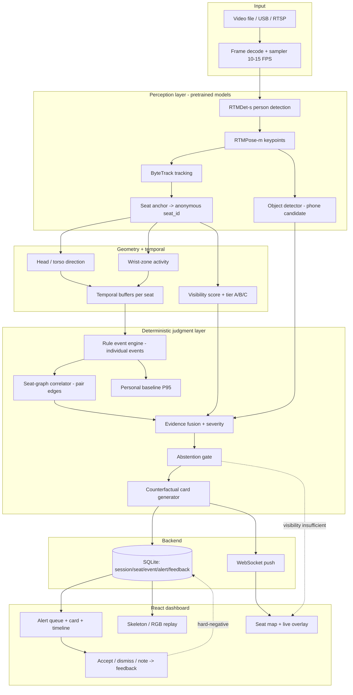

# VIGIL SeatGraph — IMPLEMENTATION_PLAN.md

**AI Examination-Hall Behaviour Intelligence System — Prototype Execution Plan**

**Freeze / PPT submission:** 26 July 2026
**Active build window:** 20 July → 25 July 2026 (6 working days)
**Submission day:** 26 July 2026 (freeze, evidence, rehearsal, packaging — no new features)

> **Repository status at time of writing:** This is a **greenfield / planning-only** repository. It contains three Markdown documents — `plan.md` (the canonical merged proposal), `Drishti AI (fable 5 max).md`, and `Drishti AI (gpt 5.6 sol).md` — and **no source code, no configuration, no models, no data, no tests, and no deployment files**. Every software component below is therefore **Missing / must be built from zero**. This plan is written on that assumption. If code lands before 20 July, re-run the Repository Reality Check (§2) and adjust.

> **Relationship to `plan.md`:** `plan.md` is the *design authority* (models, schema, feature reasoning, roadmap). This document is the *execution authority* (what must exist by end of each day, how it is verified, what gets cut, what PPT evidence it produces). Where they conflict on scope, **this document's day-wise gates win**, because they are constrained by the real 6-day budget.

---

## 1. Executive Summary

**What will be demonstrably working by 26 July (the defensible commitment):**

A single-camera, single-GPU, local-only vertical slice that takes a **real uploaded exam-hall video (or USB/RTSP feed)** and:

1. Detects and pose-estimates multiple seated people.
2. Tracks them and anchors each track to an **anonymous seat ID** on an operator-drawn seat map.
3. Computes **real** per-seat behavioural signals (head/torso direction, wrist-zone activity) from model + geometry output.
4. Emits **individual behaviour events** through a deterministic, threshold-gated rule engine (glance repetition, torso turn).
5. Fuses a **pairwise seat-graph relational event** when a scripted two-person interaction occurs.
6. Produces an **explainable, counterfactual review card** whose every number traces to system state.
7. **Abstains** ("visibility insufficient") when a seat is occluded or too small, rather than guessing.
8. Surfaces all of this in a **React dashboard** (seat map, alert queue, alert card, per-seat timeline, skeleton toggle, accept/dismiss/note) backed by a **real FastAPI + WebSocket + SQLite** service.
9. Reports a **small, honestly-measured metric set** (false alerts per student-hour, event precision/recall, latency, FPS, abstention %) from the team's own consented scripted recording.
10. Has a **recorded fallback demo** produced by the *same pipeline*, so a live failure does not end the demonstration.

**Strongest demo story:** *"One glance is nothing. Three glances become an event. A neighbour's response turns it into a reviewable relationship — and here is exactly why, and exactly what would have made us stay silent."* The counterfactual card + seat-graph edge + abstention, on genuinely processed footage, is the wedge.

**What remains prototype-level:** thresholds are hand-tuned on a tiny scripted dataset; head-pose is coarse (L/C/R) beyond the front tier; phone detection is a pretrained detector + temporal confirmation, not a fine-tuned model; metrics come from minutes of footage, not hours; one room, one camera.

**Intentionally postponed** (see §6, §20): facial recognition (permanently rejected), learned temporal models (TCN/ST-GCN), GNN relational models, multi-camera fusion, RBAC/audit hardening, retention/deletion enforcement, chit recognition as a claim, drift monitoring, and all production infrastructure.

**Why this scope is achievable:** the perception layer is 100% **pretrained** (RTMDet/RTMPose via `rtmlib`/ONNX, ByteTrack) — no training on the critical path. The judgment layer is **deterministic rules**, which are fast to build and are *themselves* the explanation. The single largest risk is not code — it is **having real footage to measure on**, which is why data recording is scheduled early (Day 5, with a Day 1 smoke clip). The plan front-loads a working vertical slice and treats every USP as an optional, kill-able layer on top of it.

---

## 2. Repository Reality Check

**Method:** full file listing (`git ls-files` + recursive glob) and full read of `plan.md`; both source dossiers were previously synthesised into `plan.md` (which confirms it read Fable = 721 lines, Sol = 775 lines).

| Component | Existing State | Evidence in Repository | Gap | Required Action | Priority |
|---|---|---|---|---|---|
| Product/architecture design | **Working (as a document)** | `plan.md` §5 — models, schema, API list, epics E1–E6, roadmap | Not executable; no code | Use as design spec; do not re-design | — |
| Source dossiers | Present (reference) | `Drishti AI (fable 5 max).md`, `Drishti AI (gpt 5.6 sol).md` | Prose, not code | Reference only | — |
| Repo scaffold (backend/frontend/models dirs) | **Missing** | No `src/`, `package.json`, `requirements.txt`, `pyproject.toml` | Everything | Create scaffold Day 1 AM | P0 |
| Video ingest / frame sampler | **Missing** | None | All | Build (OpenCV) Day 1 | P0 |
| Person detection | **Missing** | None | Model wiring | Integrate RTMDet-s (pretrained) Day 1 | P0 |
| Pose estimation | **Missing** | None | Model wiring | Integrate RTMPose-m via `rtmlib` Day 1 | P0 |
| Tracking + seat anchor | **Missing** | None | All | ByteTrack + custom anchor Day 1–2 | P0 |
| Seat-map / polygon config | **Missing** | None | All | Build editor + storage Day 1–2 | P0 |
| Head/torso/wrist signals | **Missing** | None | All | Geometry from keypoints Day 2 | P0 |
| Rule event engine | **Missing** | None | All | Deterministic gates Day 2 | P0 |
| Seat-graph correlator | **Missing** | None | All | Directed edges + fusion Day 3 | P0 |
| Counterfactual explainer | **Missing** | None | All | Template from engine state Day 3 | P0 |
| Object (phone) detection | **Missing** | None | All | Pretrained + temporal confirm Day 4 | P1 |
| Abstention / visibility tiers | **Missing** | None | All | Visibility score + gates Day 2–4 | P0 |
| Backend API + WebSocket | **Missing** | None | All | FastAPI + WS Day 1–2 | P0 |
| Database / schema | **Missing** | None | All | SQLite per `plan.md` §5.7 Day 1–2 | P0 |
| Frontend dashboard | **Missing** | None | All | React app Day 2–3 | P0 |
| Skeleton/privacy replay | **Missing** | None | All | Pose-JSON replay Day 4 | P1 |
| Model weights | **Missing** | None | Download + cache | Pin + local cache Day 1 | P0 |
| Consented dataset | **Missing** | None | All | Record Day 5 (+ Day 1 smoke clip) | P0 |
| Benchmark harness | **Missing** | None | All | Metrics scripts Day 5 | P0 |
| Tests | **Missing** | None | All | Rule/geometry units Day 2+ | P1 |
| Docker/env/config files | **Missing** | None | All | `requirements.txt` + `config.yaml` + `.env.example` Day 1 | P0 |
| CI | **Missing** | None | Optional | Skip for prototype (manual) | P2 |

**Honest verdict:** Nothing is built. The advantage is that the design is already converged and defensible, so **no time is spent deciding *what* to build** — 100% of the 6 days goes to building. The risk is that a greenfield CV integration in 6 days is aggressive; hence the ruthless P0/P1/P2 split and daily kill criteria below.

**Classification distribution:** Working = design docs only. Partially working = none. Present-but-unverified = none. Placeholder = none. **Missing = all software.** Blocked = none (no dependency is unavailable; GPU + camera access must be confirmed Day 1 AM).

---

## 3. Definition of the 26 July Prototype (Expected User Journey)

The operator (chief invigilator) performs this end-to-end journey, and **every output is derived from real system state**:

1. **Start a session** — creates a `session` row; pipeline warms up.
2. **Select input** — uploaded exam-hall video file (default), or USB camera, or RTSP (same downstream pipeline).
3. **Configure / load seat map** — draw seat polygons on a still frame once; anonymous seat IDs + visibility tier (A/B/C) assigned and stored.
4. **Detect & track students** — RTMDet + RTMPose + ByteTrack produce per-frame people with keypoints.
5. **Assign anonymous seat IDs** — seat-anchor maps each track to a seat; unstable tracks are quarantined, not guessed.
6. **Compute behavioural signals** — head/torso direction + wrist-zone dwell per seat per frame.
7. **Generate individual events** — rule engine fires glance-repetition / torso-turn events with duration & repetition gates.
8. **Fuse relational evidence** — seat-graph builds directed edges; a reciprocal interaction upgrades to a pair event.
9. **Display dashboard state** — seat map colours (observing / event / alert / unobservable), live-ish overlay, alert queue.
10. **Generate explainable alert** — counterfactual card with seat, behaviour, timing, repetitions, direction, target seat, contributing signals, confidence, visibility, threshold rationale, "what would NOT have triggered this."
11. **Review / dismiss** — accept / dismiss(reason) / note; dismissal writes a feedback row.
12. **Replay evidence** — short RGB event clip and/or skeleton-only replay.
13. **Show session metrics** — alerts/hour, dismiss rate, abstention %, FPS, latency.
14. **Export / capture** — screenshots + a session summary + the recorded fallback video, for the PPT.

---

## 4. Scope Matrix

| Feature | Must Have | Should Have | Stretch | Post-PPT | Reason |
|---|---|:--:|:--:|:--:|---|
| Video-file input + frame sampler | ✅ | | | | Journey step 2; simplest reliable input |
| USB camera input | ✅ | | | | Live-demo option, same pipeline |
| RTSP input | | ✅ | | | Realistic but fragile; file/USB fallback |
| Person detection (RTMDet-s) | ✅ | | | | Foundation |
| Pose (RTMPose-m) | ✅ | | | | Foundation |
| ByteTrack + seat anchor | ✅ | | | | Anonymity + stable seats |
| Seat-polygon editor + storage | ✅ | | | | Enables anonymity & relations |
| Visibility tiers A/B/C | ✅ | | | | Honesty; drives abstention |
| Head/torso direction (coarse) | ✅ | | | | Core behavioural signal |
| 6DRepNet Tier-A refinement | | | ✅ | | Degree-level front-row only; optional |
| Wrist-zone activity | ✅ | | | | Hand-behaviour signal |
| Rule event engine (glance, torso-turn) | ✅ | | | | Two real individual events (gate) |
| Personal baseline (P95) | | ✅ | | | Cuts false alerts; population prior fallback |
| Seat-graph pair correlator | ✅ | | | | The differentiator (gate Day 3) |
| Counterfactual card | ✅ | | | | Flagship explainability |
| Abstention on low visibility | ✅ | | | | Non-negotiable honesty rule |
| Phone candidate + temporal confirm | | ✅ | | | High-value but small-object risk |
| Chit recognition | | | | ✅ | Below pixel floor; never claimed |
| Attention Lens overlay (USP 1) | | ✅ | | | Flagship visual, but kill-able (§9) |
| Desk Leakage / LeakRank | | | ✅ | | Only if Attention Lens validates |
| Skeleton privacy replay | | ✅ | | | Privacy wow; RGB clip is the fallback |
| Per-seat timeline | ✅ | | | | Direct objective |
| Alert queue + accept/dismiss/note | ✅ | | | | Mandatory human gate |
| Session metrics view | ✅ | | | | Credibility |
| Real backend + WS + SQLite | ✅ | | | | No fake dashboards allowed |
| Benchmark harness + metrics | ✅ | | | | Only credible accuracy source |
| Recorded fallback demo | ✅ | | | | Demo survival |
| RBAC / audit log | | | | ✅ | Deployment concern, not prototype |
| Retention/deletion enforcement | | | | ✅ | Prototype uses transient buffer + minimal store |
| Lookout / handoff / chains | | | | ✅ | Data-starved; post-MVP |
| Learned temporal / GNN / multi-cam | | | | ✅ | Post-MVP |

**Ruthlessness rule:** if any Should/Stretch item threatens a Must item's daily gate, it is cut that day (see §17 Stop Conditions).

---

## 5. Existing-to-Target Architecture

**Current architecture discovered in repository:** none (documents only). There is no running system to preserve or refactor.

**Target prototype architecture:** a single-process Python service (perception + judgment + API) plus a React dashboard, local-only, one camera, one GPU. `plan.md` §5.6 is adopted verbatim for model and stack choices; MVP explicitly drops RBAC, Redis, Postgres, and any microservice split.

**Required changes vs `plan.md`:** none in direction; **subtractions only** — MVP runs as one process, SQLite, no auth, no encryption-at-rest (documented as a prototype limitation, not a claim).

**Data flow (camera → dashboard):**

**Module boundaries (Python packages):** `ingest/`, `perception/` (detector, pose, tracker, seat_anchor, objects), `signals/` (head, wrist, visibility), `judgment/` (rules, seatgraph, baseline, fusion, explain), `api/` (FastAPI routes, ws), `store/` (models, db), `config/` (thresholds YAML). Frontend: `web/` (React).

**Integration contracts:** perception emits a typed **per-frame seat state** (§6); judgment consumes seat state + config and emits **events / alerts**; API serialises DB rows to the frontend; the frontend never computes intelligence — it renders state.

**Failure isolation:**
- Object/phone detector failure → its signal is dropped; the rest of the pipeline continues.
- Attention Lens (USP 1) failure → visual layer hidden; head-direction fallback carries the demo.
- Camera/RTSP drop → switch to file input (same pipeline) with a degraded banner.
- WebSocket drop → dashboard polls REST for last state.

**Fallback data path:** the **recorded fallback video** is produced by running this exact pipeline offline and screen-capturing it; it is not a separate mock. If the live run fails, play the recording — the outputs shown are still real system outputs from a prior real run.

---

## 6. Data Contracts

Values are tagged by source: **[M]** model inference · **[G]** geometry · **[T]** temporal aggregation · **[C]** configuration · **[H]** human input.

**Session** — `session_id`, `started_at`, `input_source`[C], `camera_id`, `fps_processed`[T], `status`.

**Seat** — `seat_id` (anonymous, e.g. `C7`)[C/H], `camera_id`, `polygon`[H], `neighbours`[C], `visibility_tier`[G] (A/B/C), `created_at`.

**Track** — `track_uid`[M/T], `seat_id`[G], `t0`,`t1`[T], `avg_visibility`[G], `health`[T] (ok / uncertain / lost), `quarantined`[T] (bool).

**Per-frame seat state** — `frame_ts`, `seat_id`, `track_uid`, `keypoints`[M], `head_dir`[G] (L/C/R + optional angle), `torso_yaw`[G], `wrist_zones`[G] (desk/lap/pocket/neighbour), `visibility`[G] (0–1), `tier`[G], `observable`[G] (bool). *This is the core integration object between perception and judgment.*

**Behaviour event** — `event_id`, `seat_id`, `track_uid`, `type`[C] (e.g. `repeated_glance_right`, `torso_turn`), `t_start`,`t_end`[T], `duration`[T], `repetitions`[T], `durations[]`[T], `direction`[G], `pair_seat`[G] (nullable), `signals`[M/G/T] (JSON of contributing values), `confidence`[T], `visibility`[G], `baseline_dev`[T], `severity`[C+T], `state` (candidate/alerted/quarantined), `explanation`[T], `counterfactual`[T], `clip_ref`.

**Pairwise graph edge** — `edge_id`, `src_seat`, `dst_seat`, `type`[T] (`glance_toward`/`responds`/`reciprocal`/`handoff_candidate`), `weight`[T] (time-decayed), `evidence_event_ids[]`[T], `last_ts`[T].

**Alert** — `alert_id`, `event_id`, `severity`[C+T], `state`[H] (new/accepted/dismissed), `created_at`.

**Explanation** — derived from event state only; fields = the 14 answers (seat, behaviour, start/end, duration, repetition count, direction, target/paired seat, contributing signals, confidence, visibility, threshold rationale, baseline comparison, review recommendation, counterfactual). **No free-text number generation.** [all T from event state]

**Feedback** — `feedback_id`, `alert_id`, `action`[H] (accept/dismiss), `reason`[H] (enum), `note`[H], `created_at`.

**Visibility state** — per seat per frame: `visibility`[G], `tier`[G], `reason_if_unobservable`[G] (occlusion / small / low-light).

**Replay package** — `event_id`, `rgb_clip_ref` (short, transient), `skeleton_json_ref`[M], `window`[C].

**Session metrics** — `false_alerts_per_student_hour`[T], `event_precision`[T], `event_recall`[T], `alert_latency_s`[T], `fps`[T], `pct_unobservable`[G/T], `seat_attribution_rate`[T], `alerts_with_full_explanation`[T], `dismiss_rate`[T]. **Every value computed from stored rows; none typed by hand.**

---

## 7. Dynamic-vs-Hardcoded Audit

**Rule:** the final demo must not depend on any manually inserted alert, event, or metric. If a row's "Real Source" is not a live pipeline computation, it is prohibited.

| Output | Real Source | Refresh Trigger | Persistence | Hardcoding Risk | Validation |
|---|---|---|---|---|---|
| Student count | Detector per frame | Every processed frame | Transient | Low | Compare to manual count on clip |
| Seat states | Seat anchor + visibility | Per frame | Session | Low | Toggle occlusion → state changes |
| Track IDs | ByteTrack | Per frame | Session | Low | Log IDs; verify stability across clip |
| Head direction | Keypoint geometry (+6DRepNet Tier A) | Per frame | In events | **Medium** (could be faked) | Unit test on known-angle frames |
| Attention target (USP 1) | Gaze-target estimate, tiered | Per frame | In events | **High** (easy to fake beam) | Go/no-go on real footage Day 1; restrict by tier |
| Wrist movement | Keypoint trajectory vs zones | Per frame | In events | Medium | Test on hand-to-pocket clip |
| Phone candidate | Object detector + N-of-M temporal | On confirmation | Event + clip | **High** | Require ≥N confirmations; show clip |
| Behaviour event | Rule engine over buffers | On threshold crossing | Event row | **High** | Trace every field to seat-state log |
| Alert severity | Fusion function | On event | Alert row | Medium | Recompute from inputs in test |
| Explanation values | Event row fields | On alert render | Alert row | **High** | Consistency test: card == DB |
| Timeline | Event history query | On view / new event | Event rows | Low | Cross-check with event log |
| Session metrics | Aggregation over rows | On session end / refresh | Computed | **High** | Re-run script → same numbers |
| Dashboard health | Pipeline heartbeat (FPS, camera) | Continuous | Transient | Low | Kill camera → banner |

**Explicit prohibition:** a `card == DB` **consistency test** (Day 3) and a **"clean-run reproduces the demo without editing the DB"** test (Day 6 gate) are the two hard guards against hardcoding.

---

## 8. Feature-by-Feature Implementation Plan

> Format per feature. No implementation code; interfaces/schemas only where they remove ambiguity.

### 8.1 Video ingest & frame sampler (P0)
- **Purpose:** turn any source into a controlled frame stream. **Status:** Missing. **Inputs:** file path / device index / RTSP URL [C]. **Outputs:** timestamped frames at 10–15 FPS. **Deps:** OpenCV.
- **Approach:** OpenCV `VideoCapture`; drop-to-target-FPS sampler; source abstraction so downstream is identical for file/USB/RTSP.
- **Acceptance:** a 60 s clip decodes at target FPS with stable timestamps; source switch requires no downstream change.
- **Test:** run all three source types (file mandatory; USB if available). **Failure:** on drop, buffer + degraded banner, auto-retry. **Fallback:** file input.
- **PPT evidence:** "input source" screenshot; FPS number.

### 8.2 Person detection + pose (P0)
- **Purpose:** locate people and keypoints. **Status:** Missing. **Inputs:** frame [M]. **Outputs:** boxes + 17 keypoints + confidences. **Deps:** `rtmlib`/ONNX, RTMDet-s, RTMPose-m, GPU.
- **Approach:** pretrained via `rtmlib`; no training. Cap people/frame for FPS if needed (measure).
- **Acceptance:** on real footage, ≥ the seats-in-frame people detected with pose in ≥90% of frames at Tier A/B distance; ≥10 processed FPS on target GPU.
- **Test:** visual overlay + FPS log on the Day-1 smoke clip. **Failure:** low FPS → reduce sample rate / cap people. **Fallback:** RTMO for crowded frames (post-MVP), or process fewer FPS.
- **PPT evidence:** skeleton-overlay screenshot; measured FPS.

### 8.3 Tracking + seat anchor (P0)
- **Purpose:** stable anonymous per-seat identity. **Status:** Missing. **Inputs:** detections + seat polygons [M/G]. **Outputs:** `track→seat` with health. **Deps:** 8.2, seat map.
- **Approach:** ByteTrack for motion tracks; seat-anchor assigns a track to the seat polygon its torso centroid sits in; on ambiguity/occlusion, mark `uncertain` and **quarantine events**.
- **Acceptance:** on a fixed clip, required seats keep stable IDs through normal seated motion; post-occlusion uncertainty is surfaced and affected events quarantined (not silently reassigned).
- **Test:** ID-stability log; occlusion clip. **Failure:** ID switch → seat-anchor re-association. **Fallback:** seat-only assignment (ignore track continuity) with events tagged lower confidence.
- **PPT evidence:** seat map with stable IDs; occlusion→quarantine screenshot.

### 8.4 Seat-map / polygon config (P0)
- **Purpose:** define anonymous seats + neighbours + tiers. **Status:** Missing. **Inputs:** click points on still frame [H]. **Outputs:** seat polygons, IDs, adjacency, visibility tier. **Deps:** frontend canvas, backend store.
- **Approach:** React canvas over a captured still; store polygons; compute tier from mean person pixel-height in each polygon.
- **Acceptance:** non-overlapping polygons persist and reload; each seat shows a tier; adjacency drives the seat graph.
- **Test:** save/reload; overlap rejection. **Failure:** reject overlaps. **Fallback:** ship a pre-saved seat map JSON for the demo room.
- **PPT evidence:** seat-map setup screenshot.

### 8.5 Head/torso direction + visibility tiers (P0)
- **Purpose:** core behavioural signal + honesty gate. **Status:** Missing. **Inputs:** keypoints [M/G]. **Outputs:** L/C/R (+angle Tier A), torso yaw, visibility 0–1, tier. **Deps:** 8.2.
- **Approach:** keypoint yaw everywhere; 6DRepNet only if face ≥40 px (Tier A, transient crop, nothing stored); torso yaw from shoulder line; visibility from keypoint confidence + occlusion + person size.
- **Acceptance:** on labelled front-row frames, L/C/R matches human label majority; Tier C seats report "direction uncertain" rather than a confident angle.
- **Test:** unit test on known-orientation frames. **Failure:** low keypoint conf → abstain. **Fallback:** keypoint-only (drop 6DRepNet).
- **PPT evidence:** direction overlay; tier badges.

### 8.6 Wrist-zone activity (P0)
- **Purpose:** hand-behaviour cues. **Status:** Missing. **Inputs:** wrist keypoints + zone config [M/G/C]. **Outputs:** dwell/transition events per zone. **Deps:** 8.2, seat map zones.
- **Approach:** map wrist position to desk/lap/pocket/neighbour zones; measure dwell + transitions.
- **Acceptance:** hand-to-lap and hand-to-neighbour produce distinct zone signals on a scripted clip. **Test:** scripted hand clip. **Failure:** wrists occluded → abstain. **Fallback:** desk-vs-not-desk only.
- **PPT evidence:** wrist-zone timeline segment.

### 8.7 Rule event engine + baseline (P0)
- **Purpose:** turn signals into low-FP individual events. **Status:** Missing. **Inputs:** signal buffers + config + baseline [T/C]. **Outputs:** typed events. **Deps:** 8.5, 8.6.
- **Approach:** deterministic gates — duration, repetition-within-window, baseline-P95 deviation, geometry whitelist (clock/invigilator/door), hysteresis (enter θ_hi, exit θ_lo), cooldown. Baseline = per-seat median/P95 over first 8–10 min, population prior on cold start.
- **Acceptance:** a single <1.8 s glance produces **no** alert; 3 glances above P95 within the window produce a candidate; a whitelisted clock-look is suppressed.
- **Test:** unit tests per gate on synthetic buffers + scripted clips. **Failure:** below threshold → silent log. **Fallback:** population thresholds if baseline cold.
- **PPT evidence:** before/after (glance suppressed vs event fired).

### 8.8 Seat-graph correlator (P0)
- **Purpose:** relational evidence. **Status:** Missing. **Inputs:** per-seat events + adjacency [T]. **Outputs:** directed time-decayed edges + pair events. **Deps:** 8.7.
- **Approach:** edges `glance_toward / responds / reciprocal / handoff_candidate`; fire a pair event only on repetition + reciprocity + both seats visible.
- **Acceptance:** a scripted reciprocal glance between two visible seats fires a pair event whose evidence event-IDs trace to real individual events; no pair fires if either seat is unobservable.
- **Test:** scripted two-person clip. **Failure:** missing target visibility → no pair. **Fallback:** individual events only + "relational: insufficient evidence."
- **PPT evidence:** seat-graph edge screenshot.

### 8.9 Evidence fusion + abstention (P0)
- **Purpose:** severity + the non-negotiable honesty gate. **Status:** Missing. **Inputs:** events + visibility + object signal [T/G/M]. **Outputs:** severity ladder or "unobservable." **Deps:** 8.7, 8.8.
- **Acceptance:** an occluded seat is labelled "visibility insufficient" and **never** "suspicious"; severity is reproducible from inputs.
- **Test:** occlusion clip; recompute severity in test. **Failure:** abstain. **Fallback:** the abstention path *is* the safe default.
- **PPT evidence:** abstention screenshot.

### 8.10 Counterfactual card generator (P0)
- **Purpose:** flagship explainability. **Status:** Missing. **Inputs:** event row [T]. **Outputs:** 14-answer card + counterfactual. **Deps:** 8.9.
- **Approach:** template filled **only** from event fields; a consistency check asserts card values == DB values; no LLM invents numbers.
- **Acceptance:** every alert answers all 14 questions; counterfactual numbers exactly match engine state (consistency test passes); incomplete state → "partial — review."
- **Test:** `card == DB` automated test. **Failure:** mark partial. **Fallback:** raw evidence list if template breaks.
- **PPT evidence:** counterfactual card screenshot.

### 8.11 Phone candidate (P1)
- **Purpose:** high-value object alert. **Status:** Missing. **Inputs:** frame/hand crops [M]. **Outputs:** candidate + confidence + N-of-M confirmation. **Deps:** 8.2.
- **Approach:** **pretrained** object detector (COCO cell-phone class) on crops + temporal confirmation; **no fine-tuning on critical path** (state this limitation).
- **Acceptance:** a phone lift at 3–4 m yields a confirmed candidate with a clip; beyond the pixel floor → "insufficient visibility," not a guess.
- **Test:** scripted phone-lift + phone-absent clips. **Failure:** below floor → abstain. **Fallback:** hand-behaviour cue only.
- **PPT evidence:** phone-candidate screenshot + clip.

### 8.12 Dashboard + review workflow (P0)
- **Purpose:** where the human works. **Status:** Missing. **Inputs:** WS + REST [—]. **Outputs:** seat map, queue, card, timeline, replay, accept/dismiss/note. **Deps:** all backend.
- **Acceptance:** alert appears ≤5 s after the behaviour completes; dismiss(reason) writes a feedback row; skeleton toggle hides RGB; **no permanent per-student score anywhere**.
- **Test:** click-through; latency measurement. **Failure:** WS down → REST poll. **Fallback:** last-state view.
- **PPT evidence:** dashboard screenshots (map, queue, card, timeline).

### 8.13 Skeleton / privacy replay (P1)
- **Purpose:** privacy differentiator. **Status:** Missing. **Inputs:** stored pose JSON [M]. **Outputs:** skeleton playback + short RGB clip. **Deps:** 8.2 storage.
- **Acceptance:** replay reconstructs the event window from pose JSON with RGB hidden by default. **Test:** replay a real event. **Failure:** skip skeleton, keep RGB clip. **Fallback:** RGB clip only (still real evidence).
- **PPT evidence:** skeleton-replay screenshot.

### 8.14 Backend API + WS + SQLite (P0)
- **Purpose:** real persistence + realtime. **Status:** Missing. **Inputs:** pipeline outputs. **Outputs:** REST + `WS /ws/alerts`, `WS /ws/live-overlays`; SQLite per `plan.md` §5.7 (MVP subset: session, seat, track, event, alert, feedback, asset). **Deps:** FastAPI.
- **Acceptance:** events/alerts/feedback persist and survive restart; WS pushes new alerts. **Test:** API tests per route. **Failure:** WS down → poll. **Fallback:** REST only.
- **PPT evidence:** architecture diagram; "real backend" talking point.

### 8.15 Benchmark harness (P0)
- **Purpose:** the only credible accuracy source. **Status:** Missing. **Inputs:** annotated clips + tuning/test split [H]. **Outputs:** metrics report (§13). **Deps:** all + recorded data.
- **Acceptance:** reports only measured numbers; refuses to emit an unmeasured metric; no tuning on the test split.
- **Test:** run on held-out clips. **Failure:** report fewer metrics, honestly. **Fallback:** report the subset that was measured.
- **PPT evidence:** metrics table; ablation (before/after false-alert count).

---

## 9. USP Implementation Plan

The prototype delivers **three connected USPs**. USP 2 and USP 3 are compulsory and low-risk. USP 1 is the flagship *visual* but is **kill-able** and gated Day 1.

### USP 1 — Drishti Attention Field (flagship visual, kill-able)
- **Judge-facing value:** a live "Attention Lens" showing where seats are directing attention, and which desks *receive* foreign attention (Desk Leakage / LeakRank).
- **Minimal honest version:** per-person **attention-target estimate** (head-direction ray → target zone), aggregated as foreign-attention mass per desk. Language: **"attention estimate / gaze-target estimate,"** never "gaze proof" or "we know where every student looks."
- **Dependencies:** head-direction (8.5), seat geometry, visibility tiers.
- **Integration path:** an **optional overlay** on the seat map; failure hides the layer without touching events.
- **Validation:** **Day-1 go/no-go on real project footage** — does head-direction → target zone agree with human judgement at the available distance?
- **Demo sequence:** toggle Attention Lens on → show beams from a few Tier-A/B seats → show a desk lighting up as it receives foreign attention.
- **Visual output:** attention beams + desk leakage heat.
- **Failure conditions:** unreliable direction beyond front rows; jittery beams.
- **Kill criteria:** if not reliable on real footage by end of Day 1, **restrict to Tier-A/B seats as an optional visual only**; if still unreliable by Day 4, **cut from the live demo** and keep head-direction arrows as the core visual. Its failure must never block the MVP.
- **Fallback:** per-seat head-direction arrows (deterministic, always available).
- **PPT evidence:** Attention Lens screenshot (captioned "estimate, Tier A/B, visibility-gated").
- **Must not claim:** pupil/eye tracking; back-row gaze; certainty.

### USP 2 — Seat-Graph Relational Evidence (compulsory differentiator)
- **Judge-facing value:** the system reasons about **relationships between seats**, not just individuals — the wedge vs every "detect a person" competitor.
- **Minimal honest version:** rule-based directed edges + reciprocity, no GNN.
- **Dependencies:** rule events (8.7), adjacency, fusion.
- **Integration path:** edges render on the seat map; pair events enter the same queue.
- **Validation:** scripted two-person clip; trace pair-event evidence IDs to individual events.
- **Demo sequence (the money shot):** (1) one brief glance → **no alert**; (2) repeated glances → **individual event**; (3) neighbour's reciprocal response → **upgrades to a relational review request** with a visible edge.
- **Visual output:** highlighted seat-graph edge + pair card.
- **Failure conditions:** both seats not simultaneously visible; too little scripted data.
- **Kill criteria:** if reciprocity is unreliable by Day 3, demo individual events + "relational: insufficient evidence."
- **Fallback:** individual events only.
- **PPT evidence:** seat-graph edge + pair counterfactual card.
- **Must not claim:** proof of communication; identity of either party.

### USP 3 — Explainability with calibrated honesty (compulsory)
- **Judge-facing value:** counterfactual cards + personal baseline + visibility-aware abstention + skeleton-first replay = a system that is *fair and honest by construction*.
- **Minimal honest version:** the 14-answer card from engine state; P95 baseline where warm; abstention on low visibility; skeleton replay (RGB-hidden default).
- **Dependencies:** 8.7, 8.9, 8.10, 8.13.
- **Integration path:** every alert opens a card; abstention is a first-class seat state.
- **Validation:** `card == DB` consistency test; occlusion → abstention; baseline comparison present when warm.
- **Demo sequence:** open a card → read seat/behaviour/timing/repetitions/direction/target/signals/confidence/visibility/threshold rationale/baseline/**counterfactual** → occlude a seat → show "visibility insufficient" → open skeleton replay.
- **Visual output:** counterfactual card, abstention badge, skeleton playback.
- **Failure conditions:** template/DB drift; cold baseline.
- **Kill criteria:** if skeleton replay unfinished by Day 4, keep card + RGB clip (still real).
- **Fallback:** raw evidence list.
- **PPT evidence:** card, abstention, skeleton screenshots.
- **Must not claim:** fabricated numbers; that abstention == innocence.

---

## 10. Day-Wise Execution Plan: 20–26 July 2026

Day-level outcomes; morning/afternoon/evening only where genuinely useful. **No hour estimates.**

### 20 July — Repository audit, environment, and vertical-slice foundation
| Outcome | Tasks | Dependencies | Acceptance Gate | Fallback | PPT Asset Produced |
|---|---|---|---|---|---|
| Scope frozen & inputs confirmed | Confirm 20 objectives; confirm GPU + camera + venue + volunteers + consent form; freeze MVP scope per §4 | — | Written scope + hardware confirmed | Use file input if no live camera | — |
| Env + scaffold up | Create repo scaffold (`ingest/perception/signals/judgment/api/store/config`, `web/`); `requirements.txt`, `config.yaml`, `.env.example`; download + cache model weights | Scope | Backend imports; models load | Pin known-good versions | — |
| Perception spine runs | Frame sampler → RTMDet-s → RTMPose-m → ByteTrack on a webcam/RTSP/**smoke clip** with skeleton overlay + FPS log | Env | Live/clip skeleton overlay at ≥10 FPS | Lower FPS / cap people | Skeleton-overlay screenshot |
| Seat-map approach validated | Draw provisional polygons on a still; assign anonymous IDs + tiers | Perception | Polygons persist; tiers computed | Pre-saved seat map | Seat-map screenshot |
| **USP 1 go/no-go** | Test head-direction → target-zone agreement on **real footage** | Perception | Decision recorded (full / Tier-A/B only / cut) | Head-direction arrows | Go/no-go note |
| Backend state visible | Session + seat + one event table; write one real detected-people count to DB and read it back | Env | A real frame produces detected people, pose, anonymous tracks, and **visible backend state** | — | — |

**End-of-day gate:** a real frame/video produces detected people, pose information, anonymous tracks, and visible backend state.

### 21 July — Seat intelligence and behaviour signals
| Outcome | Tasks | Dependencies | Acceptance Gate | Fallback | PPT Asset Produced |
|---|---|---|---|---|---|
| Seat anchoring stable | Seat-anchor track→seat; quarantine on uncertainty; visibility tiers live | Day 1 | Seats keep stable IDs through normal motion | Seat-only assignment | Seat map w/ IDs |
| Signals computed | Head/torso direction; wrist-zone activity; per-seat temporal buffers | Anchoring | Signals visible per seat per frame | Coarse signals only | Direction/zone overlay |
| First individual events | Rule engine: glance-repetition + torso-turn with duration/repetition/baseline gates; persist events; minimal dashboard connection (WS event push) | Signals | **≥2 individual behaviours generate real events for the correct anonymous seat** | Population thresholds | Event-in-queue screenshot |

**End-of-day gate:** at least two individual behaviours generate real events for the correct anonymous seat.

### 22 July — Relational evidence and first complete alert
| Outcome | Tasks | Dependencies | Acceptance Gate | Fallback | PPT Asset Produced |
|---|---|---|---|---|---|
| Seat graph live | Directed edges; direction-toward-neighbour; reciprocal detection; fusion + severity | Day 2 | Edge appears on scripted interaction | Individual events only | Seat-graph edge screenshot |
| Counterfactual card | Card generator from event state; `card == DB` consistency test | Fusion | Card answers all 14 Qs; consistency test passes | Raw evidence list | Counterfactual card screenshot |
| Alert workflow | Alert API + WS queue; accept/dismiss(reason)/note → feedback row | Card | **Scripted two-person interaction creates a real pair alert whose evidence traces to model/event state** | — | Alert queue + card |

**End-of-day gate:** a scripted two-person interaction creates a real pairwise alert whose evidence values trace back to model and event state.

### 23 July — Visual USPs, object detection, and first full demo pass
| Outcome | Tasks | Dependencies | Acceptance Gate | Fallback | PPT Asset Produced |
|---|---|---|---|---|---|
| Attention/head visual | Attention Lens (if validated) else head-direction arrows; desk-leakage view if feasible | Day 1 go/no-go | Visual renders without breaking events | Head-direction arrows | Attention Lens screenshot |
| Phone candidate | Pretrained detector + N-of-M temporal confirm | Perception | Phone lift → confirmed candidate + clip | Hand-behaviour cue | Phone screenshot + clip |
| Privacy + timeline | Skeleton/RGB replay; per-seat timeline; visibility-aware abstention wired into UI; demo-path UI polish only | Day 2 | Occlusion → "visibility insufficient" | RGB clip only | Skeleton + timeline + abstention |
| **First full run** | Rehearse the 3-min path start→finish once | All above | **Primary 3-min demo path works once end-to-end** | Recorded partial | — |

**End-of-day gate:** the primary three-minute demo path works once from beginning to end.

### 24 July — Data recording, hard negatives, reliability
| Outcome | Tasks | Dependencies | Acceptance Gate | Fallback | PPT Asset Produced |
|---|---|---|---|---|---|
| Consented footage recorded | Record scripted normal + suspicious + **benign-looking** behaviours (stretch, clock-check, dropped pen, posture shift); occlusion; low-visibility | Consent, venue | Footage covers §13 list; tuning/test split kept separate | Use Day-1 smoke clip + minimal reshoot | Dataset summary |
| Hard-negative & occlusion tests | Verify brief-glance suppression; benign negatives don't alert; occlusion → abstain; fix duplicate alerts / unstable thresholds; tune **only on tuning subset** | Footage | **≥1 correct non-alert AND ≥1 abstention demonstrated** | Manual threshold set | Before/after false-alert note |
| First metrics captured | Run harness for initial FP/student-hour, latency, FPS | Footage | Real numbers recorded (not invented) | Report subset | Draft metrics |

**End-of-day gate:** the system shows at least one case where it correctly does **not** alert and one case where it **abstains** due to visibility.

### 25 July — Freeze, evaluation, presentation evidence
| Outcome | Tasks | Dependencies | Acceptance Gate | Fallback | PPT Asset Produced |
|---|---|---|---|---|---|
| **Feature freeze** | Stop new features; remove unfinished UI paths; verify clean startup instructions | Day 4 | No half-built path reachable in demo | — | — |
| Full rehearsal + metrics | Full demo rehearsal; final mini-benchmark on held-out split; final FPS/latency | Freeze | Metrics reproducible; rehearsal clean | Cut fragile step | Metrics + limitations tables |
| Evidence captured | Screenshots + short clips of every §15 asset; **record complete fallback demo via same pipeline**; architecture diagram; results/limitations tables; narration; judge Q&A prep | Rehearsal | **Fresh run from documented instructions reproduces the demo without editing the DB or injecting alerts** | Fallback recording | All PPT assets |

**End-of-day gate:** a fresh run using documented instructions reproduces the demo without manually editing the database or injecting alerts.

### 26 July — Submission day (no new features)
| Outcome | Tasks | Dependencies | Acceptance Gate | Fallback | PPT Asset Produced |
|---|---|---|---|---|---|
| Ship | Critical bug fixes only; final smoke test; PPT completion; final metric verification; rehearsal; submission packaging | Day 5 | Smoke test green; PPT complete | Fallback recording is primary | Final PPT + package |

**Rule:** no major new feature work on 26 July.

---

## 11. Priority Order

### P0 — Prototype fails without this
Video input · detection + pose · tracking + seat anchor · seat mapping · **≥2 real individual behaviour events** · seat graph · explainable counterfactual alert · dashboard alert queue · visibility handling / abstention · real persistence (SQLite + WS) · **recorded fallback demo**.

### P1 — Strong differentiation
Attention Field (only where validated) · counterfactual cards (already P0-critical for the alert, enriched here) · personal baseline · phone temporal confirmation · per-seat timeline · skeleton privacy replay · desk-leakage view.

### P2 — Only after the demo path is stable
Lookout / cover-pattern detector · chit candidate · advanced report export · extra animations · more behaviour classes · advanced styling.

---

## 12. Testing Strategy

| Layer | What | When |
|---|---|---|
| Unit | Geometry (head yaw, torso, wrist-zone) + temporal rules (duration/repetition/hysteresis/cooldown/baseline) | Day 2 onward |
| Component | Seat-anchor assignment; visibility scoring; fusion severity | Day 2–3 |
| API | Each REST route; WS push; feedback write | Day 2–3 |
| Integration | Full clip → events → alert → DB | Day 3 |
| Video-replay regression | Fixed clips → expected events/non-events/alerts/abstentions | Day 4–5 |
| Dashboard state | Card == DB; occlusion → abstention badge; no per-student score anywhere | Day 3–5 |
| Hard-negative | Stretch / clock-check / dropped-pen / posture-shift → **no alert** | Day 4 |
| Occlusion | Occluded seat → quarantine/abstain | Day 4 |
| Low-light | Reduced visibility → abstain | Day 4 |
| New-room (if possible) | Second geometry → thresholds hold or fail gracefully | Day 5 (best-effort) |
| Clean-machine startup | Fresh clone → documented steps → demo runs | Day 5–6 |
| Demo rehearsal | Full 3-/5-min run | Day 5–6 |

**Fixed regression videos (record Day 4):**

| Clip | Expected seats | Expected events | Expected non-events | Expected alerts | Expected abstentions |
|---|---|---|---|---|---|
| R1 Normal writing | all visible | none | brief posture shifts | none | none |
| R2 Brief glance | 1 seat | none (below gate) | single <1.8 s glance | none | none |
| R3 Repeated glance | 1 seat | repeated_glance event | — | 1 individual | none |
| R4 Reciprocal pair | 2 seats | 2 individual + edge | — | 1 pair (relational) | none |
| R5 Benign negatives | ≥2 seats | none | stretch, clock-check, dropped pen | none | none |
| R6 Occlusion | 1 seat occluded | quarantined | — | none | 1 (visibility insufficient) |
| R7 Phone lift | 1 seat | phone candidate | — | 1 phone (Tier A/B) | beyond floor → abstain |

---

## 13. Mini-Dataset and Evaluation Plan

**Dataset (small, consented, scripted — recorded Day 4):** normal writing · brief glance · repeated glance · prolonged glance · torso turn · reciprocal glance · phone lift · under-desk hand activity · object pass (if feasible) · stretch · clock check · dropped pen · posture adjustment · occlusion · low visibility.

**Leakage control:** split into **tuning** and **test** subsets by recording take; **never tune on the test subset**; thresholds frozen before the final test run.

**Metrics** (each: formula · data required · procedure · PPT location · limitation):

| Metric | Formula | Data required | Procedure | PPT | Small-sample limitation |
|---|---|---|---|---|---|
| False alerts / student-hour | alerts_in_normal / (students × normal_hours) | R1/R5 normal clips | Run harness on normal footage | Results slide | Minutes, not hours → wide CI |
| Event recall | TP / (TP+FN) vs annotations | annotated events | Compare emitted vs labelled | Results | Few events |
| Event precision / F1 | TP/(TP+FP); 2PR/(P+R) | annotated events | Same | Results (if n permits) | Report n explicitly |
| Alert latency | t_alert − t_behaviour_end | timestamps | Log both | Results | Single machine |
| Processed FPS | frames / seconds | pipeline log | Read log | Results | Target-GPU specific |
| % unobservable frames/seats | unobservable / total | visibility log | Aggregate | Privacy/honesty slide | Depends on room |
| Seat-attribution rate | correct_seat / total_tracks | seat labels | Compare | Results | One room |
| Alerts with full explanation | full_cards / alerts | alert rows | Count | Explainability slide | — |
| Dismiss rate (normal session) | dismissed / alerts | feedback | Count on normal run | Results | Small |

**Rule:** never invent a value; if a metric wasn't measured, it does not appear.

---

## 14. Demo Script

### 3-minute version
| # | Action | Expected UI state | Expected system output | Narration | Recovery if it fails |
|---|---|---|---|---|---|
| 1 | Start recorded/live hall feed | Seat map loads, seats green "observing" | Detections + tracks live | "Ordinary CCTV, processed locally, anonymous seats." | Switch to file input |
| 2 | Show anonymous seat map | Seats labelled C1..Cn, tier badges | Seat states from anchor | "No faces, no names — only seats." | Pre-saved map |
| 3 | Toggle Attention Lens (if validated) | Beams from Tier-A/B seats | Attention estimates | "Where attention *estimates* point — visibility-gated." | Head-direction arrows |
| 4 | Normal writing | No alerts | Events silent-logged | "One glance is nothing." | — |
| 5 | Brief glance | No alert | Below-threshold log | "Still nothing — and here's why." | — |
| 6 | Repeated glances | Individual event in queue | repeated_glance event | "Repetition crosses the gate." | Play R3 clip |
| 7 | Reciprocal response → edge | Seat-graph edge highlights | Pair event | "The neighbour responds — now it's a relationship." | Play R4 clip |
| 8 | Open counterfactual card | Card with 14 answers | Values == DB | "And exactly what would have kept us silent." | Show stored card |
| 9 | Show phone candidate | Phone alert + clip | Confirmed candidate | "High-value, multi-frame confirmed." | Hand-cue only |
| 10 | Occlude a student | Seat greys "visibility insufficient" | Abstention | "We abstain — we don't guess." | Play R6 clip |
| 11 | Session metrics | Metrics panel | Measured numbers | "Measured on our own scripted benchmark." | Show table |
| 12 | Close | — | — | "It assists — it never accuses." | — |

### 5-minute version
Insert after step 8: **skeleton privacy replay** (RGB hidden), **personal-baseline comparison** ("this seat's own P95 was 1.1 s"), and the **before/after false-alert ablation** (abstention + baseline turned off vs on). Insert after step 11: **limitations slide** (tiers, small sample, no chit claim).

**Fallback recorded-video path:** if live processing fails at any step, play the Day-5 fallback recording (same pipeline, real outputs) and narrate from there. Never fall back to a mock.

---

## 15. PPT Evidence Checklist (capture by 25 July)

| Asset | Source screen/output | When captured | Responsible workstream | Required caption | Safe claims | Must NOT claim |
|---|---|---|---|---|---|---|
| Problem slide evidence | Research + `plan.md` | Day 5 | Demo/PPT | "One invigilator, 30–60 students" | Attention bottleneck | "cheating is rampant" |
| Market-gap | `plan.md` differentiators | Day 5 | Demo/PPT | "No reviewed source combines seat-graph + counterfactual + abstention" | "not found in our reviewed sources" | "first ever" |
| Architecture diagram | §5 mermaid | Day 5 | Backend | Local-only pipeline | Privacy-by-architecture | — |
| Seat-map screenshot | Dashboard | Day 4–5 | Frontend | Anonymous seats + tiers | anonymity | identity |
| Attention Lens | Overlay | Day 4–5 | CV | "estimate, Tier A/B, visibility-gated" | attention estimate | gaze proof / eye tracking |
| Seat-graph edge | Dashboard | Day 4–5 | CV/Frontend | Relational evidence | pairwise review pattern | proof of communication |
| Counterfactual card | Alert card | Day 4–5 | Backend/Frontend | Values from engine state | explainable, non-accusatory | fabricated numbers |
| Abstention | Seat state | Day 4–5 | CV | "visibility insufficient" | abstains honestly | abstention == innocence |
| Skeleton replay | Replay modal | Day 4–5 | Frontend | Privacy-first replay | no RGB required | — |
| Phone candidate | Alert + clip | Day 4–5 | CV | "candidate, multi-frame" | selected object candidates | "detects all phones/chits" |
| Timeline | Per-seat timeline | Day 4–5 | Frontend | Seat-wise history | behavioural timeline | permanent score |
| Metrics table | Harness | Day 5 | Data/Eval | "our small scripted benchmark" | measured results | high accuracy (unqualified) |
| Ablation before/after | Harness | Day 5 | Data/Eval | FP with/without abstention+baseline | each layer cuts FPs | — |
| Dataset summary | Recording log | Day 4–5 | Data/Eval | consented scripted | small honest sample | research-scale |
| Privacy architecture | `plan.md` §5.10 | Day 5 | Demo/PPT | no FR, local, transient | privacy-conscious | "legally compliant" |
| Limitations | This doc §17/§18 | Day 5 | Demo/PPT | honest limits | prototype-level | production-ready |
| Roadmap | §20 | Day 5 | Demo/PPT | phased path | future work | committed dates |
| Demo QR/video ref | Fallback recording | Day 5 | Demo/PPT | recorded from same pipeline | real outputs | staged mock |

---

## 16. Definition of Done (observable, testable)

- **Perception:** on each regression clip, ≥90% of Tier-A/B frames yield people + pose; FPS ≥10 logged.
- **Tracking:** on each clip, required seats retain stable anonymous IDs through normal seated motion; post-occlusion uncertainty is surfaced and affected events **quarantined**, not silently reassigned.
- **Seat mapping:** polygons persist/reload; every seat has a tier; adjacency drives the graph.
- **Individual events:** R2 brief glance → no alert; R3 repeated → event; R5 benign negatives → no alert; every field traces to seat-state log.
- **Relational events:** R4 reciprocal → pair event whose evidence IDs resolve to real individual events; no pair when a seat is unobservable.
- **Alerts:** appear ≤5 s after behaviour end; severity reproducible from inputs.
- **Explanations:** every alert answers all 14 questions; `card == DB` consistency test passes; incomplete → "partial — review."
- **Dashboard:** map/queue/card/timeline/replay render; accept/dismiss/note persist; **no per-student score anywhere**.
- **Data storage:** events/alerts/feedback survive restart; raw frames not persisted (RAM buffer only).
- **Privacy:** no FR/identity/embedding; skeleton toggle hides RGB; occlusion → "visibility insufficient," never "suspicious."
- **Evaluation:** harness emits only measured numbers on a held-out split; refuses unmeasured metrics.
- **Demo:** fresh clone + documented steps reproduce the 3-min path without editing the DB or injecting alerts; fallback recording exists.
- **PPT readiness:** every §15 asset captured with a safe caption.

---

## 17. Stop Conditions and Scope-Cut Rules

- **Attention Field unreliable on real footage** → restrict to Tier-A/B, then to optional visual, then cut from live demo; head-direction fallback continues. (Decision: Day 1, re-check Day 4.)
- **Phone fine-tuning unstable** → use pretrained detector + temporal confirmation; state the limitation. (Already the plan — no fine-tuning on critical path.)
- **Chit detection unreliable** → demonstrate hand-behaviour cues + uncertainty; **never claim chit recognition.**
- **RTSP unstable** → USB camera or local video file through the identical pipeline.
- **Skeleton replay unfinished** → prioritise counterfactual card + seat-graph edge; keep RGB clip.
- **Extra behaviour classes threaten the vertical slice** → remove them.
- **UI polish competes with metrics/reliability** → choose reliability.
- **A feature can't produce real evidence by Day 4 (24 July)** → move it out of the live demo.
- **No major feature starts after feature freeze (25 July).**

---

## 18. Risk Register

| Risk | Prob | Impact | Early signal | Prevention | Fallback | Decision date |
|---|---|---|---|---|---|---|
| Greenfield: nothing builds in 6 days | Med | High | Day-1 gate slips | Ruthless P0 focus; pretrained-only perception | Ship vertical slice minus P1/USP1 | 21 Jul |
| Model env / weight download fails | Med | High | Import/load errors Day 1 | Pin versions; cache weights offline | Alternate model in stack | 20 Jul |
| GPU memory / low FPS | Med | High | <10 FPS Day 1 | Cap people/FPS; RTMPose-m not whole-body | Fewer FPS; smaller input | 20 Jul |
| Back-row / far gaze fails | High | Med | Noisy yaw | Tier system + abstention | Tier-A/B only; torso corroboration | 20 Jul |
| Tracking ID switch | Med | Med | Seat flips | Seat-anchor + quarantine | Seat-only assignment | 21 Jul |
| Seat-assignment errors | Med | Med | Wrong seat events | Polygon calibration | Manual seat map | 21 Jul |
| Small-object (phone) fails | Med | Med | No confirmations | Temporal N-of-M; Tier gating | Hand-behaviour cue | 23 Jul |
| False-alert explosion | Med | High | Queue floods on normal | Gates + hysteresis + cooldown + baseline | Raise thresholds; demo curated clips | 24 Jul |
| UI/backend state mismatch | Med | Med | Card ≠ DB | `card == DB` test | REST re-fetch | 22 Jul |
| WebSocket instability | Med | Med | Missed pushes | Heartbeat + reconnect | REST polling | 22 Jul |
| Clip/skeleton storage fails | Low | Med | Replay empty | Test write early | RGB clip only | 23 Jul |
| Volunteer availability | Med | High | No-shows Day 4 | Confirm Day 1; small script | Use Day-1 smoke + minimal reshoot | 20 Jul |
| Lighting differences | Med | Med | Detection drop | Record in demo lighting | Abstain; controlled lighting | 24 Jul |
| Demo machine failure | Low | High | Crash in rehearsal | Fallback recording Day 5 | Play recording | 25 Jul |
| Insufficient eval data | High | Med | Few events Day 4 | Script covers §13 list | Report subset honestly | 24 Jul |
| Scope creep | Med | Med | New features Day 3+ | Freeze + this doc's gates | Cut to P0 | daily |

---

## 19. Clean-Run Checklist

1. **Environment setup:** `python -m venv` → `pip install -r requirements.txt`; Node install for `web/`.
2. **Model weights:** first run downloads + caches RTMDet-s / RTMPose-m (and object detector); verify cache path exists offline.
3. **Configuration:** copy `.env.example` → `.env`; set input source in `config.yaml`; thresholds live in `config.yaml` (not scattered constants).
4. **Database init:** create SQLite schema (idempotent init script).
5. **Backend startup:** launch FastAPI + WS; hit `GET /health` → green (models loaded, camera/file reachable).
6. **Frontend startup:** run React dev/build; dashboard loads.
7. **Input selection:** choose demo video file (or USB).
8. **Seat map loading:** load pre-saved demo seat map (or draw).
9. **Demo data:** confirm regression clips R1–R7 present.
10. **First expected detection:** people + skeletons appear within seconds.
11. **First expected alert:** run R3 → individual event enters queue.
12. **Log locations:** pipeline log (FPS/latency), event log, error log paths documented.
13. **Reset procedure:** documented DB reset + cache clear to return to clean state.
14. **Offline operation:** verify the full demo runs with **no internet** (weights cached, no cloud calls).

---

## 20. Post-PPT Roadmap to Deployment

### Phase 1 — Prototype hardening
- **Entry:** MVP demo reproducible; metrics measured. **Features:** larger scripted dataset; more rooms/volunteers; hard-negative mining; threshold calibration; better seat-map wizard; stress tests; improved (fine-tuned) object detector; model/data cards. **Data:** hours of consented footage across rooms. **Eval:** three-tier (controlled/difficult/OOD) + ablations + fairness slices. **Security/privacy:** dataset license audit; consent artifacts. **Exit:** stable FP/student-hour across ≥2 rooms. **Blockers:** volunteer + annotation capacity.

### Phase 2 — Competition-ready system
- **Entry:** Phase 1 exit. **Features:** better anomaly modelling; Attention-Field validation study; lookout/dead-drop/coverage research; learned temporal (TCN/ST-GCN) **only if data supports**; calibrated abstention; deployment optimisation; richer reporting. **Data:** labelled temporal windows. **Eval:** conformal calibration; fairness. **Security/privacy:** retention tiers + deletion API tested. **Exit:** measured improvement over rules baseline. **Blockers:** data volume.

### Phase 3 — Pilot deployment
- **Entry:** Phase 2 exit + institutional partner. **Features:** one-college **shadow-mode** pilot (**no enforcement** on prototype alerts); camera survey; local edge inference; user roles; audit logs; retention controls; appeals process; security review; reliability monitoring; staff training. **Data:** field footage (consented). **Eval:** field FP/student-hour; operator trust. **Security/privacy:** RBAC + audit + DPIA draft with counsel. **Exit:** stakeholder sign-off. **Blockers:** legal + adoption.

### Phase 4 — Production deployment
- **Entry:** successful pilot. **Features:** multi-camera fusion; central event aggregation; drift monitoring; feedback→retraining; HA; encrypted secrets; formal DPDP assessment with counsel; load tests; SLOs; incident response; versioned model rollout/rollback. **Data:** ongoing. **Eval:** SLO compliance. **Security/privacy:** full DPIA, pen test, encryption at rest/in transit. **Exit:** signed MoU + live with safeguards. **Blockers:** legal sign-off, security review.

---

## Final Decision Tables

### Table A — What will definitely work by 26 July (defensible commitments)
| Commitment |
|---|
| Real video/USB input → detection + pose + tracking on genuine footage |
| Anonymous seat assignment on an operator-drawn seat map |
| ≥2 real individual behaviour events (glance repetition, torso turn) for the correct seat |
| Seat-graph pair event from a scripted reciprocal interaction, evidence traceable |
| Counterfactual review card with values == DB (consistency test) |
| Visibility-aware abstention ("visibility insufficient") |
| React dashboard: seat map, alert queue, card, timeline, accept/dismiss/note |
| Real FastAPI + WebSocket + SQLite persistence |
| Small measured metric set on own scripted benchmark |
| Recorded fallback demo from the same pipeline |

### Table B — Exceptional USPs shown in the PPT
| USP | One-line |
|---|---|
| Seat-Graph Relational Evidence | Reasons about seat-to-seat relationships, not just individuals |
| Explainability with calibrated honesty | Counterfactual cards + baseline + abstention + skeleton replay |
| Drishti Attention Field (if validated) | Attention-estimate lens + desk leakage, visibility-gated (kill-able) |

### Table C — Features included but not headline USPs
| Feature |
|---|
| Phone candidate (temporal-confirmed) |
| Per-seat timeline |
| Skeleton privacy replay |
| Personal baseline (P95) |
| Visibility tiers A/B/C |

### Table D — Features explicitly postponed
| Feature | To |
|---|---|
| Chit/paper recognition | Never claimed; hand-cue only |
| Fine-tuned phone model | Phase 1 |
| RBAC / audit / retention / deletion enforcement | Phase 1–3 |
| Learned temporal (TCN/ST-GCN/PoseC3D) | Phase 2 |
| GNN / interaction transformer / chains | Phase 2+ |
| Multi-camera fusion | Phase 4 |
| Facial recognition / emotion / audio / cheating-score / cloud | Rejected permanently |

### Table E — Demo fallback matrix
| If this fails | Fallback |
|---|---|
| Live camera / RTSP | USB, then local video file (same pipeline) |
| Whole live run | Play Day-5 recorded fallback (same pipeline, real outputs) |
| Attention Lens | Head-direction arrows |
| Seat-graph reciprocity | Individual events + "relational: insufficient evidence" |
| Phone detector | Hand-behaviour cue |
| Skeleton replay | RGB event clip |
| WebSocket | REST polling |
| Low FPS | Reduce sample rate / cap people |

### Table F — Safe claims vs unsafe claims
| Safe (say this) | Unsafe (never say) |
|---|---|
| "Detects selected behavioural review patterns" | "Detects cheating" |
| "Estimates attention targets where visibility supports it" | "Knows where every student is looking" |
| "Produces anonymous, seat-wise evidence" | "Identifies students" |
| "Abstains when visibility is insufficient" | "Detects chits at any distance" |
| "Every alert requires human review" | "Automatically flags cheaters" |
| "No similar combination found in our reviewed sources" | "First system ever" |
| "Measured on our small scripted prototype benchmark" | "High accuracy" (unqualified) |
| "Privacy-conscious by architecture" | "Legally compliant" / "production ready" |

### Table G — Final execution checklist
| Item | Priority | Current State | Workstream | Dependency | Completion Evidence | Deadline | Fallback |
|---|---|---|---|---|---|---|---|
| Repo scaffold + env + weights | P0 | Missing | DevOps/CV | — | Backend imports; models load | 20 Jul | Pin versions |
| Perception spine (det+pose+track) | P0 | Missing | CV | Env | Skeleton overlay ≥10 FPS | 20 Jul | Lower FPS |
| Seat map + tiers | P0 | Missing | CV/Frontend | Perception | Polygons persist; tiers | 21 Jul | Pre-saved map |
| USP1 go/no-go | P1 | Missing | CV | Perception | Decision recorded | 20 Jul | Head arrows |
| Signals (head/torso/wrist) | P0 | Missing | CV | Seat map | Signals per seat/frame | 21 Jul | Coarse only |
| Rule engine + 2 events | P0 | Missing | CV/Backend | Signals | ≥2 real events, correct seat | 21 Jul | Population thresholds |
| Seat-graph + pair alert | P0 | Missing | CV/Backend | Events | Pair alert, traceable | 22 Jul | Individual only |
| Counterfactual card | P0 | Missing | Backend/Frontend | Fusion | card == DB passes | 22 Jul | Raw evidence |
| Alert queue + review | P0 | Missing | Frontend | Alert API | Accept/dismiss/note persist | 22 Jul | REST view |
| Backend + WS + SQLite | P0 | Missing | Backend | Env | Survives restart; WS push | 21 Jul | REST only |
| Abstention wired | P0 | Missing | CV/Frontend | Visibility | Occlusion → insufficient | 23 Jul | Safe default |
| Phone candidate | P1 | Missing | CV | Perception | Lift → confirmed + clip | 23 Jul | Hand cue |
| Skeleton/timeline/replay | P1 | Missing | Frontend | Backend | Replay + timeline render | 23 Jul | RGB clip |
| First full demo run | P0 | Missing | Demo | All | 3-min path works once | 23 Jul | Recorded partial |
| Consented recording | P0 | Missing | Data/Eval | Volunteers | §13 clips captured | 24 Jul | Smoke + reshoot |
| Hard-neg + occlusion tests | P0 | Missing | Data/Eval | Footage | ≥1 non-alert + ≥1 abstention | 24 Jul | Manual thresholds |
| Benchmark metrics | P0 | Missing | Data/Eval | Footage | Real numbers reported | 24–25 Jul | Report subset |
| Feature freeze + clean run | P0 | Missing | All | Everything | Fresh run reproduces demo | 25 Jul | — |
| Fallback recording | P0 | Missing | Demo | Full run | Recording exists | 25 Jul | — |
| PPT assets captured | P0 | Missing | Demo/PPT | Freeze | §15 checklist complete | 25 Jul | — |
| Submission | P0 | Missing | All | Above | Smoke green; PPT done | 26 Jul | Fallback recording |

---

## Appendix — Brutal Review (applied, not appended)

Ten personas reviewed a draft of this plan; the fixes are already folded into the sections above. Summary of what each changed:

- **CV researcher** — *Weakness:* far-field gaze over-reliance. *Failure:* jittery attention beams. *Unnecessary:* 6DRepNet for all tiers. *Missing criterion:* per-tier detection floor. *Cut:* Attention Lens beyond Tier-A/B. → **Applied:** USP 1 gated Day-1 go/no-go and made kill-able (§9, §17); 6DRepNet restricted to Tier A (§8.5).
- **Hackathon judge** — *Weakness:* "measured" claims on tiny data. *Failure:* an unmeasured metric slips into the PPT. *Unnecessary:* chit detection. *Missing:* explicit small-sample caveat. *Cut:* chit as a claim. → **Applied:** every metric carries a small-sample limitation and a "never invent a value" rule (§13); Table F bans unsafe claims.
- **Backend engineer** — *Weakness:* card/DB drift. *Failure:* WS silently drops alerts. *Unnecessary:* Redis/Postgres at MVP. *Missing:* consistency test. *Cut:* microservices. → **Applied:** `card == DB` consistency test (§7, §8.10, gate Day 3); WS heartbeat + REST-poll fallback (§18); single-process SQLite (§5).
- **Frontend engineer** — *Weakness:* UI scope creep. *Failure:* half-built path reachable in demo. *Unnecessary:* live threshold sliders. *Missing:* "remove unfinished UI paths." *Cut:* advanced styling. → **Applied:** demo-path-only polish (Day 3); "remove unfinished UI paths" is a Day-5 freeze task and a DoD item.
- **Privacy advocate** — *Weakness:* RGB clip persistence. *Failure:* raw frames written to disk. *Unnecessary:* storing pose for all seats indefinitely. *Missing:* "raw frames never persisted" as a testable DoD. *Cut:* any identity feature. → **Applied:** RAM-buffer-only, no raw-frame persistence in DoD (§16); skeleton-first replay (§8.13).
- **Invigilator** — *Weakness:* alert fatigue. *Failure:* queue floods on a normal session. *Unnecessary:* extra behaviour classes. *Missing:* dismiss-rate on a normal run. *Cut:* P2 detectors. → **Applied:** dismiss-rate metric (§13); hard-negative R5 clip; cooldown/hysteresis gates (§8.7).
- **Falsely-flagged student** — *Weakness:* accusatory language. *Failure:* abstention read as guilt. *Unnecessary:* permanent score. *Missing:* "no per-student score anywhere" test. *Cut:* cheating-score. → **Applied:** counterfactual + "assists never accuses"; "no per-student score anywhere" is a DoD + dashboard test (§16); abstention caption "≠ innocence" (§9, Table F).
- **Deployment engineer** — *Weakness:* offline assumptions untested. *Failure:* first run needs internet for weights. *Unnecessary:* CI for a 6-day prototype. *Missing:* offline-run check. *Cut:* Docker/k8s. → **Applied:** offline operation in Clean-Run Checklist (§19, item 14); CI dropped to P2 (§2).
- **Demo-day operator** — *Weakness:* single point of failure = live pipeline. *Failure:* machine crash mid-demo. *Unnecessary:* RTSP for the demo. *Missing:* fallback recorded from the same pipeline. *Cut:* live RTSP. → **Applied:** recorded fallback is P0 (§10 Day 5, Table E); file input is the demo default (§4).
- **Project manager (26 Jul deadline)** — *Weakness:* greenfield in 6 days. *Failure:* Day-1 slip cascades. *Unnecessary:* anything past P1 before the slice works. *Missing:* daily kill gates. *Cut:* all Should/Stretch that threaten a Must. → **Applied:** every day has an end-of-day gate + fallback (§10); Stop Conditions cut on contact (§17); Priority Order is strict (§11).

*End of IMPLEMENTATION_PLAN.md.*
